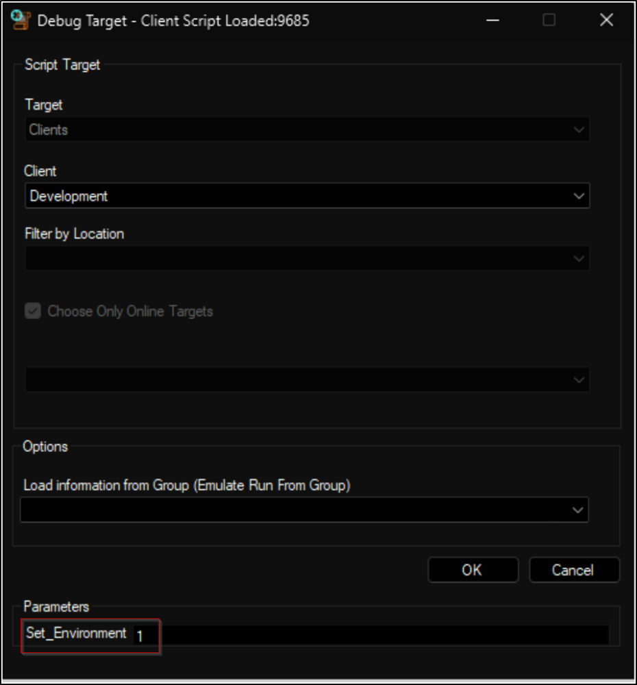
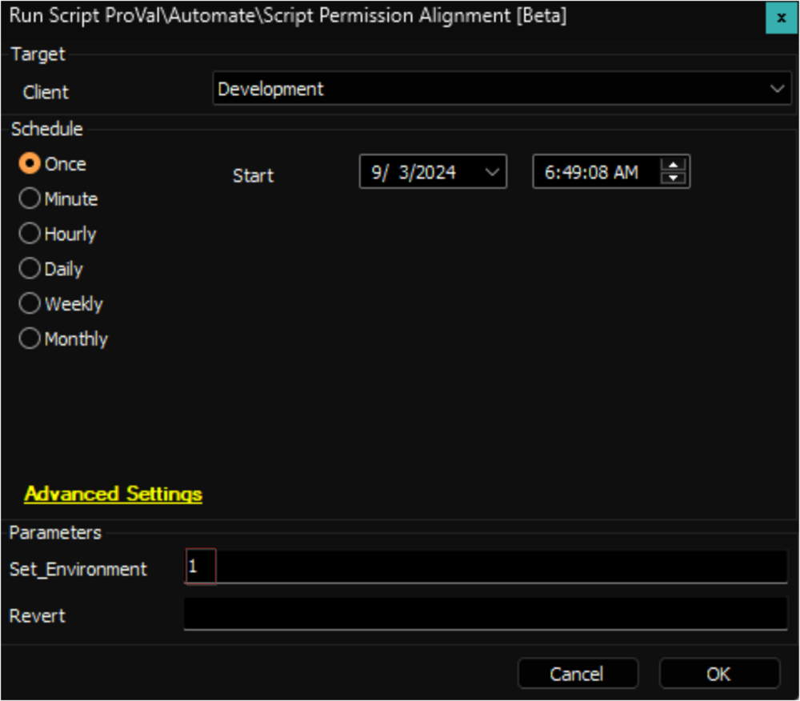
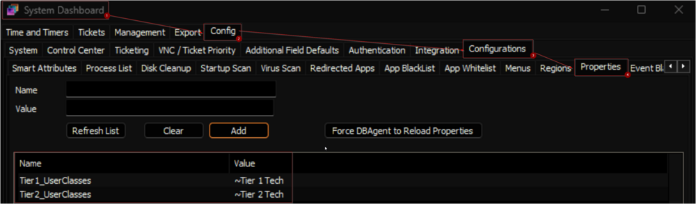
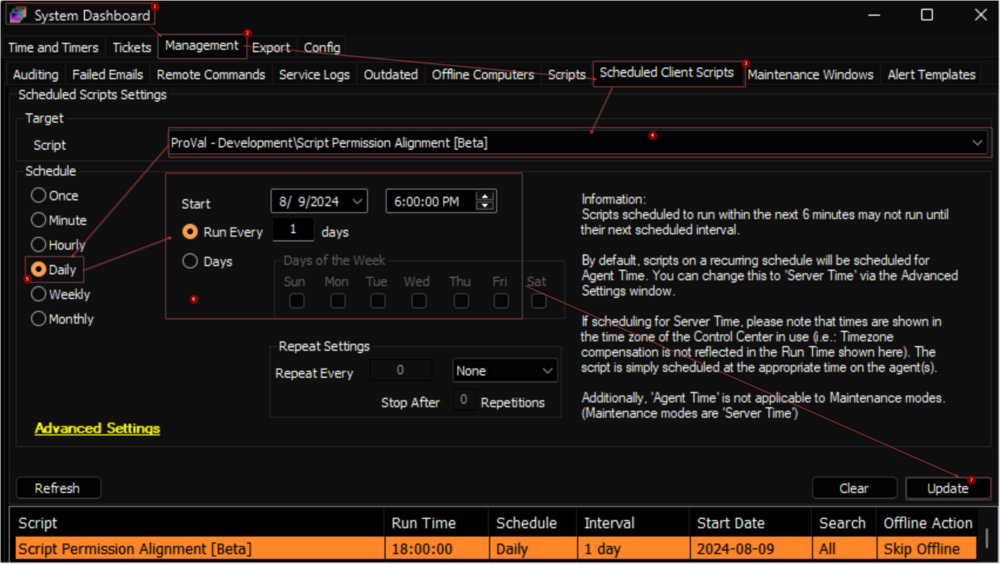

## Purpose

Set the standard permissions to the stock scripts in ConnectWise Automate.

## Associated Content

| Content                                                                                   | Type        | Function                                                                                               |
|-------------------------------------------------------------------------------------------|-------------|--------------------------------------------------------------------------------------------------------|
| [Script Permission Alignment [Beta]](https://proval.itglue.com/DOC-5078775-16760857)    | Script      | Set the permissions defined in the custom table to the Built-In scripts in ConnectWise Automate.      |
| [Script Permission Alignment [Beta]](https://proval.itglue.com/DOC-5078775-16760859)    | Dataview    | Displays the user classes which will be assigned to the stock scripts after running the script.       |
| [pvl_scripts_permissions](https://proval.itglue.com/DOC-5078775-16760865)              | Custom Table| Stores the GUID and the set of user class(es) for built-In scripts.                                   |

## Implementation

1. Import the following content using the ProSync Plugin:
   - [Script - Script Permission Alignment [Beta]](https://proval.itglue.com/DOC-5078775-16760857)
   - [Dataview - Script Permission Alignment [Beta]](https://proval.itglue.com/DOC-5078775-16760859)
   - [Custom Table - pvl_scripts_permissions](https://proval.itglue.com/DOC-5078775-16760865)

2. Reload the system cache:
   

3. Debug or Run the script against any client with the `Set_Environment` parameter set to `1`.  
     
   

4. Set the Tier 1 and Tier 2 user classes in the system properties. The consultant should provide this information. Check the [script's](https://proval.itglue.com/5078775/docs/16760857) document for more information on the system properties.  
   

5. It is suggested to ask the partner to review the [Script Permission Alignment [Beta]](https://proval.itglue.com/DOC-5078775-16760859) before scheduling the script.

6. Schedule the script to run `Daily` after getting the Green light from the partner or consultant.  
   

## FAQ

**Q:** Can we use the solution to set permission for any script?  
**A:** The solution allows setting permissions only for the scripts listed in the [Script Permission Alignment [Beta]](https://proval.itglue.com/DOC-5078775-16760859) dataview, and these permissions cannot be customized. However, the user classes Tier 1 and Tier 2 can be defined in the system properties.

