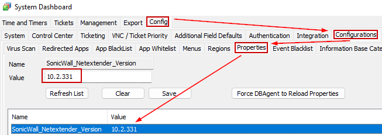

## Purpose

This solution ensures that the SonicWall NetExtender is installed or updated to the latest version.

## Associated Content

| Content                                                                                      | Type            | Function                                                                                                                                                                                                                                                                                                                                                       |
|----------------------------------------------------------------------------------------------|-----------------|----------------------------------------------------------------------------------------------------------------------------------------------------------------------------------------------------------------------------------------------------------------------------------------------------------------------------------------------------------------|
| [Install/Update SonicWall NetExtender [Winget]](<../cwa/scripts/SWM - Software - InstallUpdate Sonicwall NetExtender Winget.md>) | Script          | This script attempts to install or update the SonicWall NetExtender application on the target device using Winget.                                                                                                                                                                                                                                        |
| [Internal Monitor - SonicWall NetExtender Deployment](<../cwa/monitors/SonicWall NetExtender Deployment.md>) | Internal Monitor | This internal monitor detects the online Windows agent where the SonicWall NetExtender is installed for the upgrade. It depends on the client-based EDF 'SonicWall NetExtender Deployment' to check for the SonicWall NetExtender Install/Update. It also relies on the location-based and computer-based EDF 'SonicWall NetExtender Exclude' to exclude particular locations/agents from the deployed clients. |
| [SonicWall NetExtender - Latest Version [Winget]](<../cwa/scripts/CWM - Automate - Data Collection - SonicWall NetExtender - Latest Version Winget.md>) | Script          | This script is designed to store the latest version of SonicWall NetExtender in the system properties 'SonicWall_Netextender_Version'.                                                                                                                                                                                                                         |
| [Internal Monitor - SonicWall NetExtender - Latest Version Detection](<../cwa/monitors/SonicWall NetExtender - Latest Version Detection.md>) | Internal Monitor | This monitor schedules the script [SonicWall NetExtender - Latest Version [Winget]](<../cwa/scripts/CWM - Automate - Data Collection - SonicWall NetExtender - Latest Version Winget.md>) to collect the latest version details of the SonicWall NetExtender application every month and update it to the system properties SonicWall_Netextender_Version.                                                                         |
| **△ Custom - Autofix - SonicWall NetExtender - Latest Version Collector**                   | Alert Template   | This alert template runs the script [SonicWall NetExtender - Latest Version [Winget]](<../cwa/scripts/CWM - Automate - Data Collection - SonicWall NetExtender - Latest Version Winget.md>) for the latest version detection of SonicWall NetExtender and stores it in the system properties. It should be scheduled with the monitor [SonicWall NetExtender - Latest Version Detection](<../cwa/monitors/SonicWall NetExtender - Latest Version Detection.md>).                     |
| **△ Custom - Autofix - SonicWall NetExtender - Install/Update**                           | Alert Template   | This alert template runs the script [SWM - Software - Install/Update SonicWall NetExtender [Winget]](<../cwa/scripts/SWM - Software - InstallUpdate Sonicwall NetExtender Winget.md>) for the SonicWall NetExtender install/update. It should be scheduled with the monitor [SonicWall NetExtender Deployment](https://proval.itglue.com/DOC-5532599-13399427).                                            |
| SonicWall NetExtender Deployment                                                              | Client-EDF      | This EDF needs to be checked for the monitor to detect the clients where the SonicWall NetExtender deployment is needed on their agents.                                                                                                                                                                                                                       |
| SonicWall NetExtender Exclude                                                                 | Location-EDF    | This EDF check at the location level will exclude the agents of the locations from the SonicWall NetExtender deployment.                                                                                                                                                                                                                                        |
| SonicWall NetExtender Exclude                                                                 | Computer-EDF    | This EDF check will exclude the agents from the SonicWall NetExtender deployment.                                                                                                                                                                                                                                                                              |

## Implementation

1. Import the scripts [SWM - Software - Install/Update SonicWall NetExtender [Winget]](<../cwa/scripts/SWM - Software - InstallUpdate Sonicwall NetExtender Winget.md>) and [SonicWall NetExtender - Latest Version [Winget]](<../cwa/scripts/CWM - Automate - Data Collection - SonicWall NetExtender - Latest Version Winget.md>).
2. Import the internal monitors [SonicWall NetExtender Deployment](https://proval.itglue.com/DOC-5532599-13399427) and [SonicWall NetExtender - Latest Version Detection](<../cwa/monitors/SonicWall NetExtender - Latest Version Detection.md>).
3. Import the alert templates '△ Custom - Autofix - SonicWall NetExtender - Latest Version Collector' and '△ Custom - Autofix - SonicWall NetExtender - Install/Update'.
4. Apply the '△ Custom - Autofix - SonicWall NetExtender - Install/Update' alert template to the [SonicWall NetExtender Deployment](https://proval.itglue.com/DOC-5532599-13399427) monitor.
5. Apply the '△ Custom - Autofix - SonicWall NetExtender - Latest Version Collector' alert template to the [SonicWall NetExtender - Latest Version Detection](<../cwa/monitors/SonicWall NetExtender - Latest Version Detection.md>) monitor.
6. Run the [SonicWall NetExtender - Latest Version [Winget]](<../cwa/scripts/CWM - Automate - Data Collection - SonicWall NetExtender - Latest Version Winget.md>) script and ensure the script populates the system property.  
   
7. Enable the deployment monitor.

