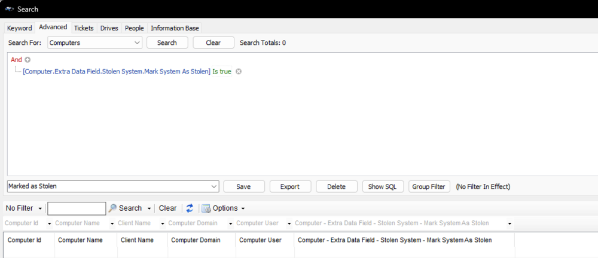
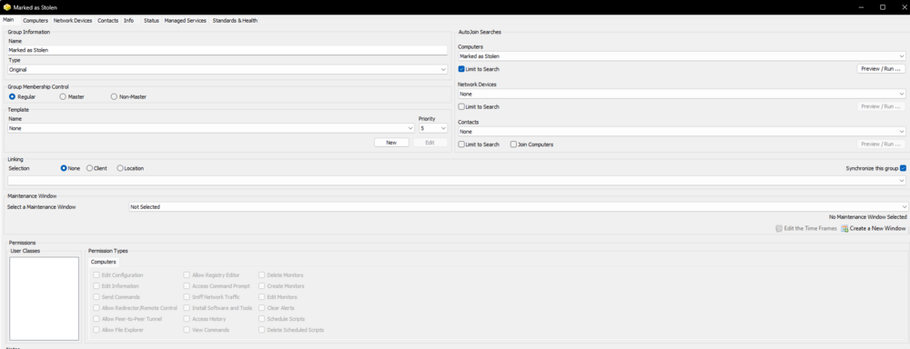
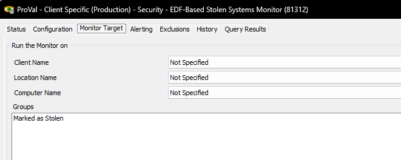
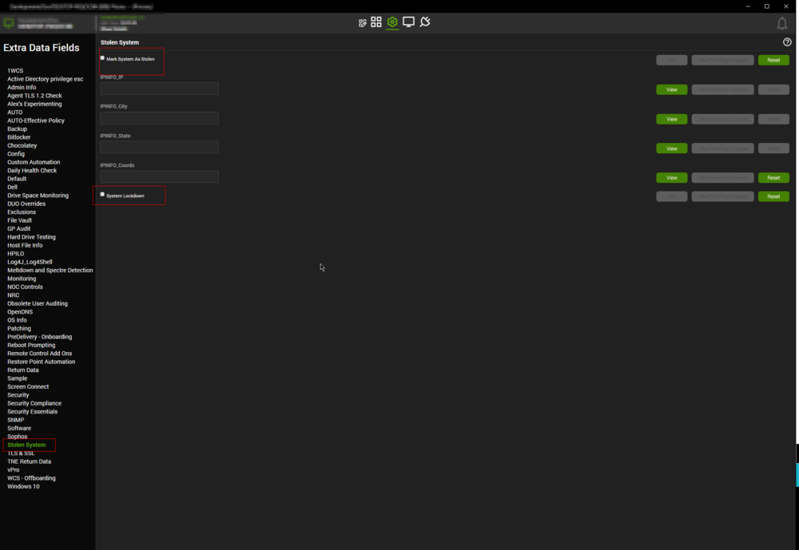

## Purpose

The purpose of the solution is to detect and lockdown the machines that are marked as stolen. This article will help guide the technician to implement the solution into a CW Automate environment.

## Associated Content

| Content                                                                                                                                              | Type          | Function                                                           |
|------------------------------------------------------------------------------------------------------------------------------------------------------|---------------|--------------------------------------------------------------------|
| [SEC - Encryption - Script - Lock Stolen System](https://proval.itglue.com/DOC-5078775-7798917)                                                  | Script        | Tracks and lock down stolen systems.                               |
| [SEC - Security - Internal Monitor - EDF-Based Stolen Systems Monitor](https://proval.itglue.com/DOC-5078775-12991040)                          | Internal Monitor | Detects the online machines where `Mark As Stolen` EDF is marked. |
| △ CUSTOM - Execute Script - Lock Stolen System                                                                                                     | Alert Template | Executes the script against the computers detected by the internal monitor. |

## Implementation

- Read the solution-related documents carefully.
- Import the script [SEC - Encryption - Script - Lock Stolen System](https://proval.itglue.com/DOC-5078775-7798917).
- Reload the system cache and ensure that the EDFs mentioned in the script's document are properly imported.
- Create/import the `Marked as Stolen` search, it should be looking for the machines where the `Mark System As Stolen` EDF is marked.  
  
- Create/import the `Marked as Stolen` group, it should be using the `Marked as Stolen` search as an Autojoin search.  
  
- Import the internal Monitor [SEC - Security - Internal Monitor - EDF-Based Stolen Systems Monitor](https://proval.itglue.com/DOC-5078775-12991040).
- Limit the monitor set to the `Marked as Stolen` group.  
  
- Import/Create the `△ CUSTOM - Execute Script - Lock Stolen System` alert template. It should be running the [SEC - Encryption - Script - Lock Stolen System](https://proval.itglue.com/DOC-5078775-7798917) script on failure.
- Assign the alert template to the monitor set.
- Mark the `Mark System As Stolen` EDF on the concerned computers. Marking `System Lockdown` EDF will enable the script's feature to bitlocker and shutdown this computer.  
  

