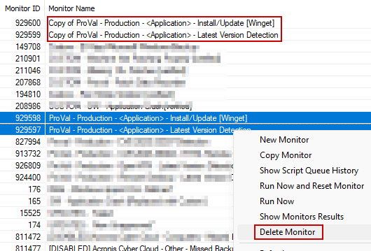
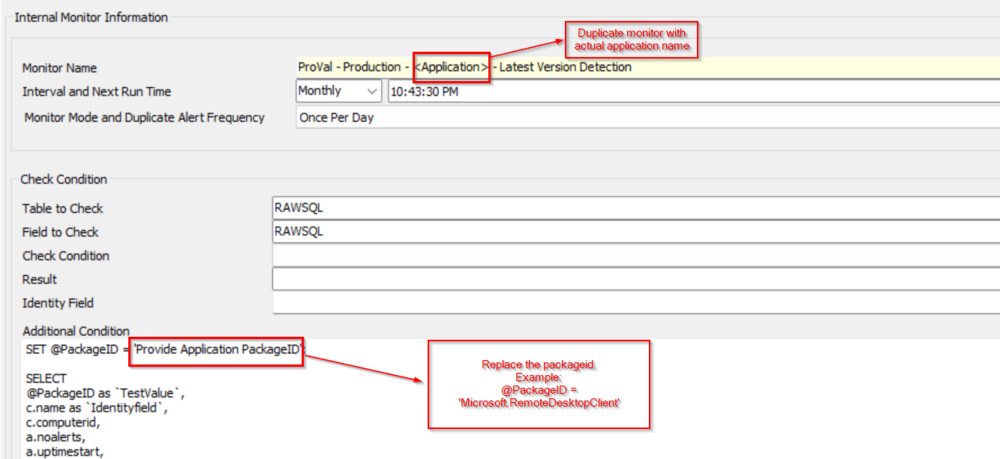
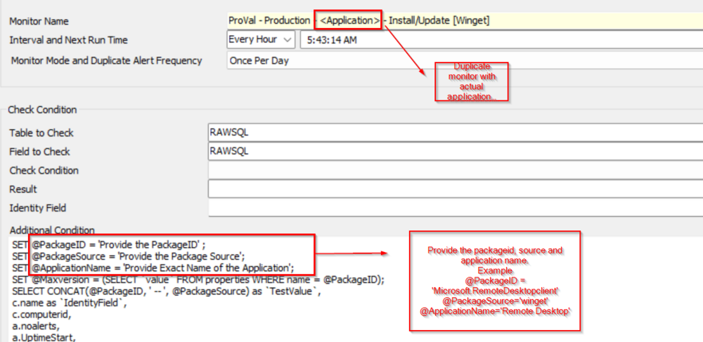

## Purpose

This solution is designed to achieve the appropriate application upgrade to the latest version detected by the Winget.

## Associated Content

| Content                                                                                             | Type         | Function                                                                                                                                                                                                                                                                             |
|-----------------------------------------------------------------------------------------------------|--------------|--------------------------------------------------------------------------------------------------------------------------------------------------------------------------------------------------------------------------------------------------------------------------------------|
| [Application - Latest Version Detection [Winget]](https://proval.itglue.com/DOC-5078775-14466237) | Script       | This script is designed to gather the latest version of applications supported by Winget which is provided in the monitor "[ProVal - Production - - Latest Version Detection](https://proval.itglue.com/DOC-5078775-14466240)".                                                  |
| [Winget - Install/Update [Autofix,Param]](https://proval.itglue.com/DOC-5078775-14466238)         | Script       | This script is created to update the application whose packageid and source are provided in the monitor "[ProVal - Production - - Install/Update [Winget]](https://proval.itglue.com/DOC-5078775-14466241)".                                                                    |
| [Internal Monitor - ](https://proval.itglue.com/DOC-5078775-14466240)  [Application - Latest Version Detection](https://proval.itglue.com/DOC-5078775-14466240) | Monitor      | This monitor is created to fetch the latest version of the application for which you want Winget to control the upgrade.                                                                                                                                                         |
| [Internal Monitor - ](https://proval.itglue.com/DOC-5078775-14466241)  [Application - Install/Update [Winget]](https://proval.itglue.com/DOC-5078775-14466241) | Monitor      | This monitor is designed to update the application based on the PackageID, Source, and Application Name provided inside the monitor.                                                                                                                                              |
| **△ Custom - Execute Script - Application Latest Version**                                          | Alert Template | This alert template is designed to be used with the monitor "[ProVal - Production - - Latest Version Detection](https://proval.itglue.com/DOC-5078775-14466240)" to run the script "[Application - Latest Version Detection [Winget]](https://proval.itglue.com/DOC-5078775-14466237)". |
| **△ CUSTOM - Application Install/Update - Winget**                                                | Alert Template | This alert template is designed to be used with the monitor [ProVal - Production - - Install/Update [Winget]](https://proval.itglue.com/DOC-5078775-14466241) to run the script [Winget - Install/Update [Autofix,Param]](https://proval.itglue.com/DOC-5078775-14466238).        |

## Implementation

- Import scripts [Application - Latest Version Detection [Winget]](https://proval.itglue.com/DOC-5078775-14466237) and [Winget - Install/Update [Autofix,Param]](https://proval.itglue.com/DOC-5078775-14466238).
- Import monitors [ProVal - Production - - Latest Version Detection](https://proval.itglue.com/DOC-5078775-14466240) and [ProVal - Production - - Install/Update [Winget]](https://proval.itglue.com/DOC-5078775-14466241).
- Import the Alert templates "**△ Custom - Execute Script - Application Latest Version**" and "**△ CUSTOM - Application Install/Update - Winget**".
- Create a duplicate of both monitors and remove the imported monitors so there is no confusion:  
    
- Remove the 'Copy of' from the monitor names and Modify the new monitors with the required details below:  
    
    
- Apply the alert template "**△ Custom - Execute Script - Application Latest Version**" with monitor [ProVal - Production - - Latest Version Detection](https://proval.itglue.com/DOC-5078775-14466240) very first and run it once before implementing the other monitor so that the system property gets created.
- Apply the alert template "**△ CUSTOM - Application Install/Update - Winget**" with monitor [ProVal - Production - - Install/Update [Winget]](https://proval.itglue.com/DOC-5078775-14466241) and make the adjustment as mentioned in the screenshot.

