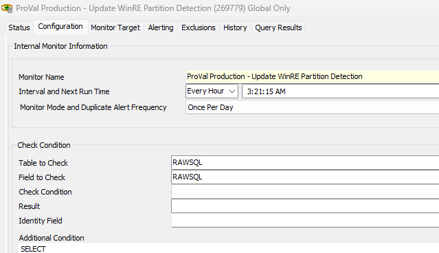
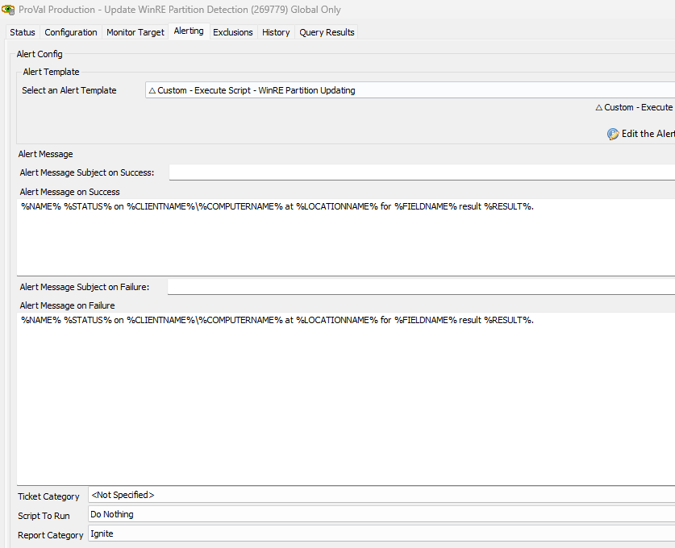
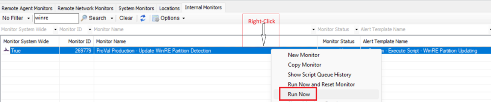
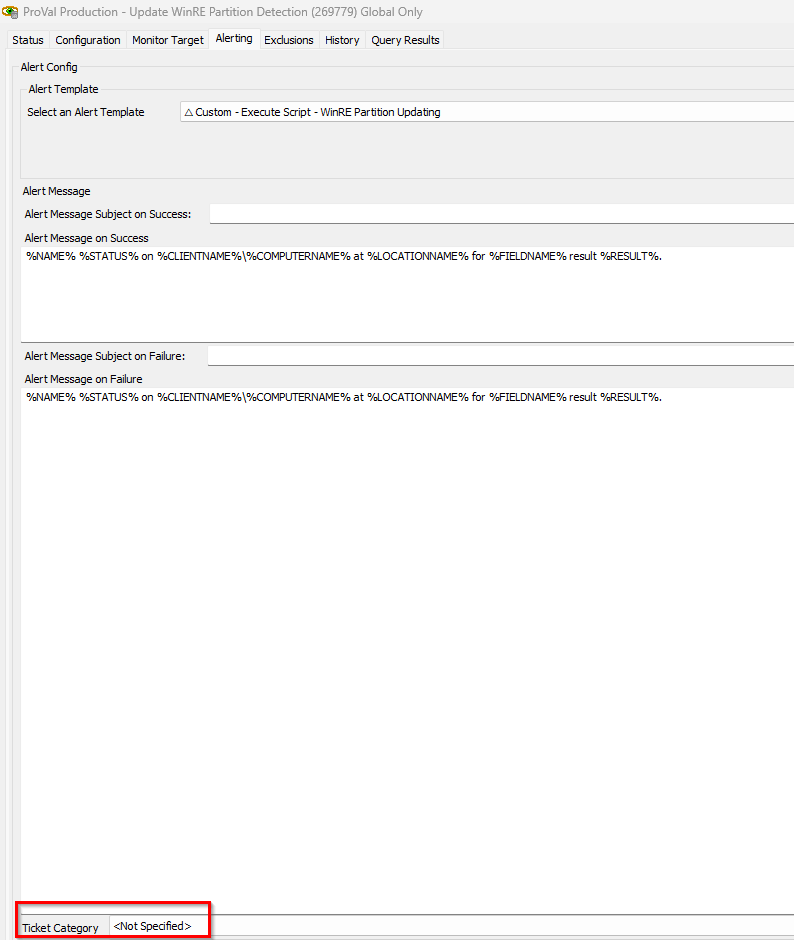
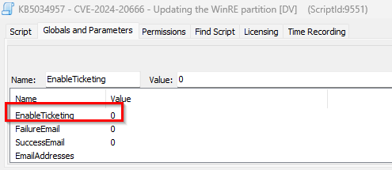

## Purpose

Updating the WinRE partition on deployed devices to address security vulnerabilities in CVE-2024-20666 by pushing the KB5034957 update.

## Associated Content

| Content                                                                                                 | Type            | Function                                                                                                                                                                                                                       |
|---------------------------------------------------------------------------------------------------------|-----------------|-------------------------------------------------------------------------------------------------------------------------------------------------------------------------------------------------------------------------------|
| [Script - KB5034957 - CVE-2024-20666 - Updating the WinRE partition](<../cwa/scripts/KB5034957 - CVE-2024-20666 - Updating the WinRE partition.md>) | Script          | This script automates the updating of WinRE images on supported Windows OS. It updates the WinRE partition on deployed devices to address security vulnerabilities in CVE-2024-20666. Refer to article: [link](https://support.microsoft.com/en-us/topic/kb5034957-updating-the-winre-partition-on-deployed-devices-to-address-security-vulnerabilities-in-cve-2024-20666-0190331b-1ca3-42d8-8a55-7fc406910c10) |
| [Dataview - KB5034957 - CVE-2024-20666 - WinRE Partition Update Status](<../cwa/dataviews/KB5034957 - CVE-2024-20666 - WinRE Partition Update Status.md>) | Dataview        | This dataview contains the status of the WinRE update on the agent stored by the script [CWA Script - KB5034957 - CVE-2024-20666 - Updating the WinRE partition](<../cwa/scripts/KB5034957 - CVE-2024-20666 - Updating the WinRE partition.md>) at computer-EDF 'Update WinRE Partition KB5034957'. |
| [Internal Monitor - Update WinRE Partition Detection](<../cwa/monitors/Update WinRE Partition Detection.md>) | Internal Monitor | This monitor detects the online Windows machines whose OS falls under the supported OS criteria using the query (c.os NOT REGEXP 'Windows.* (XP|20(03|12)|8|7)' AND c.version REGEXP '22(621|631|000)|190(41|42|44|45)|20348'). It also ensures the script runs once on the agent. |
| **△ Custom - Execute Script - WinRE Partition Updating**                                                | Alert Template   | This executes the script [KB5034957 - CVE-2024-20666 - Updating the WinRE partition](<../cwa/scripts/KB5034957 - CVE-2024-20666 - Updating the WinRE partition.md>) on the detected device of monitor [Update WinRE Partition Detection](<../cwa/monitors/Update WinRE Partition Detection.md>). |

## Other Content

| Content                                                                                                 | Type       | Function                                                                                                                                                                                                                       |
|---------------------------------------------------------------------------------------------------------|------------|-------------------------------------------------------------------------------------------------------------------------------------------------------------------------------------------------------------------------------|
| [KB5034957 - CVE-2024-20666 - Updating the WinRE partition](<../cwa/scripts/KB5034957 - CVE-2024-20666 - Updating the WinRE partition.md>) | Agnostic   | Download the required CAB file for the endpoint to patch WinRE for CVE-2024-20666.                                                                                                                                         |

## Implementation

1. **Import Contents:**

   - [Script - KB5034957 - CVE-2024-20666 - Updating the WinRE partition](<../cwa/scripts/KB5034957 - CVE-2024-20666 - Updating the WinRE partition.md>)
   - [Dataview - KB5034957 - CVE-2024-20666 - WinRE Partition Update Status](<../cwa/dataviews/KB5034957 - CVE-2024-20666 - WinRE Partition Update Status.md>)
   - [Internal Monitor - Update WinRE Partition Detection](<../cwa/monitors/Update WinRE Partition Detection.md>)
   - **△ Custom - Execute Script - WinRE Partition Updating**

2. **Reload the system cache:**

   

3. **Enable Solution:**

   - Navigate to Automation → Monitors within the CWA Control Center and set up the following:  
     [Internal Monitor - Update WinRE Partition Detection](<../cwa/monitors/Update WinRE Partition Detection.md>)  
       

   - Set up with the **△ Custom - Execute Script - WinRE Partition Updating** alert template.  
       

   - Right-click and select Run Now to start the monitor.  
       

   - The automation will automatically update the WinRE partition on all supported OS.

4. **Audit Data:**

   The Dataview is designed to store the result of the status for the Update WinRE partition.  
   [Dataview - KB5034957 - CVE-2024-20666 - WinRE Partition Update Status](<../cwa/dataviews/KB5034957 - CVE-2024-20666 - WinRE Partition Update Status.md>)

5. **Ticket/Email Creation:**

   - The script has a feature to enable ticketing or sending emails. To set ticketing, it is required to set the ticket category in the monitor itself:  
       

   - Once the ticket category is set, adjust the global parameter value to 1 in the script for EnableTicketing:  
       

   - To send emails, it is mandatory to set the email address. Multiple email addresses can be set, separated by semicolons:  
     e.g., [abc@def.com](mailto:abc@def.com); [ghi@jkl.com](mailto:ghi@jkl.com); [mno@pqr.com](mailto:mno@pqr.com)  
     Once the email address is set, you can set the value to 1 for the failure email if you need an email only on failure, set 1 for success email if you want an email for success, or set 1 for both for emails on both success and failure.

