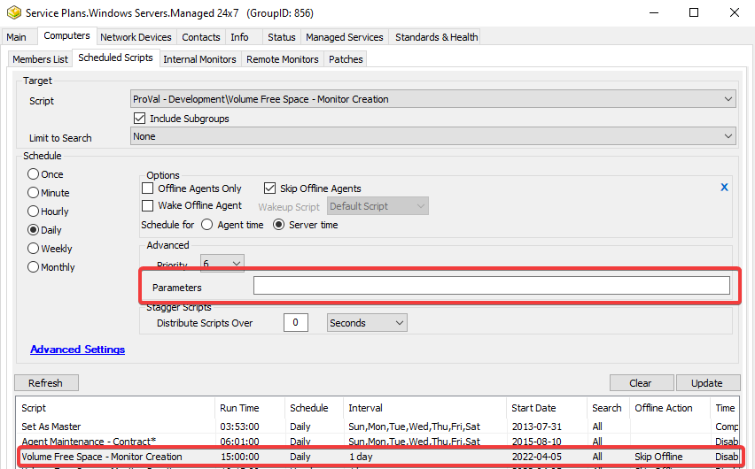

## Purpose

The Volume Space Monitoring solution aims to generate intelligent free space monitors based on either trending free space or statically assigned thresholds.

## Associated Content

| Content                                                                 | Type            | Function                                                                                                                                                                                                                       |
|-------------------------------------------------------------------------|-----------------|--------------------------------------------------------------------------------------------------------------------------------------------------------------------------------------------------------------------------------|
| [Create Predictive Volume Exhaustion Monitors](/docs/dee853b7-69a6-4f0d-ad2f-7238a10851f4) | Automate Script | Generates remote monitors based on the results of [Get-VolumeThresholds](/docs/e36d9583-23da-4dfa-96c8-3467e36e30cf) and [Get-VolumeExhaustionEstimate](/docs/21bc13d3-b2fb-42d5-8f38-da9b43990e06).                     |
| [Get-VolumeThresholds](/docs/e36d9583-23da-4dfa-96c8-3467e36e30cf) | Agnostic Script | Gathers and returns information about each applicable volume and their requested threshold for space remaining. The script has two modes: Dynamic and Static.                                                                      |
| [Get-VolumeExhaustionEstimate](/docs/21bc13d3-b2fb-42d5-8f38-da9b43990e06) | Agnostic Script | Takes a sample of the current volume space for each target volume and provides a list of space exhaustion estimations for them based on linear regression.                                                                           |
| [Volume Space Prediction](/docs/e928f9f6-f97d-44f3-aad2-26186416fa1f) | Remote Monitor  | Monitor generated by [Create Predictive Volume Exhaustion Monitors](/docs/dee853b7-69a6-4f0d-ad2f-7238a10851f4) to monitor volume space.                                                                                     |
| [Volume Space Sampling](/docs/3a441306-efbc-48a5-8732-06bfd56c9a5f) | Remote Monitor  | Monitor generated by [Create Predictive Volume Exhaustion Monitors](/docs/dee853b7-69a6-4f0d-ad2f-7238a10851f4) to gather data points for regression-based thresholds.                                                       |
| [Volume Exhaustion Estimations](<../cwa/dataviews/Volume Exhaustion Estimations.md>) | Dataview        | Displays volume information gathered by the monitoring scripts.                                                                                                                                                                                      |
| [plugin_proval_volume_exhaustion](/docs/9eee7f2a-78f1-4243-b681-6b36b56c1c9f) | Custom Table    | Stores volume exhaustion information from [Create Predictive Volume Exhaustion Monitors](/docs/dee853b7-69a6-4f0d-ad2f-7238a10851f4).                                                                                       |

## Implementation

### Automate

For implementation in Automate, the [Volume Free Space - Monitor Creation](/docs/dee853b7-69a6-4f0d-ad2f-7238a10851f4) script must be scheduled against whichever subset of machines you would like to generate monitors for. Offline agents should be skipped. This script will also generate a separate monitor ([Volume Space Sampling](/docs/3a441306-efbc-48a5-8732-06bfd56c9a5f)) for gathering volume space samples for the script to read and act upon. This extra monitor is required to offload the sampling load from the Automate script engine onto the local agent.

#### Schedule

The schedule should have the required parameters passed to it and should be run daily. Ideally, this schedule should be against Service Plan groups that require volume space monitoring.



## FAQ

### Automate

#### How do I format the ThresholdDefinitions parameter?

The ThresholdDefinitions parameter should be formatted as a comma-separated list of PowerShell hashtables. The hashtables have specific properties that must be set for the volume space monitoring engine to function:

- MaxSize - The maximum volume size that the specified threshold applies to.
- ThresholdType - The type of threshold to use. Must be either 'Percent' or 'Number'.
- Threshold - The threshold to calculate for the volume. If ThresholdType is 'Percent', this must be under 100.

##### Example

A server has 3 volumes: C, D, and F.

```
C - 50GB
D - 2048GB
F - 10240GB
```

The hashtables passed into the script are as follows:

```
@{MaxSize = 40GB; ThresholdType = 'Percent'; Threshold = 10},@{MaxSize = 1024GB; ThresholdType = 'Percent'; Threshold = 5},@{MaxSize = 4096GB; ThresholdType = 'Number'; Threshold = 100GB}
```

The following assignments are generated:

```
C - Threshold 5% (Greater than 40GB and less than 1024GB)
D - Threshold 100GB (Greater than 1024GB and less than 4096GB)
F - Threshold 100GB (Greater than all MaxSize definitions. Uses the greatest MaxSize definition available.)
```

#### What if I don't specify a ThresholdDefinitions parameter?

If you don't specify a ThresholdDefinitions parameter and a static threshold is needed for a volume, the threshold will default to 11% of the total volume size.

#### When are static thresholds used?

Static thresholds defined by the ThresholdDefinitions parameter are used in the following situations:

- When dynamic thresholds are disabled.
- When a volume does not yet have enough samples to generate a linear regression. This is denoted by the MinimumSamples variable.
- When a volume's free space is trending constant or upward based on the linear regression.
- When a volume's free space will not be exhausted within 3 years based on the linear regression.

#### What are the different options for the DriveTypes parameter?

Valid options for the DriveTypes parameter are:

```
- Unknown
- Invalid Root Path
- Removable
- Fixed
- Remote
- CD-ROM
- RAM Disk
```

#### How do I format the DriveTypes parameter?

The DriveTypes parameter should be formatted as a comma-separated list of strings.

##### Example

```
"Fixed","Removable"
```

#### How do I format the ExcludeDriveLetters parameter?

The ExcludeDriveLetters parameter should be formatted as a comma-separated list of strings.

##### Example

```
"C","D","E"
```

#### What does MinimumSamples do?

The MinimumSamples parameter is an integer that denotes the least number of gathered samples required for the dynamic calculations to be active. Each run of the script will attempt to generate a sample if the last sample was not gathered within the past 30 minutes. Once the number of samples gathered is greater than or equal to the MinimumSamples, the linear regression calculation will be performed, and the dynamic threshold for the volume will be returned instead of the thresholds passed in from ThresholdDefinitions. Each monitored volume has its own set of samples.

##### Example

A machine exists called USER-PC. USER-PC has a 256GB volume.

The script has not been run on our target machine before.

The script is scheduled against the machine for every hour with MinimumSamples set to 10. The ThresholdDefinitions is set such that a 256GB volume will be monitored with a 10GB threshold.

```
Hour 01: Threshold = 10GB
Hour 02: Threshold = 10GB
Hour 03: Threshold = 10GB
...
Hour 09: Threshold = 10GB
Hour 10: Threshold = Based on linear regression algorithm
```

So at the 10th hour and beyond, the dynamic threshold based on linear regression will be used in place of the ThresholdDefinitions that were statically set.

#### What does DaysToReport do?

The DaysToReport parameter is an integer that denotes the maximum age of samples to use in the linear regression calculation.

##### Example

A machine exists called USER-PC. USER-PC has a 256GB volume.

The script has been running hourly on USER-PC for 60 days.

The script has the DaysToReport parameter set to 14.

Three weeks ago, the user of USER-PC downloaded a large 20GB file and left it on their PC for two days before deleting it.

In this case, the abnormality of the 20GB file would be ignored, as it was deleted 19 days ago, and the DaysToReport parameter is only set to 14. Thus, the samples from that time are not used when calculating the linear regression.

#### What does DaysToLead do?

The DaysToLead parameter is an integer that denotes the number of days before the date of volume space exhaustion that the threshold will be based on. This parameter is used to ensure ample time to respond to an impending volume space problem.

##### Example

A machine exists called USER-PC. USER-PC has a 256GB volume.

The script has been running hourly on USER-PC for 60 days.

The script has the DaysToLead parameter set to 30.

The script determines that in another 70 days, the volume's space may be completely exhausted based on the linear regression. The script then returns the estimated remaining space 40 days from now (70 - DaysToLead). This estimated remaining space is then used as the threshold for the volume space remote monitor for that volume.


