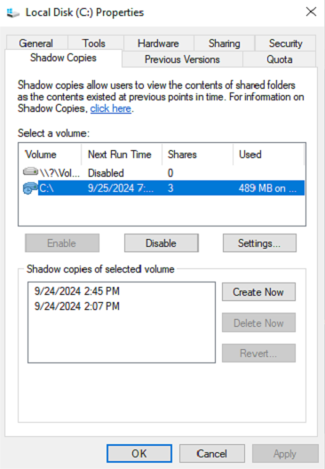
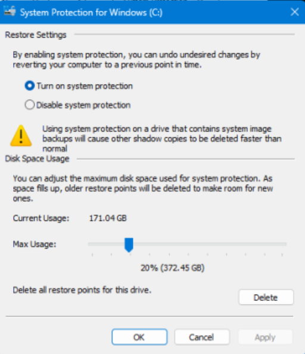

## Purpose

This solution is designed to audit the complete Shadow Copy statistics and size information on all machines set to audit. The data is populated into a dataview and can be reviewed manually. There is no alerting presently for this solution, but it can easily be added if requested.

## Associated Content

| Content                                                                                                                    | Type      | Function                                                                                                                                                                                                                                                                         |
|----------------------------------------------------------------------------------------------------------------------------|-----------|----------------------------------------------------------------------------------------------------------------------------------------------------------------------------------------------------------------------------------------------------------------------------------|
| [Script - Shadow Copy - Audit Complete Statistics [DV]](https://proval.itglue.com/DOC-5078775-7751337)                  | Script    | This script records data related to Shadow Copy for individual systems into a [Custom Table - plugin_proval_shadowcopystats](https://proval.itglue.com/DOC-5078775-8157668).                                                                                               |
| [Dataview - Windows - Shadow Copy State [Script]](https://proval.itglue.com/DOC-5078775-8105265)                        | Dataview  | This dataview will display an endpoint's Windows Shadow Copy information where the [Script - Shadow Copy - Audit Complete Statistics [DV]](https://proval.itglue.com/DOC-5078775-7751337) ran to gather the data.                                                          |
| [Monitor - Execute Script - Shadow Copy - Audit Complete Statistics](https://proval.itglue.com/DOC-5078775-8057145)     | Monitor   | This monitor detects machines, where the last Shadow Copy detected is older than the number of days set in the System Property Proval_ShadowCopyMaxAgeInDays.                                                                                                               |
| [Custom Table - plugin_proval_shadowcopystats](https://proval.itglue.com/DOC-5078775-8157668)                            | Table     | It stores information about Windows shadow copies gathered by [Script - Shadow Copy - Audit Complete Statistics [DV]](https://proval.itglue.com/DOC-5078775-7751337).                                                                                                     |
| △ Custom - Execute Script - Shadow Copy - Audit                                                                             | Alert Template | This alert template is created to run with the [Monitor - Execute Script - Shadow Copy - Audit Complete Statistics](https://proval.itglue.com/DOC-5078775-8057145) and schedule [Script - Shadow Copy - Audit Complete Statistics [DV]](https://proval.itglue.com/DOC-5078775-7751337) on the detected agents. |

## Implementation

1. Import the following content using the ProSync Plugin:
   - [Script - Shadow Copy - Audit Complete Statistics [DV]](https://proval.itglue.com/DOC-5078775-7751337)
   - [Dataview - Windows - Shadow Copy State [Script]](https://proval.itglue.com/DOC-5078775-8105265)
   - [Monitor - Execute Script - Shadow Copy - Audit Complete Statistics](https://proval.itglue.com/DOC-5078775-8057145)

2. Reload the system cache:
   

3. Configure the solution as outlined below:
   - Navigate to Automation → Monitors within the CWA Control Center and setup the following:
     - [Monitor - Execute Script - Shadow Copy - Audit Complete Statistics](https://proval.itglue.com/DOC-5078775-8057145)
       - Setup with "△ Custom - Execute Script - Shadow Copy - Audit" Alert Template
       - Right-click and Run Now to start the monitor

   Note: If the partner has a threatlocker or any blocking application please get the below file hash whitelisted for the solution to work properly without blocking.

   __MD5 FileHash__: `E69A5AD2CDCF7B20C7205D4A7BEC08C4`

## FAQ

**Q:** What to do if information for an endpoint is not present in the dataview?  
**A:** Run the "[Script - Shadow Copy - Audit Complete Statistics [DV]](https://proval.itglue.com/DOC-5078775-7751337)" against the Windows machine and re-check the dataview after the successful completion of the script.

