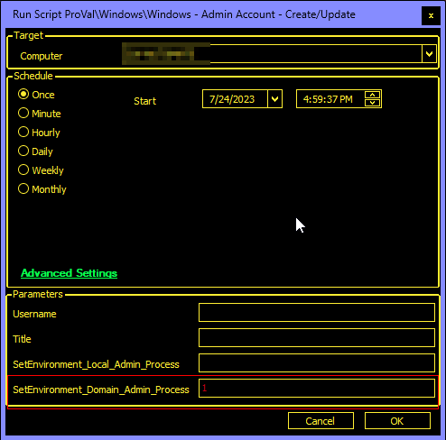
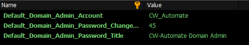
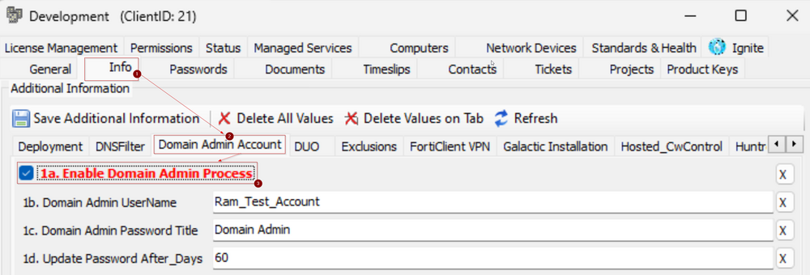

## Purpose

This solution aims to establish a centralized domain admin for each domain, ensuring a consistent and controlled approach. Additionally, the solution implements a password rotation mechanism to regularly update the password at specified intervals. This centralized approach enhances security, facilitates management, and helps mitigate potential risks associated with unmonitored or static domain admin credentials.

## Update Notice: 30-August-2024

The solution's Extra Data Fields have been renamed. Update the [Windows - Admin Account - Create/Update](<../cwa/scripts/Windows - Admin Account - CreateUpdate.md>) script from the `Prosync` plugin and run/debug against an online Windows machine with `SetEnvironment_Domain_Admin_Process` set to `1` to implement the changes.

## Associated Content

| Content                                                                                                         | Type            | Function                                               |
|-----------------------------------------------------------------------------------------------------------------|------------------|--------------------------------------------------------|
| [EPM - Windows Configuration - Internal Monitor - Windows Domain Admin Account Process](<../cwa/monitors/Windows Domain Admin Account Process.md>) | Internal Monitor | Detects the domain controller with missing or outdated credentials. |
| [EPM - Windows Configuration - Script - Windows - Admin Account - Create/Update](<../cwa/scripts/Windows - Admin Account - CreateUpdate.md>) | Script          | Create/Update the user.                               |
| △ CUSTOM - Execute Script - Windows - Admin Account - Create/Update                                           | Alert Template   | Execute the script against the machines detected by the internal monitor. |

## Implementation

1. Read the solution-related documents carefully.
2. Import the [EPM - Windows Configuration - Script - Windows - Admin Account - Create/Update](<../cwa/scripts/Windows - Admin Account - CreateUpdate.md>) script and run/debug against an online Windows machine with `SetEnvironment_Domain_Admin_Process` set to `1`. This will create the required EDFs and system properties.  
   
3. Reload the system cache.
4. Modify the default values for the system properties (if desired).  
   
5. Import the [EPM - Windows Configuration - Internal Monitor - Windows Domain Admin Account Process](<../cwa/monitors/Windows Domain Admin Account Process.md>) internal monitor.
6. Import the `△ CUSTOM - Execute Script - Windows - Admin Account - Create/Update` alert template.
7. Apply the template to the internal monitor.
8. Fill in the proper values under the client-level EDFs to enable the solution for the concerned clients.  
   

## FAQ

**Q:** The solution saves the password at the client-level password tab in Automate; is there any way to sync these credentials to ITGlue?  
**A:** Yes, the [StickySync](https://proval.itglue.com/5078775/docs/8842775) plugin can be used and configured to sync those passwords to ITGlue.

**Q:** Marking an EDF is not making the expected change/exclusion?  
**A:** The EDF data might not have been synced to the `v_extradatacomputers` or `v_extradatagroups` tables. Automate runs this sync every 20-25 minutes. So, either you need to wait for 20-25 minutes, or you can run the following SQL queries from a `RAWSQL` monitor to force sync the data:
- `Call V_Extradata(3, 'Clients');`
- `Call V_Extradata(1, 'Computers');`
- `Call V_ExtradataRefresh(3, 'Clients');`
- `Call V_ExtradataRefresh(1, 'Computers');`
