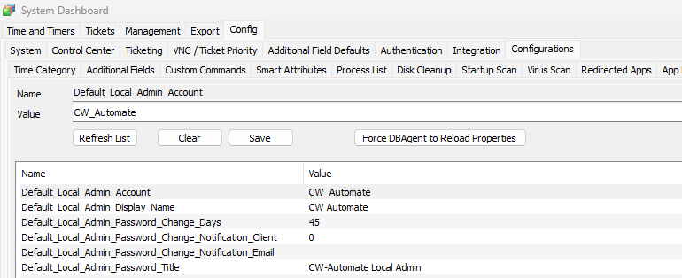
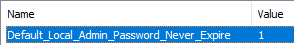
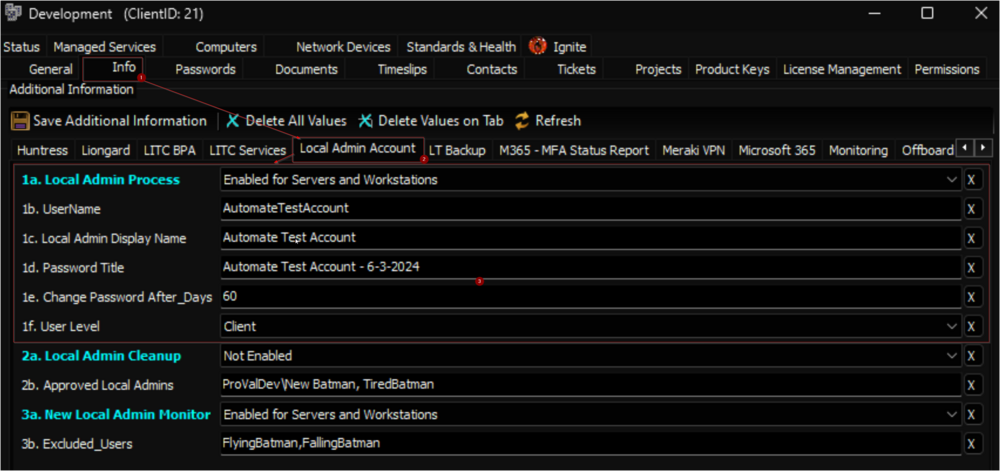

## Purpose

This solution aims to establish a centralized local admin user for each client or computer, ensuring a consistent and controlled approach. Additionally, the solution implements a password rotation mechanism to regularly update the password at specified intervals. This centralized approach enhances security, facilitates management, and helps mitigate potential risks associated with unmonitored or static local admin credentials.

## Update Notice: 06-November-2024

A new system property and EDF have been introduced for setting the password to never expire. Update the [Windows - Admin Account - Create/Update](<../cwa/scripts/Windows - Admin Account - CreateUpdate.md>) script from the `Prosync` plugin.

Run/debug against an online Windows machine with `SetEnvironment_Local_Admin_Process` set to `1` to implement the changes for the [Windows Local Admin Process](<./Windows Local Admin Process.md>) solution.

## Associated Content

| Content                                                                 | Type            | Function                                                        |
|-------------------------------------------------------------------------|-----------------|-----------------------------------------------------------------|
| [Windows Local Admin Account Process](<../cwa/monitors/Windows Local Admin Account Process.md>) | Internal Monitor | Detects machines with missing or outdated credentials.          |
| [Windows - Admin Account - Create/Update](<../cwa/scripts/Windows - Admin Account - CreateUpdate.md>) | Script          | Create/Update the user.                                        |
| △ CUSTOM - Execute Script - Windows - Admin Account - Create/Update    | Alert Template   | Execute the script against the machines detected by the internal monitor. |
| [Windows - Admin Account Password Rotation Notification](<../cwa/scripts/Windows - Admin Account Password Rotation Notification.md>) | Client Script    | This script sets the Ticket Creation or email sent for the password update made by the script 'Windows - Admin Account - Create/Update'. |

## Implementation

1. Import/Update the following content from the ProSync Plugin:
   - [Script - Windows - Admin Account - Create/Update](<../cwa/scripts/Windows - Admin Account - CreateUpdate.md>)
   - [Internal Monitor - Windows Local Admin Account Process](<../cwa/monitors/Windows Local Admin Account Process.md>)
     - If this monitor shows as needing an update, please delete the monitor from the system and re-import it.
   - Alert Template - `△ CUSTOM - Execute Script - Windows - Admin Account - Create/Update`

2. Run/debug the script [Windows - Admin Account - Create/Update](<../cwa/scripts/Windows - Admin Account - CreateUpdate.md>) against an online Windows machine with `SetEnvironment_Local_Admin_Process` set to `1`.

   

   **NOTE:** The Username and Title Parameters are used for manual runs ONLY and will not function when using the SetEnvironment variable.

3. Modify the default values for the system properties (if desired). If this is a new implementation, please confirm with the consultant if they would like any of these adjusted.

   

   New Add:

   

4. Configure the solution as outlined below:
   - Navigate to Automation → Monitors within the CWA Control Center and set up the following:
     - [Internal Monitor - Windows Local Admin Account Process](<../cwa/monitors/Windows Local Admin Account Process.md>)
       - `Alert Template: △ CUSTOM - Execute Script - Windows - Admin Account - Create/Update`
       - Right-click and select Run Now to start the monitor.

### Optional

1. This step should only be attempted if requested by the consultant:
   - Import the script [Windows - Admin Account Password Rotation Notification](<../cwa/scripts/Windows - Admin Account Password Rotation Notification.md>).
     - If the client requested the notification during a password change, then change the value of the system property 'Default_Local_Admin_Password_Change_Notification_Client' to `1`. If the client needs the email for notification, then set the email address in the property 'Default_Local_Admin_Password_Change_Notification_Email'.
   - If this information is not provided clearly, reach out to the consultant for further clarification.

   For multiple email addresses, separate the addresses with ';' (semi-colon without spaces between email IDs). For example: [test@test.com](mailto:test@test.com);[msp@msp.com](mailto:msp@msp.com)

## FAQ

**Q:** What is the process to deactivate the automatic rotation of credentials and opt for password reset when required?  
**A:** To disable the auto-rotation of credentials, adjust the system property `Default_Local_Admin_Display_Name` to '99999' and reset the client-level EDF `1f. Change Password After Days` if it is set. This setting will effectively prevent the password from auto-rotating for '99999' days, ensuring it remains unchanged. Following the deactivation of auto password rotation, to reset the password on end machines, simply update the password in the client-level password entry. Once updated, the solution will automatically propagate the new password to the endpoints.

**Q:** How to force reset the password?  
**A:** Removing the password entry from the client-level password tab will force a reset of the password at the endpoints.

**Q:** The solution saves the password at the client-level password tab in Automate; is there any way to sync these credentials to ITGlue?  
**A:** Yes, the [StickySync](https://proval.itglue.com/5078775/docs/8842775) plugin can be used and configured to sync those passwords to ITGlue.

**Q:** What do the new EDFs look like?  
**A:** The new EDF structure is shown below:

**Q:** Marking an EDF is not making the expected change/exclusion?  
**A:** The EDF data might not have been synced to the `v_extradatacomputers` or `v_extradatagroups` tables. Automate runs this sync every 20-25 minutes. Therefore, either you need to wait for 20-25 minutes or you can run the following SQL queries from a `RAWSQL` monitor set to force sync the data:
- `Call V_Extradata(3, 'Clients');`
- `Call V_Extradata(1, 'Computers');`
- `Call V_ExtradataRefresh(3, 'Clients');`
- `Call V_ExtradataRefresh(1, 'Computers');`

