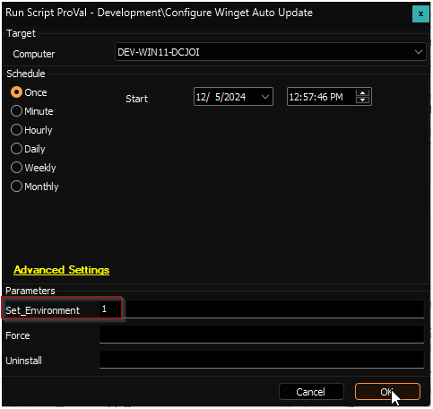

## Purpose

The solution aims to keep winget-supported applications updated and report their current status to Automate. The automation portion of the solution uses [Romanitho's Winget-AutoUpdate](https://github.com/Romanitho/Winget-AutoUpdate).

## Associated Content

#### Auditing

| Content                                                                 | Type          | Function                                                                                          |
|-------------------------------------------------------------------------|---------------|---------------------------------------------------------------------------------------------------|
| [Winget App Audit](/docs/d5ea54f9-07c9-443b-acc2-411401cfbe91)    | Script        | Fetches information about the installed winget-supported applications from the endpoint.         |
| [pvl_winget_audit](/docs/904989a6-fe21-4e40-adb6-17d1168c830e)               | Custom Table  | Stores the data fetched by the [Winget App Audit](/docs/d5ea54f9-07c9-443b-acc2-411401cfbe91) script. |
| [Winget App Audit](/docs/399a36e3-da83-4437-914b-71e9b844c0d2)    | Dataview      | Displays the data fetched by the [Winget App Audit](/docs/d5ea54f9-07c9-443b-acc2-411401cfbe91) script. |
| [Execute Script - Winget App Audit](/docs/af67ed08-40af-4899-ae8f-5e64f9bfb851) | Internal Monitor | Detects Windows computers where the [Winget App Audit](/docs/d5ea54f9-07c9-443b-acc2-411401cfbe91) script has not been executed in the past 7 days. |
| △ Custom - Execute Script - Winget App Audit                             | Alert Template | Executes the [Winget App Audit](/docs/d5ea54f9-07c9-443b-acc2-411401cfbe91) script against the computers detected by the [Execute Script - Winget App Audit](/docs/af67ed08-40af-4899-ae8f-5e64f9bfb851) internal monitor. |

#### Automation

| Content                                                                 | Type          | Function                                                                                          |
|-------------------------------------------------------------------------|---------------|---------------------------------------------------------------------------------------------------|
| [Configure Winget Auto Update](/docs/1e0c72c6-b9aa-454a-8643-ac7c7e1e7d55) | Script        | Configures the [Winget-AutoUpdate](https://github.com/Romanitho/Winget-AutoUpdate) solution on the endpoint. |
| [pvl_wau_config](/docs/be117f3c-0af2-4edb-8fcc-06da1a4db062)      | Custom Table  | Stores the current configuration set for the computer from the client-level EDFs                  |
| [Winget Auto Update Errors](/docs/68a14948-368f-4064-97a3-d1928e122013) | Remote Monitor | Checks the error log file generated by the Winget Auto Update solution.                           |
| [Execute Script - Configure Winget Auto Update](/docs/a2fa065f-6f76-4442-a0e0-a64365f6c331) | Internal Monitor | Detects Windows computers where the [Configure Winget Auto Update](/docs/1e0c72c6-b9aa-454a-8643-ac7c7e1e7d55) script needs to be executed. |
| △ Custom - Execute Script - Configure Winget Auto Update               | Alert Template | Executes the [Configure Winget Auto Update](/docs/1e0c72c6-b9aa-454a-8643-ac7c7e1e7d55) script against the computers detected by the [Execute Script - Configure Winget Auto Update](/docs/a2fa065f-6f76-4442-a0e0-a64365f6c331) internal monitor. |

**Client-Level EDFs:**  

The `Exclude From Winget Auto Update` checkbox is available in the location and computer-level EDF section `Exclusions` to exclude the location and computer, respectively.

**Note:** Refer to the [Client-Level EDF section](https://proval.itglue.com/5078775/docs/17973896#section-32120357) in the [script's document](/docs/1e0c72c6-b9aa-454a-8643-ac7c7e1e7d55) for comprehensive details on EDFs.

## Implementation

1. Import the following auditing content using the ProSync Plugin:
   - [Script - Winget App Audit](/docs/d5ea54f9-07c9-443b-acc2-411401cfbe91)
   - [Dataview - Winget App Audit](/docs/399a36e3-da83-4437-914b-71e9b844c0d2)
   - [Internal Monitor - Execute Script - Winget App Audit](/docs/af67ed08-40af-4899-ae8f-5e64f9bfb851)
   - Alert Template - △ Custom - Execute Script - Winget App Audit

2. Import the following automation content (if approved) using the ProSync Plugin:
   - [Script - Configure Winget Auto Update](/docs/1e0c72c6-b9aa-454a-8643-ac7c7e1e7d55)
   - [Internal Monitor - Execute Script - Configure Winget Auto Update](/docs/a2fa065f-6f76-4442-a0e0-a64365f6c331)
   - Alert Template - △ Custom - Execute Script - Configure Winget Auto Update

3. Reload the system cache:  
   

4. Run the [Winget App Audit](/docs/d5ea54f9-07c9-443b-acc2-411401cfbe91) script with the `Set_Environment` parameter set to `1` for the first run to create the [pvl_winget_audit](/docs/904989a6-fe21-4e40-adb6-17d1168c830e) table used by the solution.  
   

5. Run the [Configure Winget Auto Update](/docs/1e0c72c6-b9aa-454a-8643-ac7c7e1e7d55) script (if imported) with the `Set_Environment` parameter set to `1` for the first run to create the [pvl_wau_config](/docs/be117f3c-0af2-4edb-8fcc-06da1a4db062) table and the EDFs used by the solution.  
   

6. Reload the system cache again:  
   

7. Configure the auditing solution as outlined below:
   - Navigate to Automation → Monitors within the CWA Control Center and set up the following:
     - [Internal Monitor - Execute Script - Winget App Audit](/docs/af67ed08-40af-4899-ae8f-5e64f9bfb851)  
       - Alert Template - `△ Custom - Execute Script - Winget App Audit`
       - Right-click and Run Now to start the monitor

8. Configure the automation solution (if approved) as outlined below:
   - Navigate to Automation → Monitors within the CWA Control Center and set up the following:
     - [Internal Monitor - Execute Script - Configure Winget Auto Update](/docs/a2fa065f-6f76-4442-a0e0-a64365f6c331)  
       - Alert Template - `△ Custom - Execute Script - Configure Winget Auto Update`
       - Right-click and Run Now to start the monitor

