## Purpose

This document delineates the contents applicable for monitoring the Active Directory Domain environment. Please review the implementation steps meticulously, as a significant portion of the content relies on the **`Active Directory`** plugin.

This article encompasses multiple components and contents. Please import and implement only the required components.

## Associated Content

### Content

| Content                                                                                                          | Type               | Function                                                                                                                                                                                                                       |
| ---------------------------------------------------------------------------------------------------------------- | ------------------ | ------------------------------------------------------------------------------------------------------------------------------------------------------------------------------------------------------------------------------ |
| [Internal Monitor - Active Directory - Sync Out of Date](/docs/18432358-9550-4ab9-959e-255196b0ebcf)             | Internal Monitor   | This monitor looks for the AD server that has been onboarded for more than 30 days and is experiencing a credential issue in the Active Directory Plugin.                                                                      |
| [Internal Monitor - Active Directory - Enabled Test Accounts](/docs/f1bc732b-7469-4689-aa3e-d0af5161ecc5)        | Internal Monitor   | This monitor will look for any account with the name **`Test`** in the account name and will flag that account if it is enabled on the domain.                                                                                 |
| [Internal Monitor - Active Computers in AD with No Agent](/docs/29eeae8f-d854-4234-82c5-28b1bbee0fc7)            | Internal Monitor   | The monitor set generates a client-level ticket containing details of domain-joined computers active within the domain, which have been joined to the domain for at least 7 days but do not have the Automate agent installed. |
| [Internal Monitor - Active Directory - ADPluginUser - Create/Update](/docs/49c050b4-5319-4ffe-929a-d59429bdd3ba) | Internal Monitor   | The purpose of this monitor set is to create an 'ADPluginUser' account for the domain controllers detected in AD Plugin.                                                                                                       |
| [Remote Monitor - Active Directory Replication Anomaly Monitoring](/docs/c02b447f-36ba-4a88-b40f-a47cf08fb690)   | Remote Monitor     | The monitor set operates on a cluster of Primary Domain Controllers (Infrastructure Masters) for each domain, triggering a failure alert upon detecting any Active Directory Replication Failure.                              |
| [Script - New Domain Admin Monitor - Create](/docs/73adabc6-03cb-4979-9c62-97acc98308da)                         | Client Script      | Creates remote monitors to ticket when a new domain admin is added and has not been excluded.                                                                                                                                  |
| [Active Directory Reporting Solution](/docs/ca5427f7-0efe-499d-9e80-c06698efa5d0)                                | Reporting Solution | Full Reporting solution that pulls from the Active Directory Plugin                                                                                                                                                            |
| [Remote Monitor - Domain Admin Account Lockout](/docs/a24b00c5-49d4-4a2b-9090-a2716b56cf47)                      | Remote Monitor     | This remote monitor is configured to detect when the domain admin account is locked. It checks every 15 minutes and creates a ticket for the partner to review, providing complete details.                                    |

## Non-Stack Content

| Content                                                                                                      | Type             | Function                                                                                                                                                                                                                       |
| ------------------------------------------------------------------------------------------------------------ | ---------------- | ------------------------------------------------------------------------------------------------------------------------------------------------------------------------------------------------------------------------------ |
| [Internal Monitor - Active Directory - User Last Logon > X Days](/docs/2a260035-6023-4b23-ad58-4dbc38d9c819) | Internal Monitor | This monitor will check for users who have not logged in for more than X days and are not administrator accounts.                                                                                                              |
| [Internal Monitor - Active Computers in AD with No Agent](/docs/29eeae8f-d854-4234-82c5-28b1bbee0fc7)        | Internal Monitor | The monitor set generates a client-level ticket containing details of domain-joined computers active within the domain, which have been joined to the domain for at least 7 days but do not have the Automate agent installed. |
| [GPO Audit](/docs/2e5f5f2b-7c81-4aec-a76a-623a465f959a)                                                      | Audit Script     | This audit script is designed to populate some dataviews outlining the currently installed GPOs in the Active Directory Environment.                                                                                           |
| [Script - AD - Enable AD Recycle Bin](/docs/e80d5873-304e-4b12-b52c-b608a7715a9f)                            | Script           | This script is designed to enable the AD recycle bin on a Domain Controller.                                                                                                                                                   |

### Script

| Content                                                                                                                     | Type   | Function                                                                                                                                                                                                                                |
| --------------------------------------------------------------------------------------------------------------------------- | ------ | --------------------------------------------------------------------------------------------------------------------------------------------------------------------------------------------------------------------------------------- |
| [Script - AD - Enable AD Recycle Bin](/docs/e80d5873-304e-4b12-b52c-b608a7715a9f)                                           | Script | This script enables the AD Recycle Bin. [Microsoft TechNet Article](https://techcommunity.microsoft.com/t5/ask-the-directory-services-team/the-ad-recycle-bin-understanding-implementing-best-practices-and/ba-p/396944)                |
| [Script - Weak Passwords - AD Test](/docs/cf22292d-e874-47ee-9bd1-5ec79c5f3724)                                             | Script | The script tests the hashed credentials in AD against a known compromised or weak list.                                                                                                                                                 |
| [Script - Active Directory - Plugin User Account - Create/Update](/docs/ea1aca74-77ee-4387-91f2-57adb5822737)               | Script | This script will create/update a domain admin account to be used with the AD plugin with a random password.                                                                                                                             |
| [Script - Group Policy - Audit](/docs/2e5f5f2b-7c81-4aec-a76a-623a465f959a)                                                 | Script | This process will execute PowerShell to gather GPO data.                                                                                                                                                                                |
| [AD - Create Views/Table/Schedule for AD Reporting Solution](/docs/f0b2fe2b-8bd8-4d9a-9428-2123b332aa49)                    | Script | This creates all the needed items in the Database to ensure the [Active Directory Reporting Solution](/docs/ca5427f7-0efe-499d-9e80-c06698efa5d0) functions correctly.                                                                  |
| [Script - ScreenConnect - RMM+ Autofix - AD Plugin - Sync Out of Date [Ticket]](/docs/6c9ef438-835d-44a9-bf31-4a1db9253347) | Script | This script is intended to be used as an auto fix for the [CWM - Automate - Internal Monitor - Active Directory - Sync Out of Date](/docs/18432358-9550-4ab9-959e-255196b0ebcf) monitor. This script will not function if run manually. |

### Dataview

| Content                                                                                                   | Type     | Function                                                                                                                             |
| --------------------------------------------------------------------------------------------------------- | -------- | ------------------------------------------------------------------------------------------------------------------------------------ |
| [Dataview - Active Directory - AD Users](/docs/be838d2c-2633-4df6-94b0-0dc5d4aef7dd)                      | Dataview | This dataview displays all users associated with a domain and general information about all the users.                               |
| [Dataview - Active Directory - Domain Groups and Members](/docs/becaa382-47f6-414c-8d49-57b8c67b03b5)     | Dataview | This dataview shows you all domains and their respective groups and a corresponding list of members.                                 |
| [Dataview - Windows - Group Policy Objects](/docs/1da4d5e9-4168-4c21-94cf-9b52fc565bf7)                   | Dataview | This dataview shows information about GPOs, their applied policies, where they are linked to, and to what trustees they are applied. |
| [Dataview - Windows - Group Policy Settings](/docs/ea24f672-d2cd-41bc-8b62-2dcd20085d29)                  | Dataview | This dataview shows information about GPOs, their applied policies, and settings.                                                    |
| [Dataview - Windows - Group Policy Object Links](/docs/45a9f461-fac0-4e5c-9a5f-819786e8ad21)              | Dataview | This dataview shows information about GPOs, their applied policies, and where they are linked to.                                    |
| [Dataview - Windows - Group Policy Object Security Filtering](/docs/337526eb-1aa7-48a3-beab-ab66d2b7aea8) | Dataview | This dataview displays information related to Group Policy Objects in Active Directory, specifically related to security policies.   |

### Reports

| Content                                                                                         | Type      | Function                                                                                                                              |
| ----------------------------------------------------------------------------------------------- | --------- | ------------------------------------------------------------------------------------------------------------------------------------- |
| [Report - Active Directory User Assessment](/docs/71ade073-cc5c-4833-bf2c-2d8b13472078)         | Report    | Displays an overall health view of the Client's Active Directory along with a full user report.                                       |
| [Report - Active Directory User Groups - Detail](/docs/e76e5bf4-d80e-4a53-ab39-a116c157e008)    | Report    | Displays a complete user list with all groups that each user is in, along with an overall view of what groups are used the most.      |
| [Report - Computers in Active Directory - No Agent](/docs/f3651662-8b77-4254-a8b3-8a945e3aab51) | Report    | Displays a list of all computers that are in Active Directory but not in Automate. Can be used to clean up Client Active Directories. |
| SubPageHeaderLandscape                                                                          | Subreport | Used as the template for the page header on these reports.                                                                            |

## Deprecated Content

| Content                                                                                                                                | Type             | Function                                                                                                                                                                                                                                       |
| -------------------------------------------------------------------------------------------------------------------------------------- | ---------------- | ---------------------------------------------------------------------------------------------------------------------------------------------------------------------------------------------------------------------------------------------- |
| [Internal Monitor - Active Directory - New User Account Created](/docs/e04e673a-5340-47af-9536-28788ffd37ae)                           | Internal Monitor | This monitor looks for new domain user accounts that have a creation date within the past day. A ticket is created for each new account discovered.                                                                                            |
| [Internal Monitor - Password Expires This Week [G]](/docs/d002ff1b-cb8c-45db-af82-096e7912db2b)                                        | Internal Monitor | Detects the domain users whose password is going to expire within a week.                                                                                                                                                                      |
| [Internal Monitor - Account Disabled](/docs/b357e9c8-3b17-47ec-a508-0cfe345c0c41)                                                      | Internal Monitor | This Monitor looks for the disabled accounts on Active Directory servers through the Active Directory plugin and creates a ticket for each one found.                                                                                          |
| [Remote Monitor - Reset AD Users Password Age](/docs/d0774dcc-9a7f-4f9a-9719-096e90309e2d)                                             | Remote Monitor   | This remote monitor checks AD user's login password age to see if the age is set to unlimited, and if so, it will change the user password from never expire to expire and will also change the default domain policy password age to 90 days. |
| [Remote Monitor - AD Account Lockout Detection](/docs/2549fcf6-30b5-497b-b44d-7329334bb32c)                                            | Remote Monitor   | This remote monitor will detect when any AD account is flagged as being locked out. This can be noisy, so it has been deprecated.                                                                                                              |
| [Script - Active Directory - Alerting - Password Expires This Week [Global, Autofix]*](/docs/6ad5ccf5-0502-459c-a877-eaeafc0ad432) | Script           | This script sends an email to the user whose password is expiring within 1 week. This already happens through Windows, so it's been deprecated.                                                                                                |

## Implementation (Plugin)

1. The solutions presented in this section rely on the functionality provided by the **`Active Directory`** plugin. Therefore, it is imperative to verify that both the **`Active Directory`** and **`Active Directory Remote`** plugins are correctly installed and operational within the environment.
   
   

2. Ensure that the RMM+ Plugin is correctly configured and operational within the environment, as this solution relies on the proper configuration of the [CWM - Automate - RMM+ Plugin Configuration](/docs/f99ddaae-0cb3-4941-b2aa-dc93671dd246).

3. Ensure the following content is imported to the environment as it is used in multiple solutions for ticketing:
   - [Script - Ticket Creation - Computer](/docs/63beba3c-f4a6-41a5-98e2-d4e4ce885035)
   - [Script - Ticket Creation - Client](/docs/eb53c8e9-ec2f-4efe-a36c-eeb3f8487981)
   - [Script - Ticket Creation - Failures Only](/docs/e14bf501-f10d-44d7-a19a-2284fd5c5cc9)
   - [Dataview - Active Directory - AD Users](/docs/be838d2c-2633-4df6-94b0-0dc5d4aef7dd)
   - [Dataview - Active Directory - Domain Groups and Members](/docs/becaa382-47f6-414c-8d49-57b8c67b03b5)
   - Alert Template - **`△ Custom - Ticket Creation - Client`**
   - Alert Template - **`△ Custom - Ticket Creation - Computer - Failures Only`**
   - Alert Template - **`△ Custom - Ticket Creation - Computer`**

   OR - **_If the partner does not have PSA Integration_**, the Email Creation Alert Templates can be used in place of the Ticket Creation ones:
   - [Script - Email Creation - Computer](/docs/f63c0791-3057-4e90-888e-ae6f2ada558a)
   - Script - Email Creation - Failures Only
   - [Dataview - Active Directory - AD Users](/docs/be838d2c-2633-4df6-94b0-0dc5d4aef7dd)
   - [Dataview - Active Directory - Domain Groups and Members](/docs/becaa382-47f6-414c-8d49-57b8c67b03b5)
   - Alert Template - **`△ Custom - Email Creation - Computer - Failures Only`**
   - Alert Template - **`△ Custom - Email Creation - Computer`**

   After importing, ensure the system property **`_sysTicketDefaultEmail`** is filled out with the email address specified by the consultant.

   *Note: There is not currently an 'Email Creation - Client' script/alert template. If this is required, then a development ticket will need to be generated to get it created.*

### Reporting Solution

1. Import the following content from the ProSync Plugin:
   - [Script - Weak Passwords - AD Test](/docs/cf22292d-e874-47ee-9bd1-5ec79c5f3724)
   - [AD - Create Views/Table/Schedule for AD Reporting Solution](/docs/f0b2fe2b-8bd8-4d9a-9428-2123b332aa49)

2. Run the [AD - Create Views/Table/Schedule for AD Reporting Solution](/docs/f0b2fe2b-8bd8-4d9a-9428-2123b332aa49) script once on any random machine to create the framework needed for the solution.
   - **Delete the script afterward.**

3. Download the attached SQL file named 'Import_All_AD_Reports.sql'. Refer to the below document for the attachment:
   - [Active Directory Reporting SQL Import Attachment](/docs/fff1e6ee-cc28-43da-87ef-cdb121414c76)

4. Import the file using System → General → Import → SQL File (The SQL file is too large for a remote monitor).
   
   - Doing this will configure the following reports:
     - [Report - Active Directory User Assessment](/docs/71ade073-cc5c-4833-bf2c-2d8b13472078)
     - [Report - Active Directory User Groups - Detail](/docs/e76e5bf4-d80e-4a53-ab39-a116c157e008)
     - [Report - Computers in Active Directory - No Agent](/docs/f3651662-8b77-4254-a8b3-8a945e3aab51)
     - SubPageHeaderLandscape

### Sync Out of Date

1. Import the following content using the ProSync plugin:
   - [Internal Monitor - Active Directory - Sync Out of Date](/docs/18432358-9550-4ab9-959e-255196b0ebcf)
   - [Script - ScreenConnect - RMM+ Autofix - AD Plugin - Sync Out of Date [Ticket]](/docs/6c9ef438-835d-44a9-bf31-4a1db9253347)
   - Alert Template - **`△ Custom - Autofix - AD Plugin Sync Out of Date`**

2. Reload the system cache.
   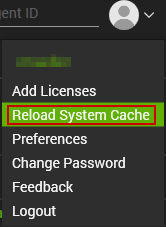

3. Navigate to Automation → Monitors → Internal Monitors and configure the following:
   - Find the [Internal Monitor - Active Directory - Sync Out of Date](/docs/18432358-9550-4ab9-959e-255196b0ebcf).
     - Assign the **`△ Custom - Autofix - AD Plugin Sync Out of Date`** alert template.

### Enabled Test Accounts

1. Import the following using the ProSync Plugin:
   - [Internal Monitor - Active Directory - Enabled Test Accounts](/docs/f1bc732b-7469-4689-aa3e-d0af5161ecc5)

2. Reload the System Cache:
   

3. Navigate to Automation → Monitors → Internal Monitors and configure the following:
   - Find the [Internal Monitor - Active Directory - Enabled Test Accounts](/docs/f1bc732b-7469-4689-aa3e-d0af5161ecc5).
     - Assign the **`△ Custom - Ticket Creation - Computer`** alert template.
     - OR
     - Assign the **`△ Custom - Email Creation - Computer`** alert template.

### PC Missing Automate

1. Import the following content from the ProSync Plugin:
   - [Internal Monitor - Domain Computers Missing Automate Agent](/docs/29eeae8f-d854-4234-82c5-28b1bbee0fc7)

2. Reload the System Cache:
   

3. Navigate to Automation → Monitors → Internal Monitors and configure the following:
   - Find the [Internal Monitor - Domain Computers Missing Automate Agent](/docs/29eeae8f-d854-4234-82c5-28b1bbee0fc7).
     - Assign the **`△ Custom - Ticket Creation - Client`** alert template.
     - If the partner requires an Email Creation - Client alert template, this will need to be built by development.
   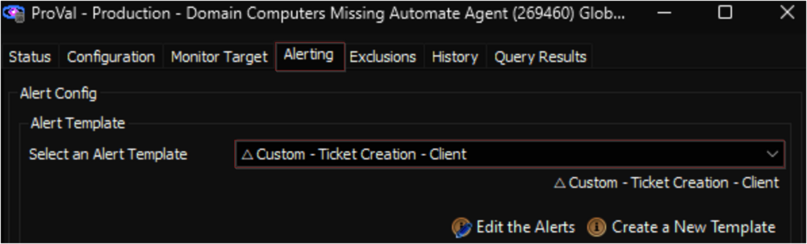

### ADPluginUser - Create

1. Import the following content using the ProSync Plugin:
   - [Internal Monitor - Active Directory - ADPluginUser - Create/Update](/docs/49c050b4-5319-4ffe-929a-d59429bdd3ba)
   - [Script - Active Directory - Plugin User Account - Create/Update](/docs/ea1aca74-77ee-4387-91f2-57adb5822737)
   - Alert Template - **`△ Custom - Autofix - AD Plugin User - Create/Update`**

2. Run the script against any online computer with **`Set Environment`** parameter set to **`1`**.
   - Set the required values for the rest of the user parameters. (This should be specified by the consultant).
   
   - *Note: There are default values for all the main parameters (Shown Below).*
   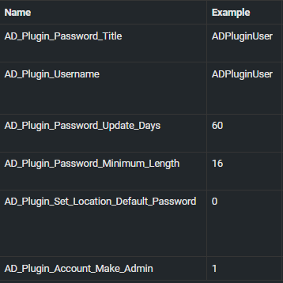

3. Validate the system property values within the System Dashboard.

### Last Login > X Days

1. Import the following monitor using the ProSync Plugin:
   - [Internal Monitor - Active Directory - User Last Logon > X Days](/docs/2a260035-6023-4b23-ad58-4dbc38d9c819)

2. Reload the System Cache:
   

3. Edit the monitor with the last login value specified by the consultant; if this has not been specified, then reach out to the consultant to clarify:
   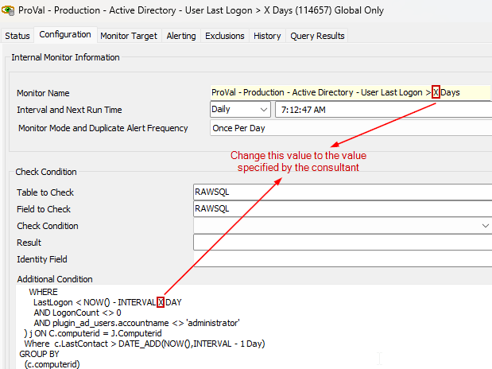

4. Navigate to Automation → Monitors → Internal Monitors and configure the following:
   - Find the [Internal Monitor - Active Directory - User Last Logon > X Days](/docs/2a260035-6023-4b23-ad58-4dbc38d9c819).
     - Assign the **`△ Custom - Ticket Creation - Computer`** alert template.
     - OR
     - Assign the **`△ Custom - Email Creation - Computer`** alert template.
   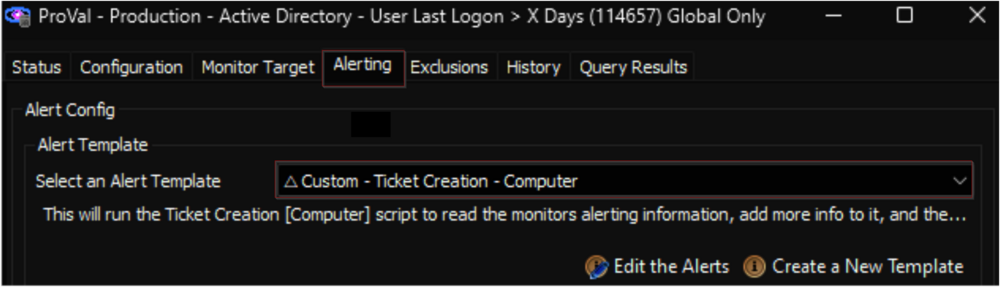

## Implementation (No Plugin)

The solutions presented in this section do not rely on any plugin.

### Group Policy Audit

1. Import the following content from the ProSync Plugin:
   - [Script - Group Policy - Audit](/docs/2e5f5f2b-7c81-4aec-a76a-623a465f959a)
   - [Dataview - Windows - Group Policy Objects](/docs/1da4d5e9-4168-4c21-94cf-9b52fc565bf7)
   - [Dataview - Windows - Group Policy Settings](/docs/ea24f672-d2cd-41bc-8b62-2dcd20085d29)
   - [Dataview - Windows - Group Policy Object Links](/docs/45a9f461-fac0-4e5c-9a5f-819786e8ad21)
   - [Dataview - Windows - Group Policy Object Security Filtering](/docs/337526eb-1aa7-48a3-beab-ab66d2b7aea8)
   - [Internal Monitor - GPO Modified](/docs/25040f3b-ef1d-4ebb-af45-e0df3d12ebae)
     - *Note: This is optional. Only import this if specifically requested.*

2. Reload the System Cache:
   

3. Schedule the [Script - Group Policy - Audit](/docs/2e5f5f2b-7c81-4aec-a76a-623a465f959a) to run once per day against the domain controllers group.
   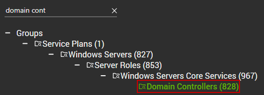
   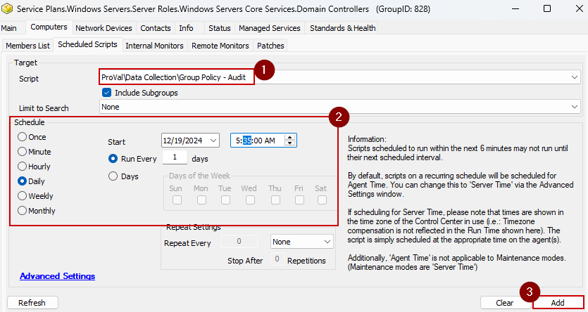

4. **Only perform this step if requested by the consultant:**
   - Navigate to Automation → Monitors → Internal Monitors and configure the following:
     - Find the [Internal Monitor - GPO Modified](/docs/25040f3b-ef1d-4ebb-af45-e0df3d12ebae).
       - Assign the **`△ Custom - Ticket Creation - Computer`** alert template.
       - OR
       - Assign the **`△ Custom - Email Creation - Computer`** alert template.
   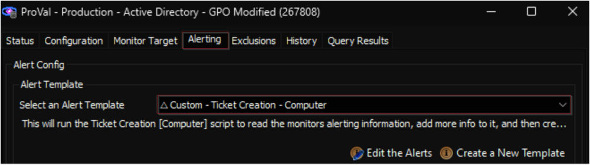

### Enable AD Recycle Bin

1. Import the following content from the ProSync Plugin:
   - [Script - AD - Enable AD Recycle Bin](/docs/e80d5873-304e-4b12-b52c-b608a7715a9f)
   - Alert Template - **`△ Custom - Execute Script - AD - Enable AD Recycle Bin`**

2. Import the [Role - AD Domain Recycle Bin Feature](/docs/01cb2977-8f3e-49fa-ad5b-62375c54a39c).

3. Import the [CWM - Automate - Remote Monitor - AD Recycle Bin State Check](/docs/5041d497-ae6c-4209-a338-60f1da396106) using the following instructions outlined here: [Import - Remote Monitor - AD Recycle Bin State Check](/docs/5041d497-ae6c-4209-a338-60f1da396106).

4. Reload the System Cache:
   

5. Locate the [EPM - User Management - Remote Monitor - Reset AD Users Password Age](/docs/d0774dcc-9a7f-4f9a-9719-096e90309e2d) remote monitor.
   - By opening the **`Domain Controllers`** group.
     - Apply the **`△ Custom - Execute Script - AD - Enable AD Recycle Bin`** alert template to the group monitor.

### Replication Anomaly

1. Import the [Remote Monitor - Active Directory Replication Anomaly Monitoring](/docs/c02b447f-36ba-4a88-b40f-a47cf08fb690) using the following instructions outlined here: [Implement - Remote Monitor - Active Directory Replication Anomaly Monitoring](/docs/c02b447f-36ba-4a88-b40f-a47cf08fb690).

2. Reload the System Cache:
   

3. Locate the [RSM - Active Directory - Remote Monitor - Active Directory Replication Anomaly Monitoring](/docs/c02b447f-36ba-4a88-b40f-a47cf08fb690) remote monitor.
   - By opening the **`Domain Controllers`** group.
     - Apply the **`△ Custom - Ticket Creation Computer - Failures Only`** alert template to the group monitor.
     - OR
     - Apply the **`△ Custom - Email Creation Computer - Failures Only`** alert template to the group monitor.

### New Domain Admin

1. Remove the existing **`ProVal - Production - New Domain Admin`** monitor set from the groups it's already applied to.
   - Execute this SQL query from a RAWSQL monitor set to get rid of the existing monitors:
     ```sql
     Delete From Groupagents where `Name` = 'ProVal - Production - New Domain Admin'
     ```

2. Open the **`Server Status`** tool by navigating to **`Help`** → **`Server Status`**.
   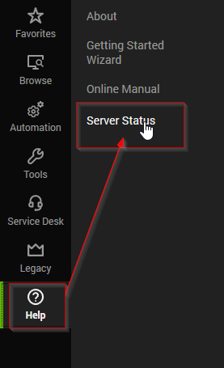

3. Click the **`Do Group Refresh`** button to refresh and apply the changes made.
   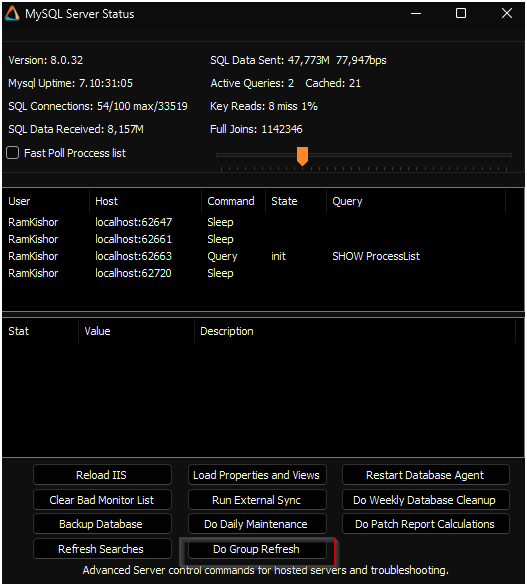

4. Click **`OK`** to the popup message and wait for a minute to allow the changes to take effect.
   

5. Import the following script from the ProSync Plugin:
   - [Script - New Domain Admin Monitor - Create](/docs/73adabc6-03cb-4979-9c62-97acc98308da)

6. **Run/Debug the Script**
   - Execute or debug the script against a single client, with the **`Set_Environment`** parameter set to **`1`**. This action will generate the necessary system properties and Extra Data Fields (EDFs) for managing the remote monitors.
   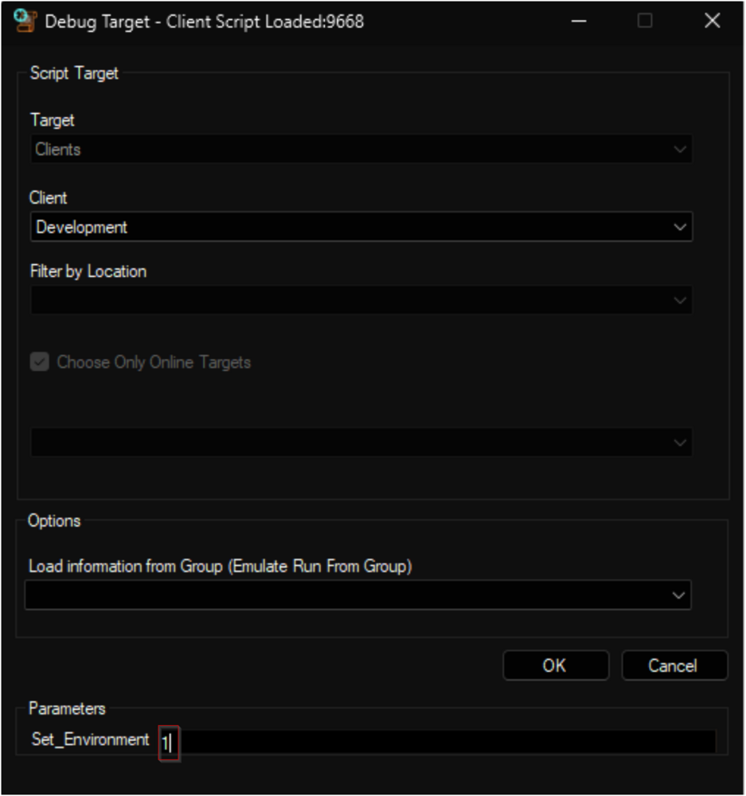
   

7. Reload System Cache.
   

8. Configure System Properties and EDFs.
   - Navigate to the **System Dashboard → Config → Configurations → Properties**.
   - Find the properties beginning with **`NDA_Monitoring`**.
   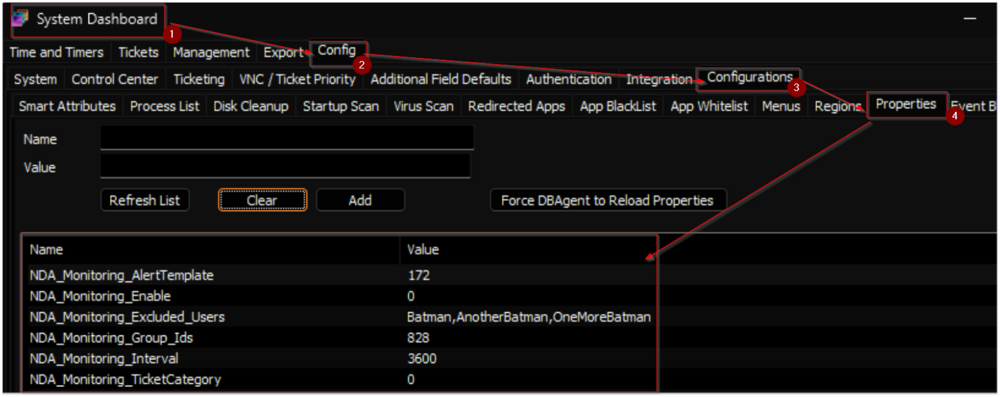
     - The consultant should have provided you with any customizations that are required. Please read through the detailed System Properties and EDF explanations to understand how to configure any customizations. You can find that [here](/docs/73adabc6-03cb-4979-9c62-97acc98308da).

9. Schedule the Script.
   - Schedule the script to run once per day, preferably around midnight, from the dashboard for optimal results.
   

### Domain Admin Lockout

1. Import the [Remote Monitor - Domain Admin Account Lockout](/docs/a24b00c5-49d4-4a2b-9090-a2716b56cf47) using the following implementation instructions:
   - [Implement - Remote Monitor - Domain Admin Account Lockout](/docs/a24b00c5-49d4-4a2b-9090-a2716b56cf47).

2. **_If the partner does not have any PSA integration_**, then navigate to the Domain Controllers group:
   
   - Then adjust the alert template for this monitor to be:
     - Alert Template - **`△ Custom - Email Creation Computer - Failures Only`**
   - Otherwise, ensure the alert template is set to the following:
     - Alert Template - **`△ Custom - Ticket Creation Computer - Failures Only`**


