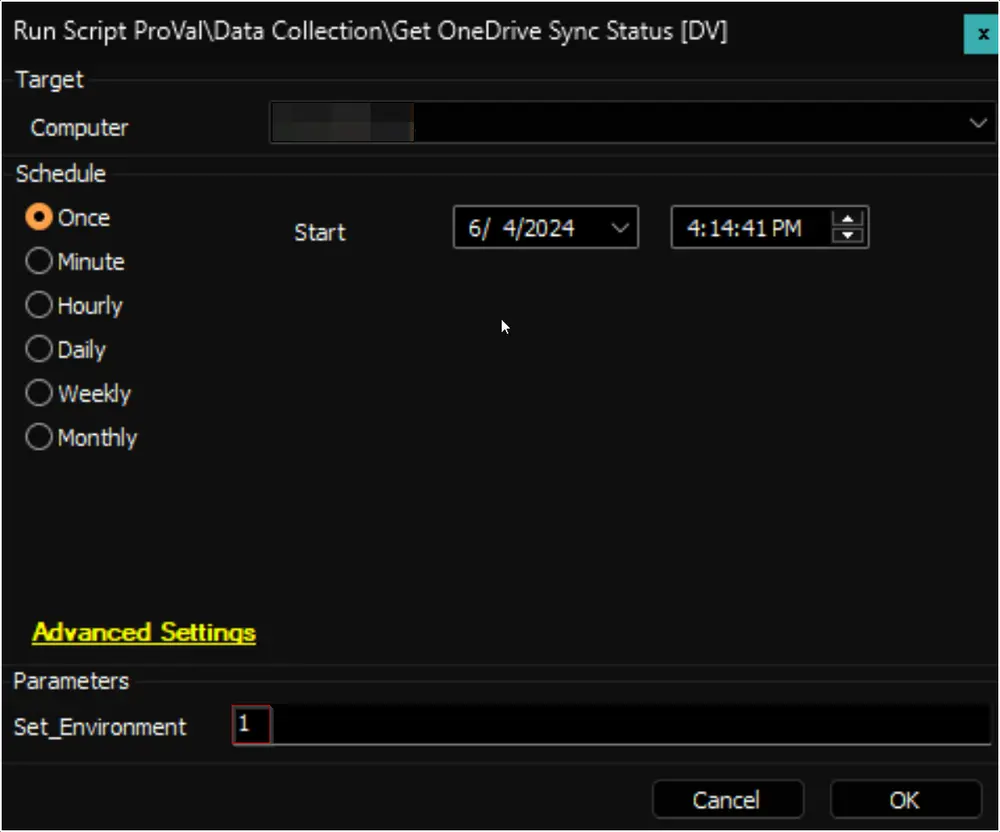

## Purpose

The solution aims to retrieve and display the OneDrive Sync Status using the [Get-ODStatus.ps1](https://github.com/rodneyviana/ODSyncUtil/blob/master/ODSyncUtil/Get-ODStatus.ps1) script.

## Associated Content

#### Auditing

| Content                                                                                         | Type          | Function                                         |
|-------------------------------------------------------------------------------------------------|---------------|--------------------------------------------------|
| [Script - Get OneDrive Sync Status [DV]](/docs/ed03ad47-d4f8-4917-8ecc-0505b6172ece)      | Script        | The script fetches the data.                     |
| [pvl_odsync_status](/docs/e7a826db-104c-4ebb-877f-b44e138067f9)                                      | Custom Table  | The custom table stores the data.                |
| [Dataview - OneDrive Sync Status [Script]](/docs/61160125-8794-4e01-ba0a-3bf4ec81077e)   | Dataview      | The dataview displays the data.                  |
| [Internal Monitor - Execute Script - Get OneDrive Sync Status [DV]](/docs/5728c22a-c1bb-4494-b300-c1a8c12e7165) | Internal Monitor | The internal monitor detects the relevant computers. |
| Alert Template - △ Custom - Execute Script - Get OneDrive Sync Status [DV]                    | Alert Template | The alert template executes the script.          |

#### Alerting

| Content                                                                                                      | Type            | Function                                         |
|--------------------------------------------------------------------------------------------------------------|-----------------|--------------------------------------------------|
| [Internal Monitor - ProVal - Production - OneDrive Sync Failures](/docs/8437ea68-5f49-4e76-ba19-52001cd178ef) | Internal Monitor | Detects the problematic machines.                 |
| [Script - Ticket Creation - Computer](/docs/63beba3c-f4a6-41a5-98e2-d4e4ce885035)                       | Autofix Script  | Manages ticketing.                               |
| △ Custom - Ticket Creation - Computer                                                                         | Alert Template   | Executes the script against the computers detected by the Internal Monitor. |

## Implementation

### 1.
**Remove the following** items if they exist (This is the old solution):
- [Script - Microsoft OneDrive Sync Status [DV]](/docs/11c05d45-a0fb-4cfb-b388-cdc59362d9a1)  
  - _If you get an error stating the script is running_, navigate to the System Dashboard --> Management --> Scripts --> Remove this script from that list by right-clicking and selecting 'Kill Script'
    - Then proceed to delete the script
- Dataview - Microsoft OneDrive Sync Status [Script]
- [Internal Monitor - OneDrive Sync Status Issue](/docs/e54f4273-60a6-4790-bb8e-8c0a3d2033d5)
- [Internal Monitor - Execute Script - Microsoft OneDrive Sync Status](/docs/b7936e96-423d-4c53-bd95-d10a6c4861f1)  
- Alert Template - `△ CUSTOM - Execute Script - Microsoft OneDrive Sync Status`

### 2.
**Import the following** content using the ProSync Plugin:
- [Script - Get OneDrive Sync Status [DV]](/docs/ed03ad47-d4f8-4917-8ecc-0505b6172ece)  
- [Dataview - OneDrive Sync Status [Script]](/docs/61160125-8794-4e01-ba0a-3bf4ec81077e)  
- [Internal Monitor - Execute Script - Get OneDrive Sync Status [DV]](/docs/5728c22a-c1bb-4494-b300-c1a8c12e7165)  
- △ Custom - Execute Script - Get OneDrive Sync Status [DV]

### 3.
Reload the system cache:  

### 4.
Run the script against any online Windows machine with the `Set_Environment` parameter set to `1` to create the custom table [pvl_odsync_status](/docs/e7a826db-104c-4ebb-877f-b44e138067f9).  

### 5.
Configure the solution as outlined below:
- Navigate to Automation --> Monitors within the CWA Control Center and set up the following:
  - [Internal Monitor - Execute Script - Get OneDrive Sync Status [DV]](/docs/5728c22a-c1bb-4494-b300-c1a8c12e7165)  
    - Alert Template: `△ Custom - Execute Script - Get OneDrive Sync Status [DV]`
    - Right-click and Run Now to start the monitor

#### Optional Alerting

The following steps to import and implement the Alerting section should only be performed if the partner chooses to opt-in.

### 1.
**Import/Update the following** content using the ProSync Plugin:
- [Internal Monitor - ProVal - Production - OneDrive Sync Failures](/docs/8437ea68-5f49-4e76-ba19-52001cd178ef)  
- [Script - Get OneDrive Sync Status [DV]](/docs/ed03ad47-d4f8-4917-8ecc-0505b6172ece)  
- Alert Template - △ Custom - Ticket Creation - Computer

### 2.
Reload the system cache:  

### 3.
Configure the solution as outlined below:
- Navigate to Automation --> Monitors within the CWA Control Center and set up the following:
  - [Internal Monitor - ProVal - Production - OneDrive Sync Failures](/docs/8437ea68-5f49-4e76-ba19-52001cd178ef)  
    - Alert Template: `△ Custom - Ticket Creation - Computer`
    - Right-click and Run Now to start the monitor