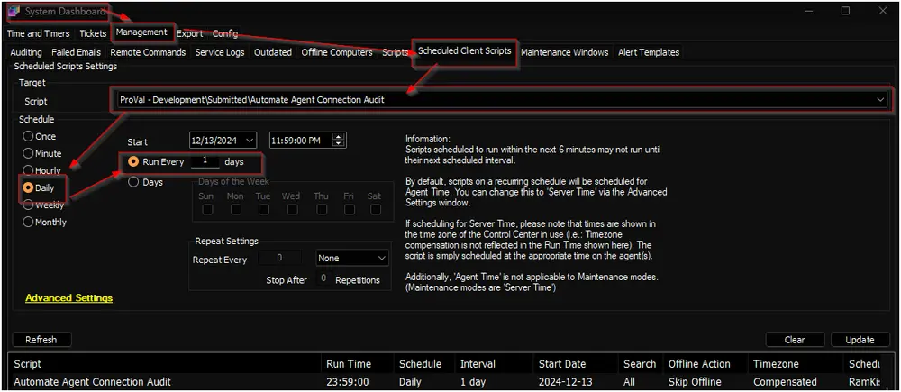

## Purpose

The solution is intended to monitor and display the duration machines were online versus offline in Automate over the past 30 days. The dataview will begin presenting useful information at least 48 hours after the script is scheduled.

## Associated Content

| Content | Type | Function |
| ------- | ---- | -------- |
| [Automate Agent Connection Audit](/docs/ef69cef8-da15-46b7-94a4-697431a87929) | Script | Creates custom tables and keeps the [pvl_automate_connection_audit_daily](/docs/da608773-1677-4247-a161-ea62b3b3ba23) table updated. |
| [Update Table - pvl_automate_connection_audit](/docs/6dfa2f6b-02bb-4ccb-b69f-e23bc8d75b5d) | Internal Monitor | Keeps the [pvl_automate_connection_audit](/docs/ec679801-c86a-4127-9b62-46be10207909) table updated. |
| [Automate Agent Connection Audit](/docs/1c5558e1-70a3-4b38-bdc0-e3eb8cf29d43) | Dataview | Displays the information. |

### Other Content

| Content | Type | Function |
| ------- | ---- | -------- |
| [pvl_automate_connection_audit](/docs/ec679801-c86a-4127-9b62-46be10207909) | Custom Table | Records the computer’s last contact time whenever its state changes. |
| [pvl_automate_connection_audit_daily](/docs/da608773-1677-4247-a161-ea62b3b3ba23) | Custom Table | Records the amount of time, in minutes, that each computer was offline and online over the past 24 hours, using data from the [pvl_automate_connection_audit](/docs/ec679801-c86a-4127-9b62-46be10207909) custom table. |

## Implementation

1. Import the following content using the ProSync Plugin:
   - [Script - Automate Agent Connection Audit](/docs/ef69cef8-da15-46b7-94a4-697431a87929)
   - [Internal Monitor - Update Table - pvl_automate_connection_audit](/docs/6dfa2f6b-02bb-4ccb-b69f-e23bc8d75b5d)
   - [Dataview - Automate Agent Connection Audit](/docs/1c5558e1-70a3-4b38-bdc0-e3eb8cf29d43)

2. Reload the system cache:
   

3. Debug the script against any random client to import the custom tables.

4. Schedule the script to run once per day around midnight:
   

5. Configure the solution as outlined below:
   - Navigate to Automation → Monitors within the CWA Control Center and set up the following:
     - [Internal Monitor - Update Table - pvl_automate_connection_audit](/docs/6dfa2f6b-02bb-4ccb-b69f-e23bc8d75b5d)
       - Right-click and Run Now to start the monitor.

## FAQ

**Q1: Why are the `- 7 Days` and `- 30 Days` columns not accurate immediately?**  
**A1:** The `- 7 Days` and `- 30 Days` columns will only be accurate once the `Days Since Data Collection` reaches 7 and 30 days, respectively. Until then, calculations are based on the available data in the `pvl_automate_connection_audit_daily` table.

**Q2: Why does the online or offline time sometimes appear greater than the total data collection time?**  
**A2:** The `Days Since Data Collection` column may not be precise, with a possible variance of up to ±23 hours from the actual data saved time. It shows rounded-off information. As a result, it is normal for the `Online - 30 Days` or other columns to display `6 days 23 hours 39 minutes` while the `Days Since Data Collection` column shows `6 days`.