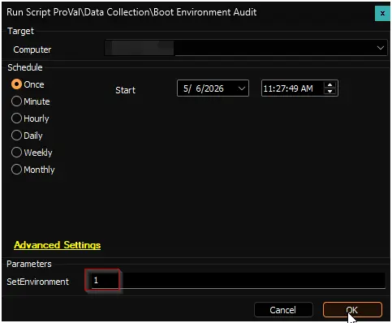

## Purpose

The goal of this solution is to audit the boot environment and security posture of Windows Workstations and Servers—collecting data on Secure Boot status, UEFI CA 2023 certificate enrollment, BIOS firmware readiness, pending OEM driver updates, cumulative update compliance, boot configuration anomalies, and telemetry settings—and store the results in a custom table for fleet-wide reporting and compliance tracking.

## Associated Content

### Scripts

| Content | Type | Function |
| ------- | ---- | -------- |
| [Boot Environment Audit](/docs/8203c614-47e4-11f1-b8be-92000234cfc2) | Script | Runs the audit against each device, collects all boot environment data, and stores the results in the custom table. |
| [OverFlowedVariable - SQL Insert - Execute](/docs/34cee8fe-1b6b-4558-a890-2face427ceb8) | Script | Helper script used to handle and insert overflowed data into the custom database table. |

### Monitor

| Content | Type | Function |
| ------- | ---- | -------- |
| [Execute Script - Boot Environment Audit](/docs/abf814c3-a689-46db-990f-cbb4342f6be0) | Internal Monitor | Executes the audit script once per week against all Windows Workstations and Servers. |

### Alert Template

| Content | Type | Function |
| ------- | ---- | -------- |
| `△ Custom - Execute Script - Boot Environment Audit` | Alert Template | Executes the [Boot Environment Audit](/docs/8203c614-47e4-11f1-b8be-92000234cfc2) script against the machines detected by the internal monitor. |

### Data and Reporting

| Content | Type | Function |
| ------- | ---- | -------- |
| [pvl_boot_environment_details](/docs/7b36b35a-51ab-4a6d-b129-f1057ef349b9) | Custom Table | Stores the boot environment audit data collected from each device. |
| [Boot Environment Audit](/docs/6dae1649-e241-4259-8df9-c19f3a08033a) | Dataview | Displays the boot environment audit results for fleet-wide review and compliance reporting. |

### Addition Content

| Content | Type | Function |
| ------- | ---- | -------- |
| [Remediate SecureBootCompliance2026](/docs/844a8efb-1f97-437f-add1-f15d0c623f00) | Script | This script uses the agnostic script [Agnostic Script - Remediate SecureBootCompliance2026](/docs/062c5b72-32b5-4fdb-b48c-5f45a19af42c) to run the Automate implementation of the PS1 on the Windows 2026 agents, so that it can remediate UEFI Secure Boot compliance for Windows 2026 by ensuring systems have the required 2023 UEFI certificates (KEK and DB), enabling Microsoft-managed certificate updates, and reporting the remediation status. It validates Secure Boot, configures registry keys for automatic updates, monitors servicing status, and logs results.|

## Implementation

1. Import the associated scripts, internal monitor, dataview, and alert template from the ProSync plugin.

2. Execute the [Boot Environment Audit](/docs/8203c614-47e4-11f1-b8be-92000234cfc2) script on any online Windows device with the `SetEnvironment` parameter set to `1`. This creates the required [pvl_boot_environment_details](/docs/7b36b35a-51ab-4a6d-b129-f1057ef349b9) custom table.  
    

3. Reload the system cache (**Ctrl + R**) and verify the custom table was created successfully.

4. Configure the solution as follows:
   - Navigate to `Automation` → `Monitors` within the CWA Control Center and set up the following:
     - [Execute Script - Boot Environment Audit](/docs/abf814c3-a689-46db-990f-cbb4342f6be0)
       - Configure with the alert template: `△ Custom - Execute Script - Boot Environment Audit`
       - Right-click and **Run Now** to start the monitor.

5. For additional remediation script, feel free to schedule it to the Windows Server 2026 group once a month.

## Changelog

### 2026-06-19

- Added the remediation for the secure boot compliance in it, as it can change the audit data and is completely related to this solution.

### 2026-05-06

- Initial version of the document.
- Deprecated content:
  - Solution: Windows Secure boot Audit
  - Role: Windows Secure Boot
  - Role: Windows Telemetry
  - Role: Windows DB Certificate
  - Role: Windows KEK Certificate
  - Dataview: Windows Secure Boot Audit [Role]
