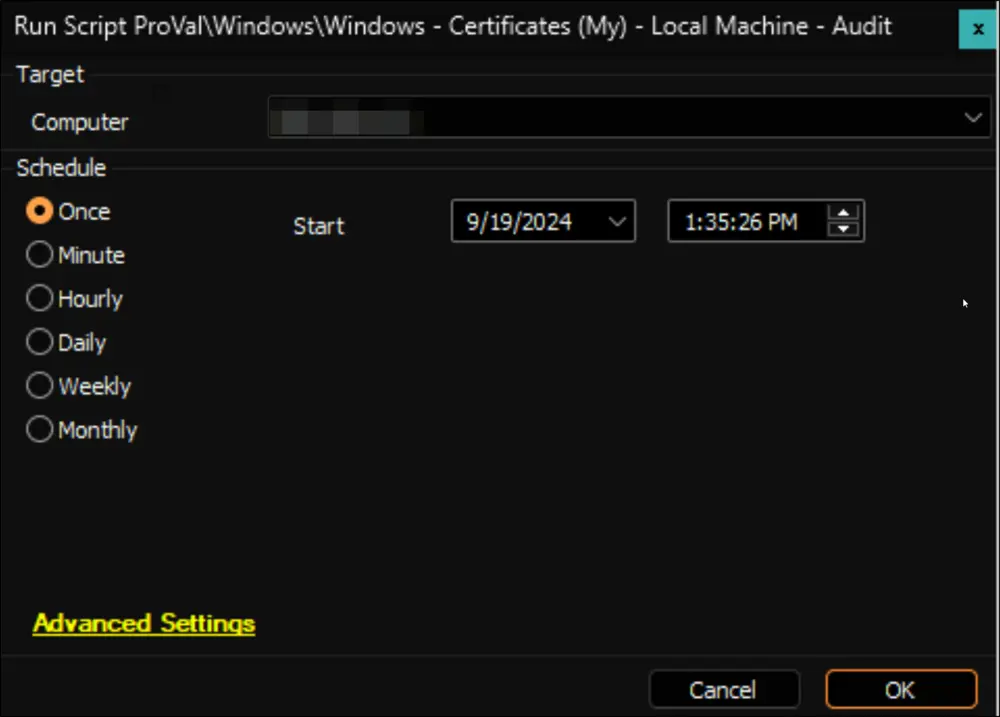

## Purpose

The purpose of this solution is to pull meaningful certificate information into Automate to be monitored, reported on, or stored for periodic checkups in a dataview.

## Update Notice 19-Sept-2024

**New Content:**
- Internal Monitor: [ProVal - Production - Local Machine Certificate Audit](/docs/48737f29-accd-41ac-a35d-047d7e266e6f)
- Alert Template: △ Custom - Local Machine Certificate Audit

**Modified Content:**
- Script: [Windows - Certificates (My) - Local Machine - Audit](/docs/7d13a122-8d62-4c50-b19f-922e6bb37a13)
- Dataview: [SSL Certificate Audit [Script]](/docs/8cca4422-d71b-4696-b5d8-8cbc51158b3d)
- Internal Monitor: [ProVal - Production - Certificate Expiration < 30 Days](/docs/a7dad4d0-d2dc-44b2-972b-0893d7814f8c)

**Modifications:**
- The [Windows - Certificates (My) - Local Machine - Audit](/docs/7d13a122-8d62-4c50-b19f-922e6bb37a13) script has been modified to use the Shell function instead of the `Execute PowerShell` function, as Threatlocker was flagging it.
- With the introduction of the [ProVal - Production - Local Machine Certificate Audit](/docs/48737f29-accd-41ac-a35d-047d7e266e6f) internal monitor, the [Windows - Certificates (My) - Local Machine - Audit](/docs/7d13a122-8d62-4c50-b19f-922e6bb37a13) script no longer needs to be scheduled against the group.

**Note:**
- It is suggested to use the [Local Machine Certificate Audit](/docs/48737f29-accd-41ac-a35d-047d7e266e6f) internal monitor to execute the script instead of scheduling it against groups.

## Associated Content

### Auditing

| Content | Type | Function |
|---------|------|----------|
| [Certificates (My) - Local Machine - Audit](/docs/7d13a122-8d62-4c50-b19f-922e6bb37a13) | Script | Gathers, sorts, and imports SSL certificate information into a custom table in the database. |
| [plugin_proval_certs](/docs/44048760-bd04-451d-82ea-b6eee6a03552) | Custom Table | Custom table created to hold SSL certificate information. |
| [Local Machine Certificate Audit](/docs/48737f29-accd-41ac-a35d-047d7e266e6f) | Internal Monitor | Detects computers where [Certificates (My) - Local Machine - Audit](/docs/7d13a122-8d62-4c50-b19f-922e6bb37a13) has not been executed in the past 7 days. |
| △ Custom - Local Machine Certificate Audit | Alert Template | Executes the [Certificates (My) - Local Machine - Audit](/docs/7d13a122-8d62-4c50-b19f-922e6bb37a13) script against the computers detected by the [Local Machine Certificate Audit](/docs/48737f29-accd-41ac-a35d-047d7e266e6f) internal monitor. |
| [SSL Certificate Audit](/docs/8cca4422-d71b-4696-b5d8-8cbc51158b3d) | Dataview | Displays a comprehensive list of all certificates found with expiration status. |

### Alerting

| Content | Type | Function |
|---------|------|----------|
| [Certificate Expiration < 30 Days](/docs/a7dad4d0-d2dc-44b2-972b-0893d7814f8c) | Internal Monitor | This monitor checks the [plugin_proval_certs](/docs/44048760-bd04-451d-82ea-b6eee6a03552) table for any SSL certificates that have an expiration date of less than 30 days. |
| [Ticket Creation - Computer](/docs/63beba3c-f4a6-41a5-98e2-d4e4ce885035) | Script | Creates a ticket using the alerting information from the monitor and adds more detailed information to the ticket. |
| △ Custom - Ticket Creation - Computer | Alert Template | Executes the [Ticket Creation - Computer](/docs/63beba3c-f4a6-41a5-98e2-d4e4ce885035) script. |

## Implementation

1. Import/Update the following content using the `Prosync` plugin:  
   **For Auditing Only:**
   - [Script - Certificates (My) - Local Machine - Audit](/docs/7d13a122-8d62-4c50-b19f-922e6bb37a13)
   - [Internal Monitor - Local Machine Certificate Audit](/docs/48737f29-accd-41ac-a35d-047d7e266e6f)
   - [Dataview - SSL Certificate Audit](/docs/8cca4422-d71b-4696-b5d8-8cbc51158b3d)
   - Alert Template - △ Custom - Local Machine Certificate Audit

   **For Alerting:**
   - [Internal Monitor - Certificate Expiration < 30 Days](/docs/a7dad4d0-d2dc-44b2-972b-0893d7814f8c)
   - [Script - Ticket Creation - Computer](/docs/63beba3c-f4a6-41a5-98e2-d4e4ce885035)
   - Alert Template - △ Custom - Ticket Creation - Computer

2. Reload the system cache:  
   

3. Execute the [Certificates (My) - Local Machine - Audit](/docs/7d13a122-8d62-4c50-b19f-922e6bb37a13) script against any online Windows computer to create the [plugin_proval_certs](/docs/44048760-bd04-451d-82ea-b6eee6a03552) custom table.  
   

4. Skip this step for new implementations.  
   Run this SQL query from a RAWSQL monitor set to remove the script's schedule:  
   ```sql
   DELETE FROM groupscripts WHERE scriptid = (SELECT scriptid FROM lt_scripts WHERE scriptGUID = '4f7fd3ff-3732-11e9-b7e5-005056a614c6')
   ```

5. Configure the auditing solution as outlined below:  
   Navigate to Automation → Monitors within the CWA Control Center and set up the following:
   - [Internal Monitor - Local Machine Certificate Audit](/docs/48737f29-accd-41ac-a35d-047d7e266e6f)  
     - `Alert Template: △ Custom - Local Machine Certificate Audit`
     - The monitor should target the following groups:
       - Service Plans.Windows Servers.Server Roles.Windows Messaging Servers
       - Service Plans.Windows Servers.Server Roles.Windows Remote Access Servers
       - Service Plans.Windows Servers.Server Roles.Windows Web/Proxy Servers
       - Service Plans.Windows Servers.Server Roles.Windows Database Servers
       - Service Plans.Windows Servers.Server Roles.MSP Specific Servers  
       
     - Right-click and select "Run Now" to start the monitor.

### If Requested

6. Please ensure that the alerting solution is implemented only after the consultant has confirmed it.  
   Configure the alerting solution as outlined below:  
   Navigate to Automation → Monitors within the CWA Control Center and set up the following:
   - [Internal Monitor - Certificate Expiration < 30 Days](/docs/a7dad4d0-d2dc-44b2-972b-0893d7814f8c)  
     - `Alert Template: △ Custom - Ticket Creation - Computer`
     - Right-click and select "Run Now" to start the monitor.
