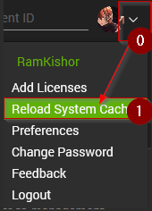

---
id: '00b52ce7-d496-4d30-9123-09ae8233fd77'
slug: /00b52ce7-d496-4d30-9123-09ae8233fd77
title: 'Configure BGInfo'
title_meta: 'Configure BGInfo'
keywords: ['bginfo', 'configuration', 'download', 'tool', 'script']
description: 'The solution outlines the process of configuring the BGInfo application on Windows machines using CW Automate.'
tags: ['windows']
draft: false
unlisted: false
--- 

## Purpose

The solution outlines the process of configuring the BGInfo application on Windows machines using CW Automate.

## Associated Content

| Content                                                        | Type           | Description                                                                                                                                                                                                       |
| -------------------------------------------------------------- | -------------- | ----------------------------------------------------------------------------------------------------------------------------------------------------------------------------------------------------------------- |
| [Configure BGInfo](/docs/405866fb-2706-49b3-aed2-3d1f1fea4b4b) | Script         | This script downloads and configures the [BGInfo](https://learn.microsoft.com/en-us/sysinternals/downloads/bginfo) tool with the appropriate `.bgi` configuration file.                                           |
| [Configure BGInfo](/docs/91b463bf-7bb2-4c79-98ca-ef556ea093b0) | Remote Monitor | This remote monitor identifies computers where `BGInfo` is not deployed, meaning the `BGInfo` application is not configured to run at startup.                                                                    |
| △ Custom - Execute Script - Configure BGInfo                   | Alert Template | This alert template executes the [Configure BGInfo](/docs/405866fb-2706-49b3-aed2-3d1f1fea4b4b) script on machines detected by the [Configure BGInfo](/docs/91b463bf-7bb2-4c79-98ca-ef556ea093b0) remote monitor. |

## Implementation

### Step 1:
Import the following content using the `ProSync` plugin:

- [Script - Configure BGInfo](/docs/405866fb-2706-49b3-aed2-3d1f1fea4b4b)
- Alert Template - △ Custom - Execute Script - Configure BGInfo

### Step 2:
Download and configure the [BGInfo](https://download.sysinternals.com/files/BGInfo.zip) tool as detailed in the [Implementation section of the script's document](/docs/405866fb-2706-49b3-aed2-3d1f1fea4b4b#implementation).

### Step 3:
Reload the system cache to ensure all changes are applied.  

### Step 4:
Execute the [Configure BGInfo](/docs/405866fb-2706-49b3-aed2-3d1f1fea4b4b) script on a few online Windows computers to verify its functionality.

### Step 5:
Implement the remote monitor as described in the [Implementation Steps section of the remote monitor's document](/docs/91b463bf-7bb2-4c79-98ca-ef556ea093b0#implementation-steps).
