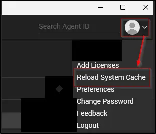
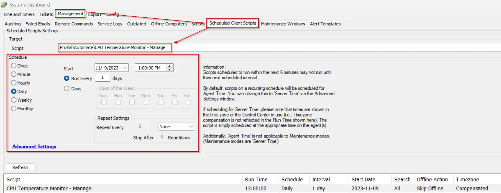

## Purpose

The goal of this solution is to monitor the CPU temperature of physical Windows machines using the [Libre Hardware Monitor](https://github.com/LibreHardwareMonitor/LibreHardwareMonitor).

Recently, the underlying LibreHardwareMonitor tool migrated its hardware access driver from Winring0 to PawnIO. Because PawnIO does not support legacy operating systems, this monitoring solution has been updated to exclude older versions of Windows.

**Currently Supported Operating Systems:**

- Windows 10 (Version 1809 / Build 17763) and newer
- Windows 11 (All versions)
- Windows Server 2019
- Windows Server 2022
- Windows Server 2025

## Associated Content

### Script

| Content | Type | Function |
|---------|------|----------|
| [CPU Temperature Monitor - Create](/docs/7519f655-224b-4c95-b716-773f59cb7314) | Script | Create and configure the remote monitor on the end machine. |
| [CPU Temperature Monitor - Manage](/docs/56c1260c-a689-45e9-a226-49bf31444750) | Client Script | Manages and maintains the remote monitors created on the end machines. |

### Monitor

| Content | Type | Function |
|---------|------|----------|
| [Execute Script - CPU Temperature Monitor - Create](/docs/7519f655-224b-4c95-b716-773f59cb7314) | Internal Monitor | Executes the above script against the concerned physical Windows machines. |
| [CPU Temperature Monitoring Process](/docs/84d6587b-2bca-4f0e-9176-c0df064f532c) | Remote Monitor | Performs the monitoring. |

### Alert Template

| Content | Type | Function |
|---------|------|----------|
| △ CUSTOM - Execute Script - CPU Temperature Monitor - Create | Alert Template | Executes the above script against the machines detected by the internal monitor. |

## Implementation

1. Import the [CPU Temperature Monitor - Create](/docs/7519f655-224b-4c95-b716-773f59cb7314) script from the ProSync plugin.

2. Import the [CPU Temperature Monitor - Manage](/docs/56c1260c-a689-45e9-a226-49bf31444750) script from the ProSync plugin.

3. Import the [Execute Script - CPU Temperature Monitor - Create](/docs/7519f655-224b-4c95-b716-773f59cb7314) internal monitor from the ProSync plugin.

4. Import the alert template named `△ CUSTOM - Execute Script - CPU Temperature Monitor - Create` from the ProSync plugin.

5. Execute the [`CPU Temperature Monitor - Create`](/docs/7519f655-224b-4c95-b716-773f59cb7314) script on any online Windows computer. Make sure to set the ‘`Set_Environment`’ parameter to `1`. This will create the EDFs and system properties.  
   

6. Reload the system cache and verify the existence of the EDFs and the system property as detailed in the [script](/docs/7519f655-224b-4c95-b716-773f59cb7314) documentation.  
   

7. Adjust the values in the system properties (or the EDFs) as needed.

8. Run the [CPU Temperature Monitor - Create](/docs/7519f655-224b-4c95-b716-773f59cb7314) script on a physical Windows machine. Check the configuration and operation of the remote monitor created by the script.

9. Configure the solution as follows:
   - Navigate to Automation --> Monitors within the CWA Control Center and set up the following:
     - [Execute Script - CPU Temperature Monitor - Create](/docs/7519f655-224b-4c95-b716-773f59cb7314)
       - Configure with the alert template: `△ CUSTOM - Execute Script - CPU Temperature Monitor - Create`
       - Right-click and Run Now to start the monitor
   - Schedule the [CPU Temperature Monitor - Manage](/docs/56c1260c-a689-45e9-a226-49bf31444750) script to run daily.  
     

## Updating Existing Deployments

If this solution was deployed in your environment before 2026-04-02 and you are now upgrading to the updated `CPUTempMon.exe` file and associated scripts, make sure those updated components are pushed back out to all applicable machines.

The recommended method is to make a small change to the `CPUTempMon_Interval_Seconds` system property and then run the [CPU Temperature Monitor - Manage](/docs/56c1260c-a689-45e9-a226-49bf31444750) script. For example, if the current value is `300`, change it to `310` and then execute the Manage script. The Manage script will detect that the existing monitor-set configuration no longer matches the configured values and will automatically run the [CPU Temperature Monitor - Create](/docs/7519f655-224b-4c95-b716-773f59cb7314) script against the affected machines, forcing the monitor set to be recreated and redeploying the updated files.

If a partner is using the [_Automation Directory - Remove Obsolete .ps1 [Change]](/docs/e2c56554-7f1d-4f1a-b1a2-37a0bd343629) remote monitor, verify that it is up to date and that its exclusions properly account for `CPUTempMon` so the deployed files are not removed unintentionally.

## FAQ

**Q:** Is it accurate to state that tickets generated by the remote monitor are automatically closed upon the resolution of the identified issue?  

**A:** Affirmative, tickets are configured to be automatically closed subsequent to the resolution of the associated issue. However, it's important to note that if there are any modifications to the monitor set's configuration during the interval between the generation of the ticket and the resolution of the issue, the auto-closure of tickets will not be executed.

**Q:** What types of machines should this solution be applied to?  

**A:** This solution is intended for physical Windows machines. The remote monitor is designed with physical Windows endpoints in mind, and the Create script should be used to deploy the monitor set only where CPU temperature monitoring is relevant and supported.

**Q:** What happens if direct hardware temperature readings are blocked by the device manufacturer or BIOS?  

**A:** `CPUTempMon` first attempts to read sensors through Libre Hardware Monitor. If that direct method is blocked, it falls back to WMI thermal-zone readings. If both methods are unavailable on the endpoint, the tool returns an empty sensor list instead of failing.

**Q:** Does `CPUTempMon` require administrative privileges?  

**A:** Yes. `CPUTempMon` should be run with Administrator privileges. Without elevation, the utility may return empty sensor arrays because access to hardware sensors and WMI thermal data can be restricted.

**Q:** When should the [CPU Temperature Monitor - Manage](/docs/56c1260c-a689-45e9-a226-49bf31444750) script be used after initial deployment?  

**A:** The Manage script should be scheduled to run daily and can also be used whenever configuration values are changed in system properties or EDFs. If it detects that an installed monitor set differs from the configured values, it will trigger the [CPU Temperature Monitor - Create](/docs/7519f655-224b-4c95-b716-773f59cb7314) script to rebuild the monitor set with the correct configuration.

**Q:** Why did the CPU Temperature Monitor stop working or deploying on older machines like Windows 7, Windows 8, or Windows Server 2016?  

**A:** The underlying LibreHardwareMonitor tool recently migrated to a new hardware access driver (PawnIO) that does not support legacy operating systems. As a result, the solution now explicitly requires Windows 10 (Build 17763) or Windows Server 2019 and newer to function.

**Q:** Do I need to manually remove the monitor from older, unsupported operating systems?  

**A:** No manual cleanup is required. The updated [CPU Temperature Monitor - Manage](/docs/56c1260c-a689-45e9-a226-49bf31444750) script is designed to automatically detect unsupported legacy operating systems and will safely remove the deployed files and monitoring components from them during its regular daily run.

## Changelog

### 2026-06-05

- Modified scripts and monitor targeting logic to exclude legacy operating systems, enforcing a minimum requirement of Windows 10 (Build 17763) or Windows Server 2019.

### 2026-04-02

- Modified and hosted the `CPUTempMon.exe` tool on our file server.
- Code signed the tool.
- Code signed the PowerShell scripts used in solution.
- Added rollout guidance for updating existing deployments.
- Expanded the FAQ section.

### 2025-04-10

- Initial version of the document
