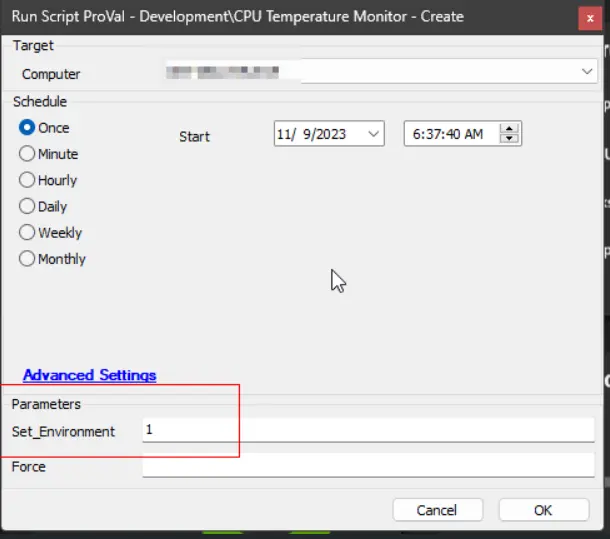
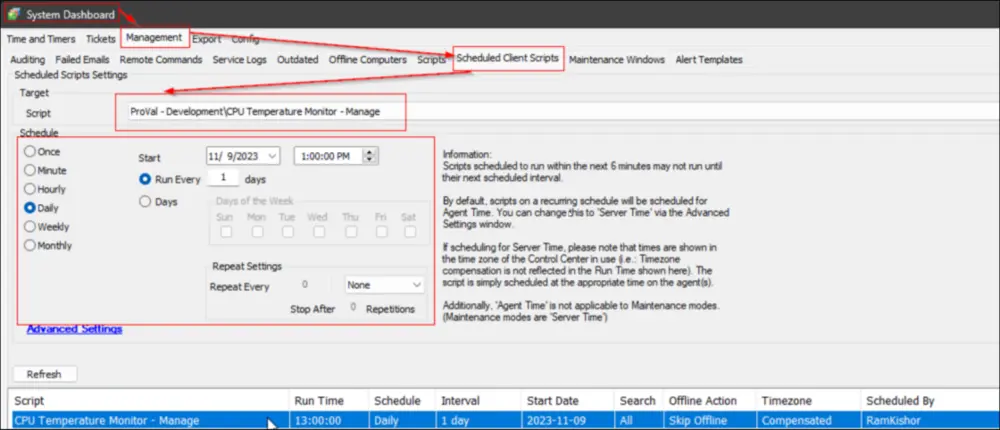

## Purpose

The goal of this solution is to monitor the CPU temperature of physical Windows machines using the [Libre Hardware Monitor](https://github.com/LibreHardwareMonitor/LibreHardwareMonitor).

## Associated Content

#### Script

| Content | Type | Function |
|---------|------|----------|
| [EPM - Sensors - Script - CPU Temperature Monitor - Create](/docs/7519f655-224b-4c95-b716-773f59cb7314) | Script | Create and configure the remote monitor on the end machine. |
| [EPM - Sensors - Script - CPU Temperature Monitor - Manage](/docs/56c1260c-a689-45e9-a226-49bf31444750) | Client Script | Manages and maintains the remote monitors created on the end machines. |

#### Monitor

| Content | Type | Function |
|---------|------|----------|
| [EPM - Sensors - Internal Monitor - Execute Script - CPU Temperature Monitor - Create](/docs/7519f655-224b-4c95-b716-773f59cb7314) | Internal Monitor | Executes the above script against the concerned physical Windows machines. |
| [EPM - Sensors - Remote Monitor - CPU Temperature Monitoring Process](/docs/84d6587b-2bca-4f0e-9176-c0df064f532c) | Remote Monitor | Performs the monitoring. |

## Alert Template

| Content | Type | Function |
|---------|------|----------|
| △ CUSTOM - Execute Script - CPU Temperature Monitor - Create | Alert Template | Executes the above script against the machines detected by the internal monitor. |

## Implementation

1. Place the [CPUTempMon.exe](https://proval.itglue.com/attachments/13313008) file in the `LTShare` (or `Webdav` for hosted partners) as outlined in the [Script's](/docs/7519f655-224b-4c95-b716-773f59cb7314) documentation.

2. Import the [CPU Temperature Monitor - Create](/docs/7519f655-224b-4c95-b716-773f59cb7314) script from the ProSync plugin.

   Import the [CPU Temperature Monitor - Manage](/docs/56c1260c-a689-45e9-a226-49bf31444750) script from the ProSync plugin.

3. Import the [Execute Script - CPU Temperature Monitor - Create](/docs/7519f655-224b-4c95-b716-773f59cb7314) internal monitor from the ProSync plugin.

4. Import the alert template named `△ CUSTOM - Execute Script - CPU Temperature Monitor - Create` from the ProSync plugin.

5. Execute the [`CPU Temperature Monitor - Create`](/docs/7519f655-224b-4c95-b716-773f59cb7314) script on any online Windows computer. Make sure to set the ‘`Set_Environment`’ parameter to `1`. This will create the EDFs and system properties.  
   

6. Reload the system cache and verify the existence of the EDFs and the system property as detailed in the [script](/docs/7519f655-224b-4c95-b716-773f59cb7314) documentation.  
   

7. Adjust the values in the system properties (or the EDFs) as needed.

8. Run the [CPU Temperature Monitor - Create](/docs/7519f655-224b-4c95-b716-773f59cb7314) script on a physical Windows machine. Check the configuration and operation of the remote monitor created by the script.

9. Configure the solution as follows:
   - Navigate to Automation --> Monitors within the CWA Control Center and set up the following:
     - [Execute Script - CPU Temperature Monitor - Create](/docs/7519f655-224b-4c95-b716-773f59cb7314) 
       - Configure with the alert template: `△ CUSTOM - Execute Script - CPU Temperature Monitor - Create`
       - Right-click and Run Now to start the monitor
   - Schedule the [CPU Temperature Monitor - Manage](/docs/56c1260c-a689-45e9-a226-49bf31444750) script to run daily.  
     

## FAQ

**Q:** Is it accurate to state that tickets generated by the remote monitor are automatically closed upon the resolution of the identified issue?  
**A:** Affirmative, tickets are configured to be automatically closed subsequent to the resolution of the associated issue. However, it’s important to note that if there are any modifications to the monitor set’s configuration during the interval between the generation of the ticket and the resolution of the issue, the auto-closure of tickets will not be executed.