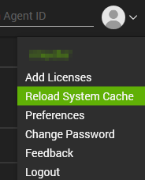
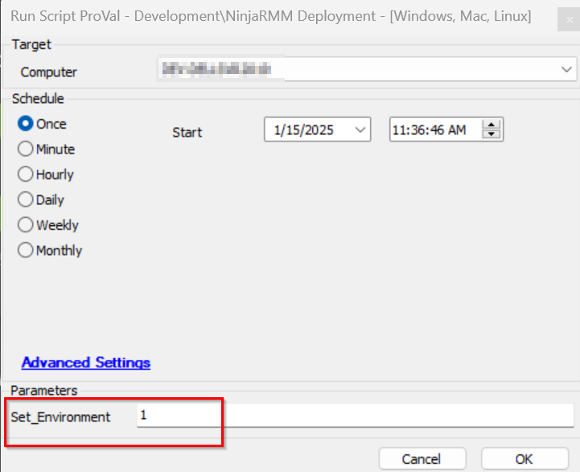

## Purpose

This solution is built to set the NinjaRMMAgent migration from CW Automate to Ninja using an automated process.

## Associated Content

| Content                                                                                            | Type            | Function                                                                                      |
|----------------------------------------------------------------------------------------------------|-----------------|-----------------------------------------------------------------------------------------------|
| [Script - NinjaRMM Deployment - [Windows, Mac, Linux]](/docs/372559cc-5af7-4075-a442-ef7909712fea) | Script          | This script deploys the NinjaRMMAgent to all supported OS, based on the article provided here: https://ninjarmm.zendesk.com/hc/en-us/articles/27524794230669-NinjaOne-Agent-Installation-Agent-Tokenization. It depends on the Authorization token which will be kept to the client and location EDFs. |
| [Internal Monitor - NinjaRMM Deployment - [Windows, Mac, Linux]](/docs/015605a7-a2b3-49c6-b773-2ebbdbbbc7ed) | Internal Monitor | This monitor is designed to set the automatic deployment of the NinjaRMMAgent where the Ninja Deployment is enabled. |
| △ Custom - Execute Script - NinjaRMMAgent Deployment                                               | Alert Template  | This alert template is required to be run with the "Internal Monitor - NinjaRMM Deployment - [Windows, Mac, Linux]" so that it can schedule the "Script - NinjaRMM Deployment - [Windows, Mac, Linux]" to the detected agent where the NinjaRMM deployment is enabled. |
| [NinjaOne Agent Installation: Agent Tokenization – NinjaOne Dojo](https://ninjarmm.zendesk.com/hc/en-us/articles/27524794230669-NinjaOne-Agent-Installation-Agent-Tokenization) | Ninja Helping Documentation | Please note that this feature is currently in beta. Please contact your Account Manager to enable it. The agent installers for Windows, Linux, and Mac now have the option to use an alphanumeric token representing the server, organization, location, and role of an agent when it's installed. This token will allow for easier script-based installation of the agent and make mass-deployments faster and easier. |

## Implementation

1. Import the following content using the ProSync Plugin:
    - [Script - NinjaRMM Deployment - [Windows, Mac, Linux]](/docs/372559cc-5af7-4075-a442-ef7909712fea)
    - [Internal Monitor - NinjaRMM Deployment - [Windows, Mac, Linux]](/docs/015605a7-a2b3-49c6-b773-2ebbdbbbc7ed)
    - Alert Template - △ Custom - Execute Script - NinjaRMMAgent Deployment

2. Reload the system cache:
    
    

3. Execute the [Script - NinjaRMM Deployment - [Windows, Mac, Linux]](/docs/372559cc-5af7-4075-a442-ef7909712fea) with Set_Environment user parameter value to 1 to any ran computer once:

    

    This will get the EDFs created in the partner environment.

4. Reload the system cache:
    
    

5. Configure the solution as outlined below:
    - Navigate to Automation --> Monitors within the CWA Control Center and setup the following:
        - [Internal Monitor - NinjaRMM Deployment - [Windows, Mac, Linux]](/docs/015605a7-a2b3-49c6-b773-2ebbdbbbc7ed) 
            - Setup with △ Custom - Execute Script - NinjaRMMAgent Deployment Alert Template
            - Right-click and Run Now to start the monitor

## FAQ

1. It is possible the partner will not be able to see the option Devices>Agent Installers in the Ninja Portal.
Ans -> It is because the Devices>Agent Installers is a Beta feature that is required to be enabled by requesting their account manager.