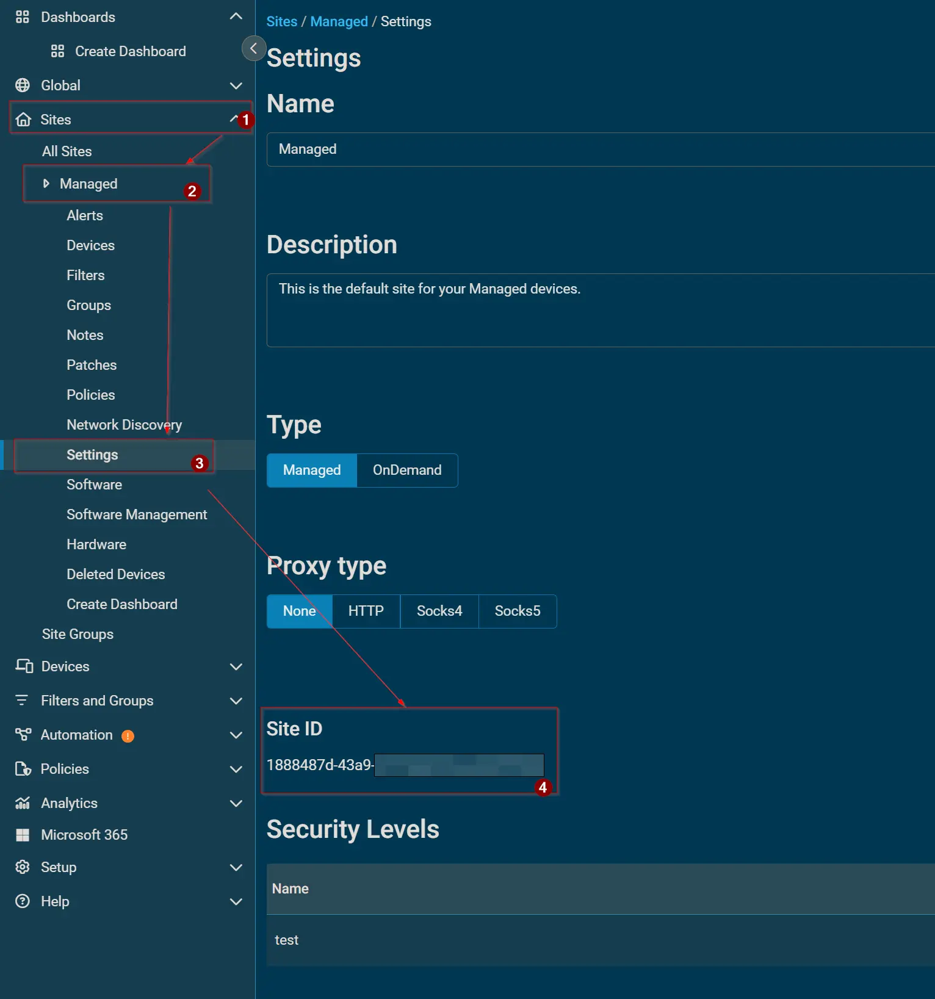

## Purpose

This solution outlines the full process for automatically deploying the Datto RMM Agent to both Mac and Windows devices using ConnectWise RMM, utilizing a custom field, dynamic device groups, automated monitors, and an installation script.

## Associated Content

### Custom Fields

| Name | Example | Type | Level | Required | Purpose |
| --- | --- | --- | --- | --- | --- |
| [Datto RMM Site ID](/docs/b5af697b-7eeb-4395-8962-44b76645fdc5) | `6ef3f5aa-81b7-400c-a667-02075f98ba15` | Text | COMPANY | Yes | The Site ID of the target site in the Datto RMM portal that the agent will check into after installation. |

### Groups

| Name | Purpose |
| --- | --- |
| [Datto RMM Agent Installation [MAC]](/docs/b8948dfb-8c54-4872-9ae2-41d9ce4c5a15) | Dynamic group targeting Mac devices (Darwin) where the Datto RMM Agent is not installed and the Site ID is populated. |
| [Datto RMM Agent Installation [Windows]](/docs/f2349473-6980-4336-a294-37d9cdbc7e4d) | Dynamic group targeting Windows devices where the Datto RMM Agent is not installed and the Site ID is populated. |

### Monitors

| Name | Type | Schedule | Purpose |
| --- | --- | --- | --- |
| [Install Datto RMM Agent [MAC]](/docs/0b216db3-7775-4754-b9bb-bfad7f9757ad) | File System | On File State | Checks for the absence of the macOS app path and triggers the install script on missing agents. |
| [Install Datto RMM Agent [Windows]](/docs/0562cbb5-db83-486a-84ae-730abd583fab) | File System (Script Condition) | Every 1 Hour | Monitors service status via PowerShell script and triggers the install task on devices missing the Datto RMM agent. |

### Task

| Name | Purpose |
| --- | --- |
| [Install Datto RMM Agent](/docs/7920577d-9a4a-48d0-9102-b01c27c2e00f) | Executes the installation process for the Datto RMM Agent on both Windows and Mac machines utilizing parameters and site IDs. |

## Implementation

### Step 1: Create the Required Custom Field

Create the required custom field under `SETTINGS → Custom Fields` in CW RMM. See the documentation page for configuration details.

* [Datto RMM Site ID](/docs/b5af697b-7eeb-4395-8962-44b76645fdc5)

### Step 2: Create the Dynamic Groups

Create the targeting groups under `ENDPOINTS → Groups` as dynamic groups. These groups should target endpoints where the Custom Field is correctly filled.

* [Datto RMM Agent Installation [MAC]](/docs/b8948dfb-8c54-4872-9ae2-41d9ce4c5a15)
* [Datto RMM Agent Installation [Windows]](/docs/f2349473-6980-4336-a294-37d9cdbc7e4d)

### Step 3: Create the Installation Task

Create the install script task under `AUTOMATION → Tasks` as a `Script Editor` type. Configure the required `Platform` user parameter, apply the custom field variable, and paste in the distinct PowerShell and Bash scripts from the referenced documentation.

* [Install Datto RMM Agent](/docs/7920577d-9a4a-48d0-9102-b01c27c2e00f)

### Step 4: Set up the Deployment Monitors

Configure the deployment monitors under `ENDPOINTS → Alerts → Monitors` to target the respective dynamic device groups. Set the Mac monitor to check for file existence, and the Windows monitor to run its conditional script every 1 hour. Both monitors should trigger the installation task if the agent is missing.

* [Install Datto RMM Agent [MAC]](/docs/0b216db3-7775-4754-b9bb-bfad7f9757ad)
* [Install Datto RMM Agent [Windows]](/docs/0562cbb5-db83-486a-84ae-730abd583fab)

### Step 5: Fetch and Apply Target Values

Retrieve your specific [Datto RMM Site ID](/docs/b5af697b-7eeb-4395-8962-44b76645fdc5) from your Datto RMM portal (`Sites` > `<Desired Site>` > `Settings`) and apply it to the respective CW RMM companies. Ensure the `Platform` parameter in the [Install Datto RMM Agent](/docs/7920577d-9a4a-48d0-9102-b01c27c2e00f) task is set to your instance name (e.g., Merlot, Pinotage, Concord, etc.).

## FAQ

### 1. How do I retrieve the Datto RMM Site ID for deployment?

> To find the Site ID of the target site in the Datto RMM portal:
>
> > * Log into the Datto RMM portal.
> > * Navigate to the `Sites` page.
> > * Click on the `<Desired Site>`.
> > * Go to `Settings`.
> > * Scroll down to locate the `Site ID` option.
>
> 

### 2. How do I determine my Datto RMM Platform name?

> Your Platform name is located at the very beginning of your Datto RMM portal URL. The accepted values are based on your region:
>
> > * EMEA: `Merlot` or `Pinotage`
> > * NA: `Concord`, `Vidal`, or `Zinfandel`
> > * APAC: `Syrah`
>
> 

### 3. What operating systems are supported by this automatic deployment solution?

> This solution natively supports:
>
> > * Windows (Both Servers and Workstations)
> > * macOS (Darwin)

### 4. What happens if the installation task runs on a machine that already has the agent?

> Both the Windows and macOS installation scripts have built-in validation checks at the beginning of their execution. If they detect the agent is already present, the scripts will log that it is already installed and exit successfully without attempting to overwrite or reinstall.

### 5. How often does the system check for missing Windows agents?

> The [Install Datto RMM Agent [Windows]](/docs/0562cbb5-db83-486a-84ae-730abd583fab) monitor is scheduled to run a conditional PowerShell script every 1 hour to check the installation status.

### 6. How does the macOS monitor determine if the agent needs to be installed?

> The macOS monitor relies on a File System check rather than a scheduled script. It specifically looks to see if the application directory exists:
>
> > * File Path: `/Applications/AEM Agent.app`
> > * Condition: Exists
>
> If the file is missing, it triggers the installation automation.

### 7. How does the Windows monitor determine if the agent needs to be installed?

> The Windows monitor runs a lightweight PowerShell script that checks for the Datto agent's background service.
>
> > * Service Name: `CagService`
>
> If the service is missing, the script outputs "Not Installed", which triggers the automation task.

### 8. Can I exclude a specific endpoint from the automatic deployment?

> Yes. The dynamic groups rely on the [Datto RMM Site ID](/docs/b5af697b-7eeb-4395-8962-44b76645fdc5) custom field. To exclude an endpoint:
>
> > * Clear the custom field for that specific device (leave it blank).
> > * Alternatively, type `NA` into the custom field.
>
> Devices with a blank or `NA` Site ID are automatically excluded from the deployment groups.

### 9. Can I manually trigger the Datto RMM Agent installation?

> Absolutely. The [Install Datto RMM Agent](/docs/7920577d-9a4a-48d0-9102-b01c27c2e00f) task can be executed manually against any device at any time, independently of the monitor or dynamic group status.

### 10. What user permissions are used to run the installation scripts?

> To ensure the scripts have the necessary administrative privileges to install software and configure services, both the PowerShell (Windows) and Bash (macOS) scripts are configured to `Run As: System`.

### 11. What is the expected execution time for the installation task before it times out?

> The expected time of script execution before it times out is configured to 900 seconds (15 minutes) for both platforms.

### 12. Why are my Mac endpoints not appearing in the deployment group?

> For a Mac to populate in the [Datto RMM Agent Installation [MAC]](/docs/b8948dfb-8c54-4872-9ae2-41d9ce4c5a15) group, it must strictly meet three criteria:
>
> > * `OS Type` is Equal to `Darwin`.
> > * `Datto RMM Site ID` is Not Blank.
> > * `Datto RMM Site ID` is Not Equal to `NA`.

### 13. Why are my Windows endpoints not appearing in the deployment group?

> For a Windows machine to populate in the [Datto RMM Agent Installation [Windows]](/docs/f2349473-6980-4336-a294-37d9cdbc7e4d) group, it must strictly meet three criteria:
>
> > * `OS Type` is Equal to `Windows`.
> > * `Datto RMM Site ID` is Not Blank.
> > * `Datto RMM Site ID` is Not Equal to `NA`.

### 14. Will the deployment monitors generate service tickets if an agent is missing?

> No. The monitors are designed for silent remediation. Under the Monitor Output settings, the output action is explicitly set to `Do not Generate Ticket`. It will only trigger the installation automation.

### 15. Are there any specific network or TLS requirements for the Windows deployment?

> Yes. The Windows installation script downloads the installer directly from Datto's servers. The script enforces TLS 1.2 or TLS 1.3. If the system's PowerShell or .NET framework version is too outdated to support these protocols, the download will fail.

### 16. Does the macOS installation require a user to click through any prompts?

> No. The Bash script handles the entire process silently. It downloads the archive, unzips it using the `-q` (quiet) flag, and executes the macOS `.pkg` installer via the terminal without requiring user interaction.

### 17. Where are the temporary installation files stored during the Windows deployment?

> The Windows script downloads the Datto RMM executable to a hidden automation directory. The script forces a cleanup of this file after installation.
>
> > * Working Directory: `C:\ProgramData\_Automation\App\windows-upgrader`

### 18. Where are the temporary installation files stored during the macOS deployment?

> The macOS script downloads the archive and extracts the installer to the Mac's temporary directory. It performs a cleanup of this directory upon completion.
>
> > * Working Directory: `/tmp/_Automation/App/DRMMSetup`

### 19. What happens if the installer fails to download on Windows?

> If the script fails to download the installer from the Datto RMM URL, and it does not detect a previously cached local copy of the installer on the machine, the script will intentionally throw an error and halt execution.

### 20. How can I verify that the script successfully installed the agent?

> You can check the "Script Log" output in ConnectWise RMM. Both scripts perform a final validation check at the very end of their execution.
>
> > * If successful: It will log "Agent installation completed successfully."
> > * If it fails: It will throw an error and log the specific exit code (on Windows) or a failure message (on macOS).

## Changelog

### 2026-02-28

- Initial version of the document
