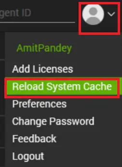
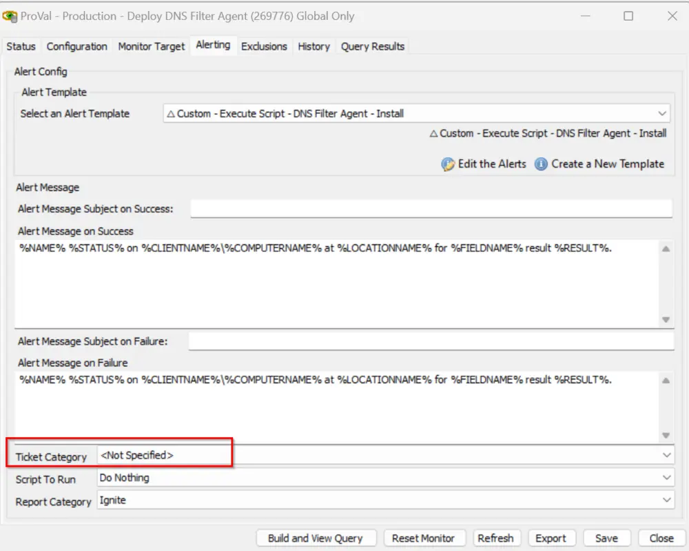

## Purpose

This solution is designed to automatically deploy the DNS filter to the agents.

## Associated Content

| Content                                                                                               | Type            | Function                                                                                                                                                                                                                                                                                                                                                                                                                                                                                                                                                                                                 |
|-------------------------------------------------------------------------------------------------------|-----------------|---------------------------------------------------------------------------------------------------------------------------------------------------------------------------------------------------------------------------------------------------------------------------------------------------------------------------------------------------------------------------------------------------------------------------------------------------------------------------------------------------------------------------------------------------------------------------------------------------------|
| [Script - DNS Filter Agent - Install](/docs/f281c866-d1a8-44fd-9412-388b5f06200b)              | Script          | This script installs the DNS Filter agent on the machines. It is compatible with both Macintosh machines and Windows workstations, but not with Windows servers, as they do not support the DNS Filter Agent.                                                                                                                                                                                                                                                                                                                                                                                        |
| [Internal Monitor - Deploy DNS Filter Agent](/docs/3990e2f6-344e-4d2a-98ac-bd73b7a6c752)       | Internal Monitor | The internal monitor executes the `DNS Filter Agent Deploy` script hourly on online machines that are missing the `DNS Agent`. This monitor excludes Linux and Windows servers since they do not support the DNS Filter Agent. It detects agents where the 'Deploy DNS Filter Agent' client-EDF is checked and the 'Exclusion of DNS Filter Agent' at the location/computer level is not checked. It also ensures that the secret key at the Computer/Location/Client level exists for the installation.                                                                                  |
| △ Custom - Execute Script - DNS Filter Agent - Install                                               | Alert Template  | This alert template executes the script [CWA - Script - DNS Filter Agent - Install](/docs/f281c866-d1a8-44fd-9412-388b5f06200b) automatically on the detected agents of the monitor [CWA - Internal Monitor - Deploy DNS Filter Agent](/docs/3990e2f6-344e-4d2a-98ac-bd73b7a6c752).                                                                                                                                                                                                                                                                                                                             |

## Implementation

1. Import the following content using the ProSync Plugin:
   - [Script - DNS Filter Agent - Install](/docs/f281c866-d1a8-44fd-9412-388b5f06200b)
   - [Internal Monitor - Deploy DNS Filter Agent](/docs/3990e2f6-344e-4d2a-98ac-bd73b7a6c752)
   - Alert Template - `△ Custom - Execute Script - DNS Filter Agent - Install`

2. After importing the script, please reload the system cache so the EDFs get loaded.  
   

3. Navigate to Automation → Monitors → Find the monitor named 'ProVal - Production - Deploy DNS Filter Agent'  
   - Apply the alert template `△ Custom - Execute Script - DNS Filter Agent - Install` to the monitor.
   - Right-click the monitor and select 'Run Now and Reset Monitor'.

   *Note*: To enable the solution, it is required to check the client-EDF 'Deploy DNS Filter Agent' for the deployment of the DNS filter on the agents of the client. Running the monitor should do nothing upon the initial installation of this content since the EDFs should not be enabled anywhere.

   *This solution can have exclusions made using the Location and Computer level EDFs located on the Exclusions tab:*  
   - *Exclusion of DNS Filter Agent*

   One of the following EDFs must be filled out for the script to function as well. They are:  
   **DNSFilter Computer Key** → Computer EDF.  
   If this is set, then the deployment of the DNS Filter will be done with this key as it overrides both location/client secret keys.  
   **DNSFilter Location Key** → Location EDF.  
   If this is set, then the deployment of the DNS Filter will be done with this key as it overrides both client secret keys.  
   **DNSFilter Site Key** → Client EDF.  
   If this is set, then the deployment of the DNS Filter will be done with this key only when both location and computer EDFs are empty.

4. Once the EDFs are set, the solution will automatically start deploying the DNS Filter.

5. Ticket Creation  
   For ticket creation, it is required to set the Ticket Category at the monitor level to gather the ticket category ID and create the ticket on the respective board via the script [CWA - Script - DNS Filter Agent - Install](/docs/f281c866-d1a8-44fd-9412-388b5f06200b):  
   