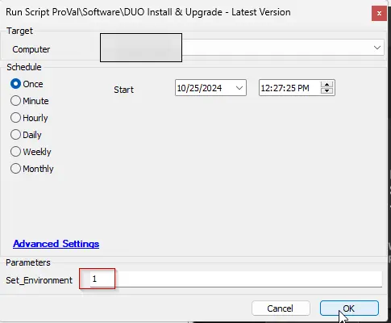

## Purpose

This solution assists in setting the latest DUO detection and updating older DUO installations on agents based on the latest version detection. It was created to ensure DUO is patched for CVE-2024-20292; however, this will keep the application up to date consistently in the future.

## Associated Content

| Content                                                                                                      | Type           | Function                                                                                                           |
|--------------------------------------------------------------------------------------------------------------|----------------|--------------------------------------------------------------------------------------------------------------------|
| [Internal Monitor - DUO Authentication - Latest Version Detection](/docs/00d98e8b-1261-4f49-b5c0-6555a12afee8) | Monitor        | This internal monitor is created to fetch the latest version of the application.                                   |
| [Script - Application - Latest Version Detection [Winget]](/docs/ffb77c6c-8dd7-4ca5-82a2-327b1658cbde) | Script         | This script is designed to gather the latest version of applications supported by Winget, which is provided in the [Internal Monitor - DUO Authentication - Latest Version Detection](/docs/00d98e8b-1261-4f49-b5c0-6555a12afee8). |
| [Internal Monitor - DUO Authentication - Install/Update](/docs/4e62e216-7a5f-4b35-8ac8-eca9a38bd440)   | Monitor        | This monitor is designed to update DUO Authentication on computers where the outdated application is detected.     |
| [Script - DUO Install & Upgrade - Latest Version](/docs/99a31695-f399-4982-989b-5fbc3aada8c6)           | Script         | This script will install or update DUO if the currently installed instance is older than the latest released version. It matches the hash of the installer from the official website before deploying it. This script downloads the latest installer from [https://dl.duosecurity.com/duo-win-login-latest.exe](https://dl.duosecurity.com/duo-win-login-latest.exe). |
| △ Custom - Execute Script - Application Latest Version                                                       | Alert Template | This alert template is designed to be used with the [Internal Monitor - DUO Authentication - Latest Version Detection](/docs/00d98e8b-1261-4f49-b5c0-6555a12afee8) to run the script [Application - Latest Version Detection [Winget]](/docs/ffb77c6c-8dd7-4ca5-82a2-327b1658cbde). |
| △ CUSTOM - Execute Script - DUO Install & Upgrade - Latest Version                                         | Alert Template | This alert template is designed to run the script [DUO Install/Upgrade - Latest Version](/docs/99a31695-f399-4982-989b-5fbc3aada8c6) with the [Monitor - DUO Authentication - Install/Update](/docs/4e62e216-7a5f-4b35-8ac8-eca9a38bd440). |

## Optional Content

| Content                                                                                                      | Type           | Function                                                                                                           |
|--------------------------------------------------------------------------------------------------------------|----------------|--------------------------------------------------------------------------------------------------------------------|
| [CWM - Automate - Script - Uninstall DUO](/docs/4fb8001d-94a0-4867-8776-437c4f6b97cc)                   | Script         | Uninstalls DUO from Windows machines.                                                                              |
| [CWM - Automate - Internal Monitor - Uninstall DUO](/docs/0c3523a9-e392-40f6-bc59-173a21001f0d)        | Monitor        | Detects machines where DUO is installed and Duo Exclusion EDFs are selected.                                       |
| `△ Custom - Execute Script - Uninstall DUO`                                                                 | Alert Template | Executes the script [CWM - Automate - Script - Uninstall DUO](/docs/4fb8001d-94a0-4867-8776-437c4f6b97cc) against the machines detected by the internal monitor. |

## Implementation

1. Import the following content using the ProSync Plugin:
   - Import scripts
     - [Script - Application - Latest Version Detection [Winget]](/docs/ffb77c6c-8dd7-4ca5-82a2-327b1658cbde)
     - [Script - DUO Install/Upgrade - Latest Version](/docs/99a31695-f399-4982-989b-5fbc3aada8c6)
   - Import monitors
     - [Internal Monitor - DUO Authentication - Latest Version Detection](/docs/00d98e8b-1261-4f49-b5c0-6555a12afee8)
     - [Internal Monitor - DUO Authentication - Install/Update](/docs/4e62e216-7a5f-4b35-8ac8-eca9a38bd440)
   - Import the Alert templates
     - `△ Custom - Execute Script - Application Latest Version`
     - `△ CUSTOM - Execute Script - DUO Install & Upgrade - Latest Version`

2. Reload the system cache:
   

   Run the script against any online Windows machine with the `Set_Environment` parameter set to `1` to create the EDFs used by the solution.  
   

3. Navigate to Automation → Monitors within the CWA Control Center and set up the following:
   - [Monitor - DUO Authentication - Latest Version Detection](/docs/f5315643-b01b-48e6-ae4c-b89e5c0f20d6)
     - Set up with the alert template `△ Custom - Execute Script - Application Latest Version`
     - Ensure the monitor is running monthly and not at a more frequent interval.
     - Right-click and Run Now, then Reset Monitor after applying the alert template.
   - [Monitor - DUO Authentication - Install/Update](/docs/4e62e216-7a5f-4b35-8ac8-eca9a38bd440)
     - Apply the alert template `△ CUSTOM - Execute Script - DUO Install & Upgrade - Latest Version`
     - **NOTE**: Make sure to confirm the Latest Version Detection monitor has run and completed before enabling this monitor.
       - Right-click and Run Now after applying the alert template.

### Optional - Uninstall

Use the content below if the partner wants to uninstall DUO on Windows agents automatically. This will remove the application if the exclusion box has been checked on either the location or computer levels.

Import the following content using the ProSync Plugin:
- [CWM - Automate - Script - Uninstall DUO](/docs/4fb8001d-94a0-4867-8776-437c4f6b97cc)
- [CWM - Automate - Internal Monitor - Uninstall DUO](/docs/0c3523a9-e392-40f6-bc59-173a21001f0d)
- `△ Custom - Execute Script - Uninstall DUO`

Configure the solution as outlined below:
- Navigate to Automation → Monitors within the CWA Control Center and set up the following:
  - [CWM - Automate - Internal Monitor - Uninstall DUO](/docs/0c3523a9-e392-40f6-bc59-173a21001f0d)
    - Ensure `△ Custom - Execute Script - Uninstall DUO` is applied on the monitor
      - And the alert template has the script [CWM - Automate - Script - Uninstall DUO](/docs/4fb8001d-94a0-4867-8776-437c4f6b97cc) bonded to it.
    - Right-click and Run Now to start the monitor.