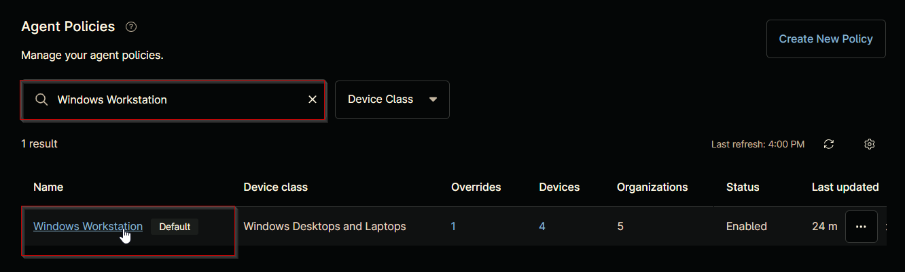
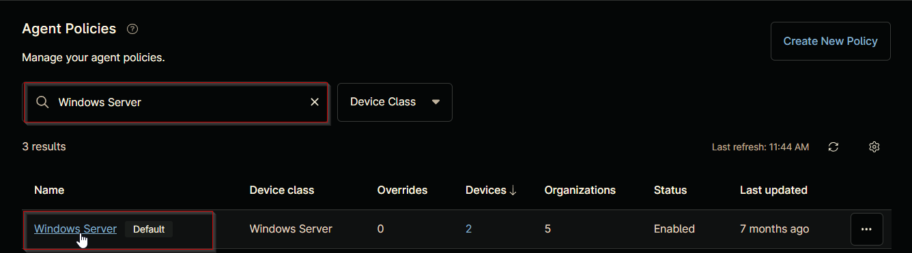
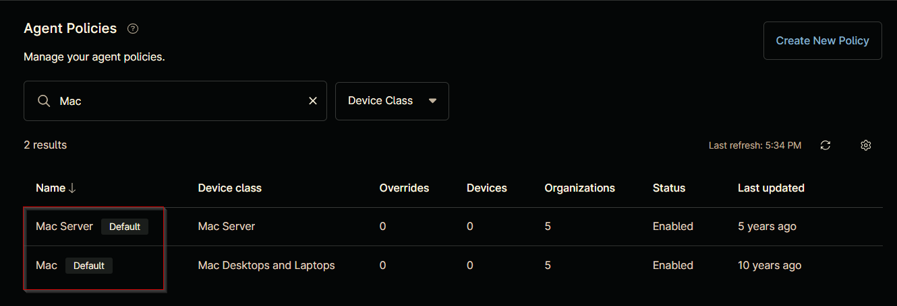

## Purpose

This solution is designed to configure the automatic deployment of the `Duo Auth` application on Windows and Macintosh machines that are missing the agent, using the NinjaOne platform.

**References:**

- [Windows - Duo Authentication for Windows Logon x64 - Silent Install](https://duo.com/docs/macos)
- [Macintosh - Duo Authentication for macOS - Silent Install](https://help.duo.com/s/article/1090?language=en_US)

## Associated Content

### Custom Field

| Content | Definition Scope | Required | Type | Available Options | Applicable OS | Function |
| ------- | ---------------- | -------- | ---- | ----------------- | ------------- | -------- |
| [cPVAL DUO Deployment](/docs/22469c4c-79f2-4a87-9650-f418f4327e07) | `Organization` | True | Drop-down | `All`, `Windows`, `Windows Workstations`, `Windows Servers`, `Macintosh`, `Disabled` | `Windows`, `Macintosh` | Enables Duo auto-deployment for the selected platform. |
| [cPVAL DUO Deployment Exclude](/docs/a27efdd4-32a9-4d9f-9aad-094543b49ffa) | `Location`, `Device` | False | Drop-down | `Yes`, `No` | `Windows`, `Macintosh` | Excludes the device or location from Duo deployment automation when set to 'Yes'. |
| [cPVAL DUO IKEY](/docs/ca460823-862e-4c38-8a30-72474f2b1b5a) | `Organization` | True | Text |  | `Windows`, `Macintosh` | Links authentication requests to the correct Duo account using the integration key from the Duo Admin Panel. |
| [cPVAL DUO SKEY](/docs/868d35d1-fe4e-4e65-b7a5-7661d0d33405) | `Organization` | True | Text |  | `Windows`, `Macintosh` | Secures communication with Duo’s service using the secret key from the Duo Admin Panel. |
| [cPVAL DUO HKEY](/docs/b8a5b5bd-a7fe-4cd5-aae4-81a25a0be7fa) | `Organization` | True | Text | | `Windows`, `Macintosh` | Specifies the API hostname for communication with Duo’s service, obtained from the Duo Admin Panel. |
| [cPVAL DUO AUTOPUSH](/docs/3ce9e690-2bf1-4e78-9e66-04960f3f1b25) | `Organization` | False | Drop-down | `All`, `Windows`, `Windows Workstations`, `Windows Servers`, `Macintosh`, `Disabled` | `Windows`, `Macintosh` | Automatically sends a push request to the user’s device during login when enabled. |
| [cPVAL DUO FAILOPEN](/docs/b3cbbe5c-f1a6-4f9f-99b7-9b0dbbca574e) | `Organization` | False | Drop-down | `All`, `Windows`, `Windows Workstations`, `Windows Servers`, `Macintosh`, `Disabled` | `Windows`, `Macintosh` | Determines login behavior when Duo’s service is unreachable: allows login (fail open) or denies access (fail closed). |
| [cPVAL DUO SMARTCARD](/docs/f0c8a089-0c1b-4056-8375-c3601acc968d) | `Organization` | False | Drop-down | `All`, `Windows`, `Windows Workstations`, `Windows Servers`, `Macintosh`, `Disabled` | `Windows`, `Macintosh` | Enables smart card login as an alternative to Duo authentication when enabled. |
| [cPVAL DUO ENABLEOFFLINE](/docs/4db3e2e3-adfc-465a-8dc8-026b2fc77b45) | `Organization` | False | Drop-down | `Windows`, `Windows Workstations`, `Windows Servers`, `Disabled` | `Windows` | Controls whether offline access is permitted, allowing authentication without a real-time connection to Duo. |
| [cPVAL DUO RDPONLY](/docs/1bef21cf-30ae-4f56-ab2b-8f2b6165806a) | `Organization` | False | Drop-down | `Windows`, `Windows Workstations`, `Windows Servers`, `Disabled` | `Windows` | Requires Duo authentication only for remote logins via RDP when enabled. |
| [cPVAL DUO WRAPSMARTCARD](/docs/f7519fa5-6ffd-49a1-aab2-d63e3d1c1d3e) | `Organization` | False | Drop-down |  `Windows`, `Windows Workstations`, `Windows Servers`, `Disabled` | `Windows` | Requires Duo authentication after smart card primary login when enabled. |
| [cPVAL DUO USERNAMEFORMAT](/docs/ca662111-e0a5-4318-8615-a00341257a1c) | `Organization` | False | Drop-down | `0`,`1`,`2` | `Windows` | Specifies the username format sent to Duo: sAMAccountName, NTLM domain\username, or userPrincipalName. |
| [cPVAL DUO UAC_PROTECTMODE](/docs/61453e58-57fd-425e-aa68-0a1e003784d5) | `Organization` | False | Drop-down | `0`,`1`,`2` | `Windows` | Configures Duo authentication for logon and User Account Control (UAC) elevation. |
| [cPVAL DUO UAC_OFFLINE](/docs/bb3f2e8b-d772-4f42-9bb0-da16facafa0e) | `Organization` | False | Drop-down | `0`,`1` | `Windows` | Enables or disables offline access for UAC elevation. |
| [cPVAL DUO UAC_OFFLINE_ENROLL](/docs/a83d55b5-c765-4a82-84e1-03fbeb3e8606) | `Organization` | False | Drop-down | `0`,`1` | `Windows` | Enables or disables offline enrollment during UAC elevation. |

### Automation

| Content | Function |
| ------- | -------- |
| [Duo Deployment - Windows](/docs/3cc5e786-f5bd-4a86-85c6-89278fccaa65) | Installs `Duo Authentication for Windows Logon x64` on Windows machines, retrieving required keys from custom fields if not provided at runtime. |
| [Duo Deployment - Macintosh](/docs/059819a5-8b95-40d1-ac89-b33858e864a0) | Installs the `Duo Authentication for macOS` on Macintosh machines, retrieving required keys from custom fields. |

### Compound Conditions

| Content | Function |
| ------- | -------- |
| [Duo Deployment - Windows Workstations](/docs/b90edc31-5509-4568-9c24-c020b24904cd) | Triggers the [Duo Deployment - Windows](/docs/3cc5e786-f5bd-4a86-85c6-89278fccaa65) automation on Windows workstations where deployment is enabled and `Duo Authentication for Windows Logon x64` is not installed. |
| [Duo Deployment - Windows Servers](/docs/1f8e6ed3-ac24-40a5-8238-4c52f259c157) | Triggers the [Duo Deployment - Windows](/docs/3cc5e786-f5bd-4a86-85c6-89278fccaa65) automation on Windows servers where deployment is enabled and `Duo Authentication for Windows Logon x64` is not installed. |
| [Duo Deployment - Macintosh](/docs/efef6d5d-b853-46a5-8b7b-3d248a55e7a0) | Triggers the [Duo Deployment - Macintosh](/docs/69915d4b-f3e4-4192-b71c-e77559fe9d7f) automation on Macintosh machines where deployment is enabled and `Duo Authentication for macOS` is not installed. |

## Implementation

### Step 1

Create the following custom fields:

- [cPVAL DUO Deployment](/docs/22469c4c-79f2-4a87-9650-f418f4327e07)
- [cPVAL DUO Deployment - Exclude](/docs/a27efdd4-32a9-4d9f-9aad-094543b49ffa)
- [cPVAL DUO IKEY](/docs/ca460823-862e-4c38-8a30-72474f2b1b5a)
- [cPVAL DUO SKEY](/docs/868d35d1-fe4e-4e65-b7a5-7661d0d33405)
- [cPVAL DUO HKEY](/docs/b8a5b5bd-a7fe-4cd5-aae4-81a25a0be7fa)
- [cPVAL DUO AUTOPUSH](/docs/3ce9e690-2bf1-4e78-9e66-04960f3f1b25)
- [cPVAL DUO FAILOPEN](/docs/b3cbbe5c-f1a6-4f9f-99b7-9b0dbbca574e)
- [cPVAL DUO SMARTCARD](/docs/f0c8a089-0c1b-4056-8375-c3601acc968d)
- [cPVAL DUO ENABLEOFFLINE](/docs/4db3e2e3-adfc-465a-8dc8-026b2fc77b45)
- [cPVAL DUO RDPONLY](/docs/1bef21cf-30ae-4f56-ab2b-8f2b6165806a)
- [cPVAL DUO WRAPSMARTCARD](/docs/f7519fa5-6ffd-49a1-aab2-d63e3d1c1d3e)
- [cPVAL DUO USERNAMEFORMAT](/docs/ca662111-e0a5-4318-8615-a00341257a1c)
- [cPVAL DUO UAC_PROTECTMODE](/docs/61453e58-57fd-425e-aa68-0a1e003784d5)
- [cPVAL DUO UAC_OFFLINE](/docs/bb3f2e8b-d772-4f42-9bb0-da16facafa0e)
- [cPVAL DUO UAC_OFFLINE_ENROLL](/docs/a83d55b5-c765-4a82-84e1-03fbeb3e8606)

### Step 2

Create the following automations:

- [Duo Deployment - Windows](/docs/3cc5e786-f5bd-4a86-85c6-89278fccaa65)
- [Duo Deployment - Macintosh](/docs/059819a5-8b95-40d1-ac89-b33858e864a0)

### Step 3

Create the [Duo Deployment - Windows Workstations](/docs/b90edc31-5509-4568-9c24-c020b24904cd) compound condition for default `Windows Workstation [Default]` agent policy.  

### Step 4

Create the [Duo Deployment - Windows Servers](/docs/1f8e6ed3-ac24-40a5-8238-4c52f259c157) compound condition for default `Windows Server [Default]` agent policy.  

### Step 5

Create the [Duo Deployment - Macintosh](/docs/efef6d5d-b853-46a5-8b7b-3d248a55e7a0) compound condition for both default agent policies: `Mac Server [Default]` and `Mac [Default]`. The example in the [document](/docs/efef6d5d-b853-46a5-8b7b-3d248a55e7a0) illustrates the deployment process for the `Mac [Default]` agent policy. It is also recommended to apply this compound condition to the `Mac Server [Default]` agent policy, following the same process.

## FAQ

### 1. Can the automations be executed manually without relying on the auto-deployment custom fields (`cPVAL DUO Deployment`, `cPVAL DUO Deployment - Exclude`) ?

Yes, the automations can be executed manually, independent of the auto-deployment custom fields. Even if deployment is not enabled or the machine is excluded, the scripts can still be run manually to perform the required actions.

### 2. Are the [cPVAL DUO IKEY], [cPVAL DUO SKEY], and [cPVAL DUO HKEY] custom fields mandatory for deployment?

Yes, these custom fields are mandatory for the deployment to function correctly. They are used to link the Duo authentication requests to the appropriate Duo account and ensure secure communication with Duo’s service.

### 3. What should I do if the auto-deployment is not working for certain machines?

If auto-deployment is not working, check if the machines are excluded using the `cPVAL DUO Deployment Exclude` custom field or if they are using a different agent policy. Ensure the compound conditions are applied to the correct agent policies for deployment to work.

### 4. Can the deployment process be customized for specific platforms?

Yes, the deployment process can be customized by selecting the appropriate options in the `cPVAL DUO Deployment` custom field. This allows you to enable deployment for specific platforms such as Windows workstations, Windows servers, or Macintosh machines.

### 5. What happens if Duo’s service is unreachable during login?

The `cPVAL DUO FAILOPEN` custom field determines the login behavior when Duo’s service is unavailable. If it is `enabled`, login is permitted; otherwise, access is denied.