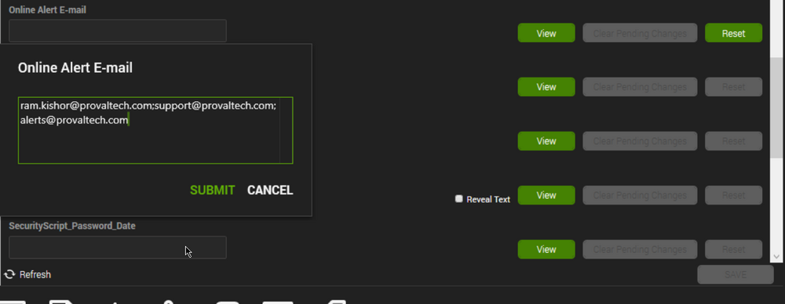
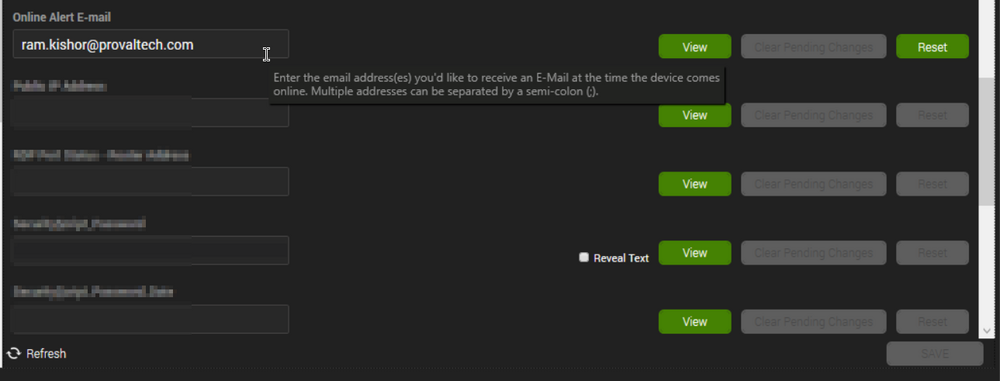
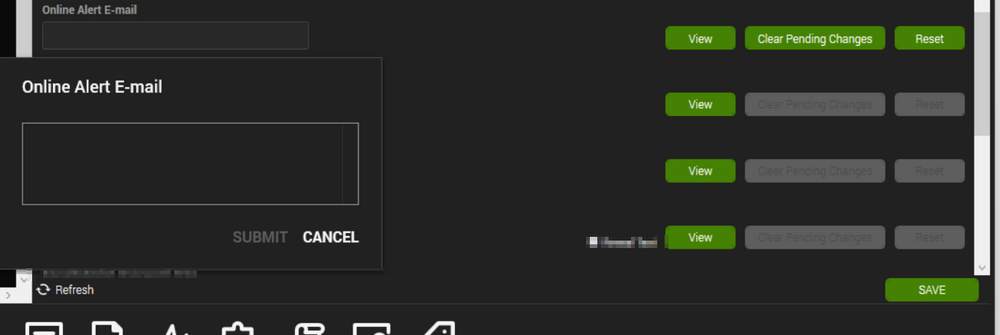

## Purpose

This solution is intended to provide notification of a machine's ConnectWise Automate online check-in to a contact.

## Associated Content

| Content                                                                                                                                                       | Type              | Function                                                                                                                        |
|---------------------------------------------------------------------------------------------------------------------------------------------------------------|-------------------|---------------------------------------------------------------------------------------------------------------------------------|
| [CWM - Automate - Internal Monitor - ProVal - Development - Agent - E-Mail - Machine Back Online](/docs/82c2d005-f115-4481-8c59-82b22526eafa)           | Internal Monitor   | Detects the machines the moment they start checking in with Automate.                                                          |
| [CWM - Automate - Script - Email - EDF - Machine Back Online [Autofix]*](/docs/c32c5921-0bd1-4e4a-b605-baa0e958fbc0)                                   | Script            | Sends an email to the addresses mentioned in the computer-level EDF "Online Alert E-mail" for the machines detected by the [CWM - Automate - Internal Monitor - ProVal - Development - Agent - E-Mail - Machine Back Online](/docs/82c2d005-f115-4481-8c59-82b22526eafa) monitor. |
| △ Custom - Machine Back Online                                                                                                                             | Alert Template    | Executes the [CWM - Automate - Script - Email - EDF - Machine Back Online [Autofix]*](/docs/c32c5921-0bd1-4e4a-b605-baa0e958fbc0) script against the machines detected by the [CWM - Automate - Internal Monitor - ProVal - Development - Agent - E-Mail - Machine Back Online](/docs/82c2d005-f115-4481-8c59-82b22526eafa) monitor. |

## Implementation

1. Import the script [CWM - Automate - Script - Email - EDF - Machine Back Online [Autofix]*](/docs/c32c5921-0bd1-4e4a-b605-baa0e958fbc0).
2. Import the monitor set [CWM - Automate - Internal Monitor - ProVal - Development - Agent - E-Mail - Machine Back Online](/docs/82c2d005-f115-4481-8c59-82b22526eafa).
3. Reload System Cache.
4. Create the alert template `△ Custom - Machine Back Online`.

   ```
   INSERT INTO `alerttemplate` (`Name`, `Comment`, `Last_User`, `Last_Date`, `GUID`) 
   SELECT 
   '△ Custom - E-Mail - Machine Back Online' AS `Name`, 
   '△ Custom - E-Mail - Machine Back Online' AS `Comment`,
   'PRONOC' AS `Last_User`,
   (NOW()) AS `Last_Date`,
   '20bd12ab-6f23-42e6-ad8a-373fc41faab9' AS `GUID` 
   WHERE (SELECT COUNT(*) FROM alerttemplate WHERE GUID = '20bd12ab-6f23-42e6-ad8a-373fc41faab9') = '0';

   INSERT INTO `alerttemplates` (`AlertActionID`, `DayOfWeek`, `TimeStart`, `TimeEnd`, `AlertAction`, `ContactID`, `UserID`, `ScriptID`, `Trump`, `GUID`, `WarningAction`)
   SELECT 
   (SELECT alertactionid FROM alerttemplate WHERE `GUID` = '20bd12ab-6f23-42e6-ad8a-373fc41faab9') AS `AlertActionid`,
   '127' AS `DayOfWeek`,
   '00:00:00' AS `TimeStart`,
   '23:59:00' AS `TimeEnd`,
   '512' AS `AlertAction`,
   '-2' AS `ContactID`,
   '0' AS `UserID`,
   (SELECT Scriptid FROM lt_scripts WHERE scriptGUID = '73415a51-8a97-11ed-91e5-000c295e5f17') AS `Scriptid`,
   '0' AS `Trump`,
   '7245e028-bbee-4fff-9df6-35ebdaea3933' AS `GUID`,
   '512' AS `WarningAction` 
   WHERE (SELECT COUNT(*) FROM alerttemplates WHERE GUID = '7245e028-bbee-4fff-9df6-35ebdaea3933') = '0';
   ```

Set the email addresses at the computer-level EDF `Online Alert E-mail` located under the `Default` EDF section for the concerned computers. To set multiple email addresses, each address must be separated by a semicolon (;). 

e.g.,  
Multiple Email Addresses:  
  
Single Email Address:  
  

## FAQ

```
Q: How to stop receiving the emails after getting the work done? 

A: Remove the email address(es) from the EDF.
```


## Sample Email


