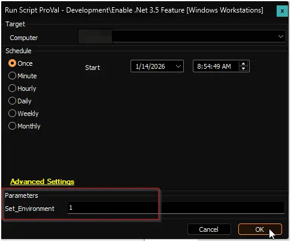

## Purpose

Enable the .NET Framework 3.5 feature on Windows 10 and Windows 11 workstations when automation is enabled via EDFs.

## Associated Content

| Content                                             | Type                                                      | Function                                               |
|-----------------------------------------------------|-----------------------------------------------------------|--------------------------------------------------------|
| [Enable .Net 3.5 Feature [Windows Workstations]](/docs/31e2b232-f0b1-11f0-be0d-92000234cfc2) | Script | Installs or enables the .NET 3.5 feature on targeted workstations. |
| [.Net 3.5 Feature](/docs/be6d1705-be61-4510-b3c1-9a0f75397e46) | Remote Monitor | Identifies machines where the .NET 3.5 feature is not present or enabled. |
| `Enable .Net 3.5 Feature`| Search | Restricts the monitor to machines where automation is enabled via EDFs. |
| `△ Custom - Enable - .Net 3.5 Feature` | Alert Template | Triggers the script on machines detected by the remote monitor. |

## EDFs

| Name | Type | Scope | Section | Required | Description |
| ---- | ---- | ----- | ------- | -------- | ----------- |
| Enable .Net 3.5 Feature | Checkbox | Client | Automation | False | Set to enable automated installation of the .NET 3.5 feature for a client. |
| .Net 3.5 Feature - Exclusion | Checkbox | Location | Exclusions | False | Set to exclude an entire location from automated installation. |
| .Net 3.5 Feature - Exclusion | Checkbox | Computer | Exclusions | False | Set to exclude an individual computer from automated installation. |

## Implementation

### Step 1

Import the required components from the ProSync plugin:

- [Script: Enable .Net 3.5 Feature [Windows Workstations]](/docs/31e2b232-f0b1-11f0-be0d-92000234cfc2)
- `Alert Template: △ Custom - Enable - .Net 3.5 Feature`

### Step 2

Reload System Cache (Ctrl + R)

### Step 3

Run the script with the `Set_Environment` parameter set to `1` on any online Windows machine. This initializes and creates the EDFs required by the solution.

### Step 4

Create and configure the remote monitor as described in the implementation section of the remote monitor documentation: [.Net 3.5 Feature](docs/be6d1705-be61-4510-b3c1-9a0f75397e46#implementation).

### Step 5

Reload System Cache (Ctrl + R)

### Step 6

Enable the solution for target clients by setting the client-level EDF `Enable .Net 3.5 Feature`.

## FAQs

**Q:** Can the script be used without configuring EDFs?  
**A:** Yes. The script may be executed manually on individual machines. EDFs are provided to enable automated deployment.

**Q:** What happens if I exclude a location or computer from automation?  
**A:** Machines in excluded locations or explicitly excluded computers will not be targeted by the automated monitor and will not have .NET 3.5 installed by this automation. Automation will not remove or disable .NET 3.5 from any machine. To remove the feature, run a separate removal script or perform the action manually, and ensure the machine is excluded from this solution to prevent re-enablement.
