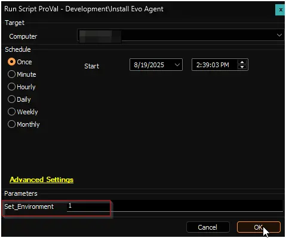

## Purpose

The solution aims to auto-deploy Evo Agent from CW Automate.

## Associated Content

### Primary Content

| Content | Type | Purpose |
| ------- | ---- | ------- |
| [Install Evo Agent](/docs/b1089c56-7d18-11f0-8d05-92000234cfc2) | Script | Installs Evo Agent |
| [Install Evo Agent](/docs/39162f8f-057c-4dec-adf8-e68309cbec5b) | Internal Monitor | Detects machines where deployment is enabled and application is not installed |
| `△ Custom - Execute Script - Install Evo Agent` | Alert Template | Executes installation script on machines detected by the internal monitor |

### Optional Content

| Content | Type | Purpose |
| ------- | ---- | ------- |
| [Uninstall Evo Agent](/docs/456dab4a-7d1c-11f0-8d05-92000234cfc2) | Script | Uninstalls Evo Agent |

## Implementation

### Step 1

Import the following content from the ProSync plugin.

- [Script - Install Evo Agent](/docs/b1089c56-7d18-11f0-8d05-92000234cfc2)  
- [Script - Uninstall Evo Agent](/docs/456dab4a-7d1c-11f0-8d05-92000234cfc2)  
- [Internal Monitor - Install Evo Agent](/docs/39162f8f-057c-4dec-adf8-e68309cbec5b)
- Alert Template - △ Custom - Execute Script - Install Evo Agent

### Step 2

Reload System Cache (Ctrl + R)

### Step 3

Run or debug the installation script on any online Windows machine with the `Set_Environment` parameter set to `1` to generate the necessary EDFs.  

### Step 4

Configure the automation as follow:

- Internal Monitor: [Install Evo Agent](/docs/39162f8f-057c-4dec-adf8-e68309cbec5b)
  - Alert Template: `△ Custom - Execute Script - Install Evo Agent`

### Step 5

Set the client-level deployment and parameter EDFs to initiate the Automation.  

