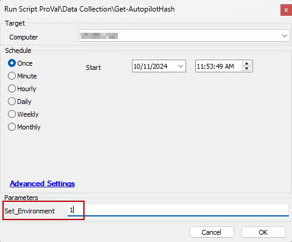

## Purpose

The purpose of this solution is to collect the Hardware Hash for autopilot device registration.

## Associated Content

| Content                                                                                                               | Type           | Function                                           |
|-----------------------------------------------------------------------------------------------------------------------|----------------|----------------------------------------------------|
| [Get-AutopilotHash](/docs/9171549a-070a-4346-be90-393416713806)                                         | Script         | Gather agents' Hardware Hash.                       |
| [Get - Autopilot Hash](/docs/3add591b-445e-440d-a7b3-cc85b2ea0674) | Internal Monitor | Detects Windows agents missing Hardware Hash       |
| `△ Custom - Execute Script - Get-AutopilotHash`                                                                     | Alert Template | Execute the script [CWA - Script - Get-AutopilotHash](/docs/9171549a-070a-4346-be90-393416713806) against the machines detected by the internal monitor. |
| [Autopilot Hash](/docs/d7da7b86-19e7-4bad-9936-8687800cee66)                                 | Dataview       | Displays the Hardware Hash details of Windows agents. |

## Implementation

1. Import the following content using the ProSync Plugin:
   - [Script - Get-AutopilotHash](/docs/9171549a-070a-4346-be90-393416713806)
   - [Internal Monitor - ProVal - Production - Get - Autopilot Hash](/docs/3add591b-445e-440d-a7b3-cc85b2ea0674)
   - [Dataview - Autopilot Hash](/docs/d7da7b86-19e7-4bad-9936-8687800cee66)
   - `△ Custom - Execute Script - Get-AutopilotHash`  

2. Reload the system cache:  
   

3. Run the [Script - Get-AutopilotHash](/docs/9171549a-070a-4346-be90-393416713806) against any machine with the Set_Environment parameter set to '1':  

   

4. Configure the solution as outlined below:
   - Navigate to Automation → Monitors within the CWA Control Center and set up the following:
     - [Get - Autopilot Hash](/docs/3add591b-445e-440d-a7b3-cc85b2ea0674)
       - `△ Custom - Execute Script - Get-AutopilotHash`
       - Right-click and Run Now to start the monitor.