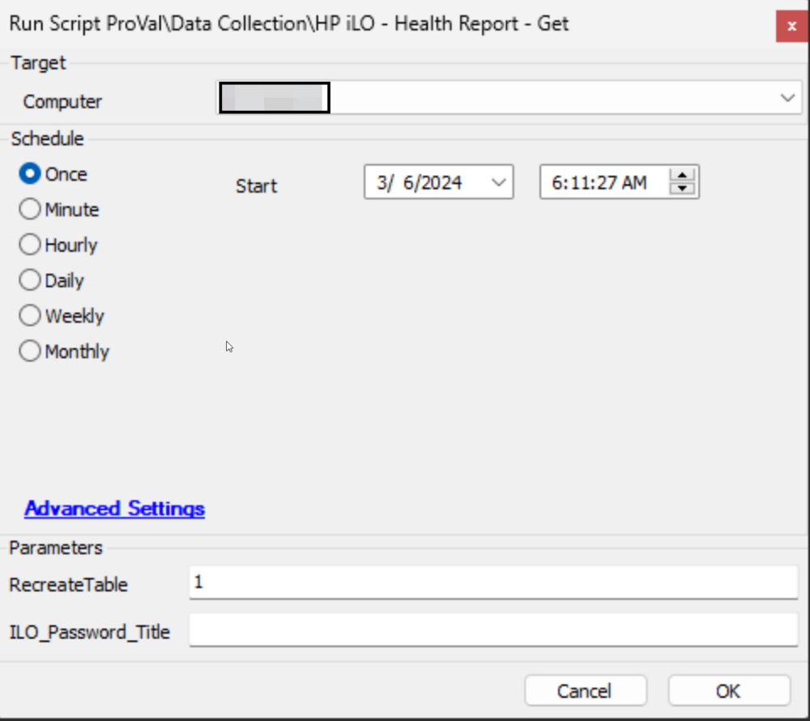
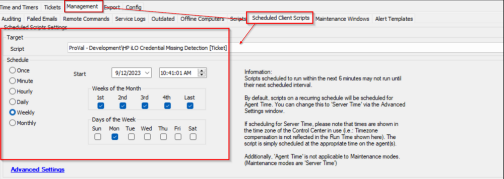

## Purpose

To gather information about and monitor the health status of HP iLO devices.

## Associated Content

#### Auditing

| Content                                                                                                     | Type            | Function                                                                                                              |
|-------------------------------------------------------------------------------------------------------------|-----------------|-----------------------------------------------------------------------------------------------------------------------|
| [Dataview - HP iLO Health Report](/docs/163aca22-cc56-45ee-9732-3873c6117e60)                            | Dataview        | Displays information gathered by the [HP iLO - Health Report - Get](/docs/f28ef90e-ba80-4ba1-9bd6-e4aa4c2b549a) script. |
| [Script - HP iLO - Health Report - Get](/docs/f28ef90e-ba80-4ba1-9bd6-e4aa4c2b549a)                | Script          | Calls the agnostic script and formats the data for SQL.                                                               |
| [Internal Monitor - Execute Script - HP iLO - Health Report - Get](/docs/a8f66140-8915-41fa-805b-64fafbf002fc) | Internal Monitor | Executes the [HP iLO - Health Report - Get](/docs/f28ef90e-ba80-4ba1-9bd6-e4aa4c2b549a) script against the relevant computers to keep the dataview up-to-date. |
| △ CUSTOM - Execute Script - HP iLO - Health Report - Get                                                  | Alert Template   | Executes the script on the machines detected by the internal monitor.                                               |
| [Dataview - HP iLO Checks Not Running](/docs/90498d55-eb8d-45cb-8ea0-90e1729fefc4)                  | Dataview        | Lists the password entries for which the HP iLO Health Check automation is not running properly.                    |

#### Automation

| Content                                                                                                     | Type               | Function                                                                                                              |
|-------------------------------------------------------------------------------------------------------------|--------------------|-----------------------------------------------------------------------------------------------------------------------|
| [Monitor - HP iLO Health Report Check](/docs/9f991e6a-9560-46ee-a9cc-29e401f000e0)                   | Internal Monitor    | Monitors for bad health status information stored in the [plugin_proval_ilo_health_report](/docs/d6e5e2a7-ecb8-4262-92a1-cc322b4af3b6) custom table. |
| [Script - Ticket Creation - HP iLO Health Check*](/docs/5c6b4bbb-732d-4d97-af38-f10d51a8a96c) | Script              | Manages ticketing for the [HP iLO Health Report Check](/docs/9f991e6a-9560-46ee-a9cc-29e401f000e0) monitor set.  |
| △ Custom - Ticket Creation - HP iLO Health Check                                                          | Alert Template      | Executes the script on the machines detected by the internal monitor.                                              |

#### Optional

| Content                                                                                                     | Type               | Function                                                                                                              |
|-------------------------------------------------------------------------------------------------------------|--------------------|-----------------------------------------------------------------------------------------------------------------------|
| [Script - HP iLO Credential Missing Detection](/docs/4d27ff0e-704d-47dd-8c07-3008b7fbfafb)    | Client Script       | Creates a ticket for all clients that have an HP Server and have HP iLO enabled but the credentials are missing.   |
| [Dataview - HP iLO - Potentially Missing Credential](/docs/0abb04f1-450d-4185-9ecd-f27a842cf658) | Dataview            | Displays the clients/servers for which the [HP iLO Credential Missing Detection](/docs/4d27ff0e-704d-47dd-8c07-3008b7fbfafb) will create a ticket. |

#### Other

| Content                                                                                                     | Type               | Function                                                                                                              |
|-------------------------------------------------------------------------------------------------------------|--------------------|-----------------------------------------------------------------------------------------------------------------------|
| [plugin_proval_ilo_health_report](/docs/d6e5e2a7-ecb8-4262-92a1-cc322b4af3b6)                       | Custom Table        | Stores information gathered from the [HP iLO - Health Report - Get](/docs/f28ef90e-ba80-4ba1-9bd6-e4aa4c2b549a) script. |
| [Get-HPiLOHealthReport](/docs/71faa943-e504-4e87-b8d1-39471af44780)                                        | Agnostic Script      | Performs the audit of the iLO devices via PowerShell.                                                                |

## Implementation

1. Import the following scripts from the `ProSync` plugin:
   - [Script - HP iLO - Health Report - Get](/docs/f28ef90e-ba80-4ba1-9bd6-e4aa4c2b549a)
   - [Script - Ticket Creation - HP iLO Health Check*](/docs/5c6b4bbb-732d-4d97-af38-f10d51a8a96c)
   - [Script - HP iLO Credential Missing Detection](/docs/4d27ff0e-704d-47dd-8c07-3008b7fbfafb)

2. Import the following internal monitors from the `ProSync` plugin:
   - [Internal Monitor - Execute Script - HP iLO - Health Report - Get](/docs/a8f66140-8915-41fa-805b-64fafbf002fc)
   - [Monitor - HP iLO Health Report Check](/docs/9f991e6a-9560-46ee-a9cc-29e401f000e0)

3. Import the following alert templates from the `ProSync` plugin:
   - `△ Custom - Execute Script - HP iLO - Health Report - Get`
   - `△ Custom - Ticket Creation - HP iLO Health Check`

4. Import the following dataviews from the `ProSync` plugin:
   - [Dataview - HP iLO Health Report](/docs/163aca22-cc56-45ee-9732-3873c6117e60)
   - [Dataview - HP iLO - Potentially Missing Credential](/docs/0abb04f1-450d-4185-9ecd-f27a842cf658)
   - [Dataview - HP iLO Checks Not Running](/docs/90498d55-eb8d-45cb-8ea0-90e1729fefc4)

5. Reload the System Cache.  
   

6. Execute the [Script - HP iLO - Health Report - Get](/docs/f28ef90e-ba80-4ba1-9bd6-e4aa4c2b549a) script against an online Windows machine with the `RecreateTable` parameter set to `1` to create the [plugin_proval_ilo_health_report](/docs/d6e5e2a7-ecb8-4262-92a1-cc322b4af3b6) custom table.  
   

7. Configure the client-level password entries labeled as `iLO Automation Password` for the iLO Devices to be audited. See the documentation for the internal monitor [Execute Script - HP iLO - Health Report - Get](/docs/a8f66140-8915-41fa-805b-64fafbf002fc) for more information on how to set up this password entry.

8. Configure the **Auditing** content as follows:  
   - Navigate to Automation > Monitors > Internal Monitors
     - [Internal Monitor - Execute Script - HP iLO - Health Report - Get](/docs/a8f66140-8915-41fa-805b-64fafbf002fc)
       - Configure with the Alert Template: `△ CUSTOM - Execute Script - HP iLO - Health Report - Get`
       - Right-click and Run Now to start the monitor

9. Configure the **Automation** content as follows:  
   - Navigate to Automation > Monitors > Internal Monitors
     - [Internal Monitor - HP iLO Health Report Check](/docs/9f991e6a-9560-46ee-a9cc-29e401f000e0)
       - Configure with the Alert Template: `△ Custom - Ticket Creation - HP iLO Health Check`
       - Right-click and Run Now to start the monitor

10. **The Optional configuration should only be set if the partner opts in for ticket generation for HP Servers configured with HP iLO but lacking credentials in the Client-Level Password tab.**  
    Configure the **Optional** content as follows:
    - Navigate to System > Configuration > Dashboard > Management > Scheduled Client Scripts
      - Schedule the [HP iLO Credential Missing Detection](/docs/4d27ff0e-704d-47dd-8c07-3008b7fbfafb) script to run once per week.  
      

