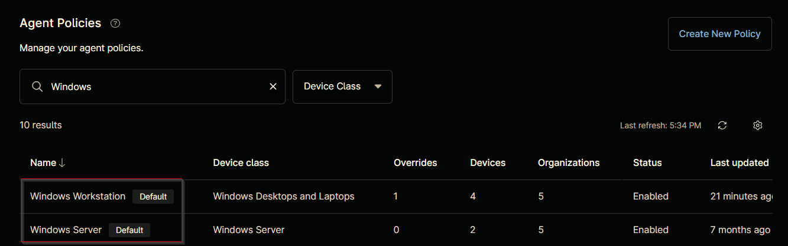

## Purpose

This solution is designed to configure the automatic deployment of the Huntress Agent on Windows and Macintosh machines that are missing the agent, using the NinjaOne platform.

## Associated Content

### Custom Field

| Content | Type | Available Options | Function |
| ------- | ---- | ----------------- | -------- |
| [cPVAL Huntress Deployment](/docs/67554954-e8da-48af-bda9-13a6a37c8295) | Drop-down | `Windows`, `Windows and Macintosh`, `Disabled` | Enables Huntress auto-deployment for Windows or both Windows and Macintosh machines at the organization level. |
| [cPVAL Huntress Install - Exclude](/docs/bdb92684-f093-49f8-9568-09874f9f79d5) | Drop-down | `Yes`, `No` | Allows exclusion of specific locations or devices from Huntress agent auto-deployment. |
| [cPVAL Huntress Account Key](/docs/2b62c710-cd01-4c0a-ab26-58f637e3226a) | Text | | Stores the Huntress Account Key to associate agents with the correct Huntress account. |
| [cPVAL Huntress Org Key](/docs/a746555d-f311-449f-ace0-c8a3b67a2ba4) | Text | | Stores the Huntress Organization Key. By default, this is the organization's name, but it can be customized if needed. |
| [cPVAL Huntress Tags](/docs/ac9bd64b-0327-4879-931d-128936bc43a6) | Text | | Stores one or more tags, separated by commas (optional). |

### Automation

| Content | Function |
| ------- | -------- |
| [Install Huntress Agent - Windows](/docs/518bff20-44d4-4206-9336-bb6922d959da) | Installs the Huntress agent on Windows machines, retrieving required keys from custom fields if not provided at runtime. |
| [Install Huntress Agent - Macintosh](/docs/69915d4b-f3e4-4192-b71c-e77559fe9d7f) | Installs the Huntress agent on Macintosh machines, retrieving required keys from custom fields. |

### Compound Conditions

| Content | Function |
| ------- | -------- |
| [Install Huntress Agent - Windows](/docs/73daf0e3-7d35-415b-ab69-386ddd7377e0) | Triggers the [Install Huntress Agent - Windows](/docs/518bff20-44d4-4206-9336-bb6922d959da) automation on Windows machines where deployment is enabled and `Huntress Agent` is not installed. |
| [Install Huntress Agent - Macintosh](/docs/6e7c65c3-3a14-433e-9cbb-617674c1aff0) | Triggers the [Install Huntress Agent - Macintosh](/docs/69915d4b-f3e4-4192-b71c-e77559fe9d7f) automation on Macintosh machines where deployment is enabled and `Huntress` is not installed. |

## Implementation

### Step 1

Create the following custom fields:

- [cPVAL Huntress Deployment](/docs/67554954-e8da-48af-bda9-13a6a37c8295)  
- [cPVAL Huntress Install - Exclude](/docs/bdb92684-f093-49f8-9568-09874f9f79d5)  
- [cPVAL Huntress Account Key](/docs/2b62c710-cd01-4c0a-ab26-58f637e3226a)  
- [cPVAL Huntress Org Key](/docs/a746555d-f311-449f-ace0-c8a3b67a2ba4)  
- [cPVAL Huntress Tags](/docs/ac9bd64b-0327-4879-931d-128936bc43a6)

### Step 2

Create the following automations:

- [Install Huntress Agent - Windows](/docs/518bff20-44d4-4206-9336-bb6922d959da)  
- [Install Huntress Agent - Macintosh](/docs/69915d4b-f3e4-4192-b71c-e77559fe9d7f)

### Step 3

Create the [Install Huntress Agent - Windows](/docs/73daf0e3-7d35-415b-ab69-386ddd7377e0) compound condition for both default agent policies: `Windows Server [Default]` and `Windows Workstation [Default]`. The example in the [document](/docs/73daf0e3-7d35-415b-ab69-386ddd7377e0) illustrates the deployment process for the `Windows Workstations [Default]` agent policy. It is also recommended to apply this compound condition to the `Windows Server [Default]` agent policy, following the same process.  

### Step 4

Create the [Install Huntress Agent - Macintosh](/docs/6e7c65c3-3a14-433e-9cbb-617674c1aff0) compound condition for both default agent policies: `Mac Server [Default]` and `Mac [Default]`. The example in the [document](/docs/6e7c65c3-3a14-433e-9cbb-617674c1aff0) illustrates the deployment process for the `Mac [Default]` agent policy. It is also recommended to apply this compound condition to the `Mac Server [Default]` agent policy, following the same process.

## FAQ

### 1. Can the automations be executed manually and independently of the deployment custom fields?

Yes, the automations can be executed manually without relying on the deployment custom fields. If deployment is not enabled or the machine is excluded, the scripts can still be run manually to perform the desired actions.

### 2. Is the [cPVAL Huntress Account Key](/docs/2b62c710-cd01-4c0a-ab26-58f637e3226a) custom field mandatory for the auto-deployment solution to work?

Yes, the [cPVAL Huntress Account Key](/docs/2b62c710-cd01-4c0a-ab26-58f637e3226a) custom field is mandatory for the auto-deployment solution to function correctly. It is used to associate the Huntress Agent with the appropriate Huntress account.

### 3. What actions can the Windows script perform, and how are they controlled?

The [Windows script](/docs/73daf0e3-7d35-415b-ab69-386ddd7377e0) can perform installation, repair, uninstallation, or reinstallation of the Huntress Agent for Windows machines. These actions are controlled by the `Action` runtime parameter of the script, which can be set to `Install`, `Repair`, `Uninstall`, `Reinstall`, or `Reregister`.

### 4. Why is the auto-deployment not working for a client even after enabling it?

If the auto-deployment is not working for a client, verify whether the organization, location, or machines are using a different agent policy. If they are, the compound conditions must be added to those specific agent policies as well to ensure the deployment functions correctly.