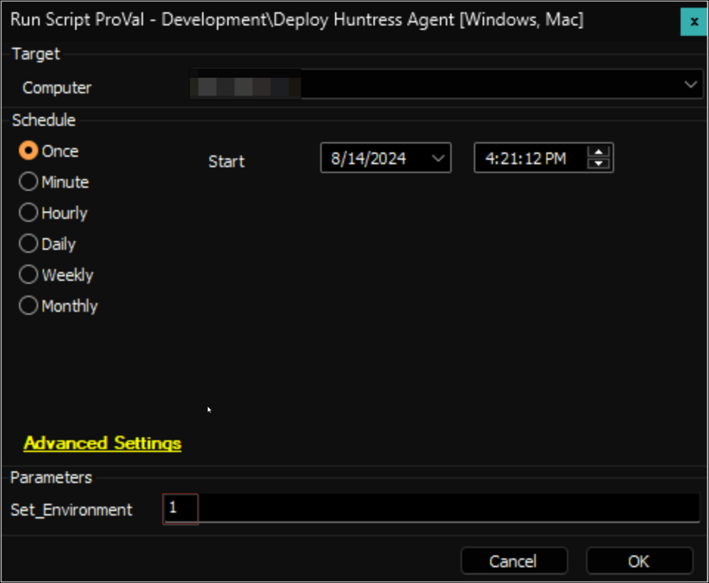
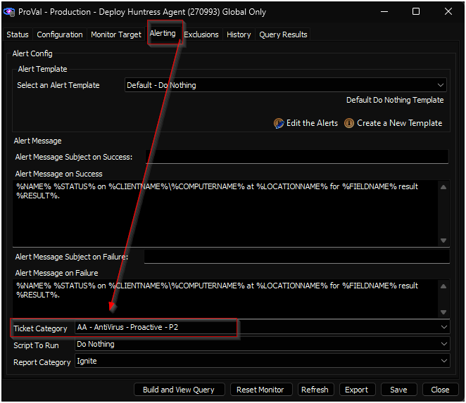

## Purpose

The solution aims to deploy and manage the Huntress Agent on both Windows and macOS machines.

## Associated Content 

#### Deployment 

| Content                                                                 | Type            | Function                                   |
|-------------------------------------------------------------------------|-----------------|--------------------------------------------|
| [Deploy Huntress Agent [Windows, Mac]](/docs/523b8882-2c51-4f70-ad7d-cb2b4baf7bbf) | Script          | Install Huntress Agent.                   |
| [Deploy Huntress Agent](/docs/8888ddb9-ea31-48cb-a88e-56ff970b0e6c) | Internal Monitor | Detects the computers missing Huntress Agent. |
| △ Custom - Deploy Huntress Agent                                         | Alert Template   | Execute the script against the computer detected by the internal monitor. |

#### Management (Optional) 

| Content                                                                  | Type   | Function                                   |
|--------------------------------------------------------------------------|--------|--------------------------------------------|
| [Uninstall Huntress Agent [Windows, Mac]](/docs/12c94448-10eb-4523-85e6-6c4cde84a33c) | Script | Uninstall Huntress Agent.                 |
| [Reinstall Huntress Agent [Windows]](/docs/161f5696-0f6b-46af-ad25-fe942745f099) | Script | Reinstall Huntress Agent.                 |
| [Repair Huntress Agent [Windows]](/docs/6489855d-0391-444d-a207-dfbd76152948) | Script | Repair Huntress Agent.                    |
| [Re-Register Huntress Agent [Windows]](/docs/6cf7ba91-b78d-4368-91a2-43095fad952b) | Script | Re-Register Huntress Agent.               |

## Implementation 

### 1.
Import the following content using the ProSync Plugin:
- [Script - Deploy Huntress Agent [Windows, Mac]](/docs/523b8882-2c51-4f70-ad7d-cb2b4baf7bbf) 
- [Internal Monitor - Deploy Huntress Agent](/docs/8888ddb9-ea31-48cb-a88e-56ff970b0e6c) 
- Alert Template - △ Custom - Deploy Huntress Agent

### 2.
Import the optional content using the ProSync Plugin if needed: 
- [Script - Uninstall Huntress Agent [Windows, Mac]](/docs/12c94448-10eb-4523-85e6-6c4cde84a33c) 
- [Script - Reinstall Huntress Agent [Windows]](/docs/161f5696-0f6b-46af-ad25-fe942745f099) 
- [Script - Repair Huntress Agent [Windows]](/docs/6489855d-0391-444d-a207-dfbd76152948) 
- [Script - Re-Register Huntress Agent [Windows]](/docs/6cf7ba91-b78d-4368-91a2-43095fad952b) 

### 3.
Execute the [Deploy Huntress Agent [Windows, Mac]](/docs/523b8882-2c51-4f70-ad7d-cb2b4baf7bbf) script against any online machine with the `Set_Environment` parameter set to `1` to create the EDFs used by the solution.  

### 4.
Reload the system cache:  

### 5.
Configure the solution as outlined below:
- Navigate to Automation → Monitors within the CWA Control Center and set up the following:
  - [Internal Monitor - Deploy Huntress Agent](/docs/8888ddb9-ea31-48cb-a88e-56ff970b0e6c) 
    - `Alert Template - △ Custom - Deploy Huntress Agent`
    - Right-click and Run Now to start the monitor

### 6.
Confirm with the consultant before enabling ticketing by setting a ticket category for the [Deploy Huntress Agent](/docs/8888ddb9-ea31-48cb-a88e-56ff970b0e6c) internal monitor.  

