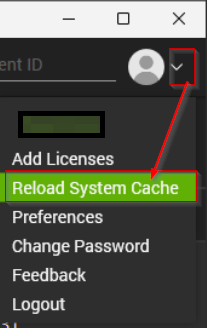
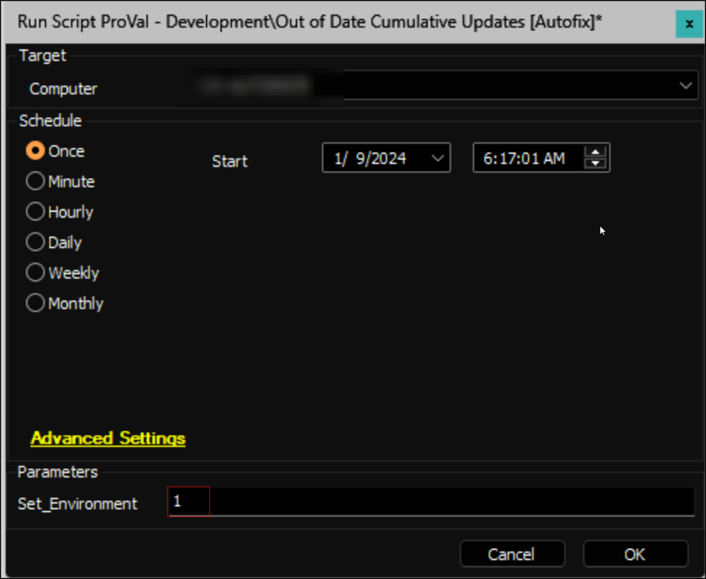

## Purpose

The solution audits Windows 10 and 11 computers to verify the latest installed Cumulative Update. It includes an Autofix option that automatically attempts to install the latest available CU if no update has been installed within the specified number of days.

## Associated Content

### Auditing

| Content                                                                                   | Type            | Function                                                         |
|-------------------------------------------------------------------------------------------|-----------------|------------------------------------------------------------------|
| [Script - Get Latest Installed Cumulative Update](/docs/bd99d6b2-2d31-4611-9682-3c8518c53998)  | Script          | Fetches the data from the machine.                               |
| [Dataview - Latest Installed Cumulative Update](/docs/0c224e91-ca6e-49b5-b2e6-3a8fee076690)  | Dataview        | Displays the data fetched by the script.                         |
| [Internal Monitor - Execute Script - Get Latest Installed Cumulative Update](/docs/4d2a667d-ba87-4148-ba5d-d6da484acccf)  | Internal Monitor | Detects machines where the script hasn't been executed within the last 7 days. |
| △ Custom - Execute Script - Get Latest Installed Cumulative Update                      | Alert Template   | Executes the script upon the machines detected by the internal monitor. |

### Automation

| Content                                                                                   | Type            | Function                                                         |
|-------------------------------------------------------------------------------------------|-----------------|------------------------------------------------------------------|
| [Internal Monitor - Last Cumulative Update > X Days ago](/docs/a835c448-fd00-4807-a3b2-8f1066e1a682)  | Internal Monitor | Detects computers that haven't received a Cumulative Update installation within the past 75(Default) days, excluding End-of-Life (EOL) machines. |
| [Script - Out of Date Cumulative Updates [Autofix]*](/docs/dedb8564-bb1a-47b8-9525-61fc9e690cae)  | Autofix Script   | Initiates the installation of the latest available Cumulative Update. |
| △ Custom - Autofix - Out of Date Cumulative Updates                                      | Alert Template   | Executes the Autofix script upon the machines detected by the internal monitor. |

### Other

| Content                                                                                   | Type            | Function                                                         |
|-------------------------------------------------------------------------------------------|-----------------|------------------------------------------------------------------|
| [Custom Table - pvl_win_latest_installed_cu](/docs/c03e4def-7efe-4a8b-99e9-d99ac2c65f5a)  | Custom Table    | Stores the data fetched by the [Script - Get Latest Installed Cumulative Update](/docs/bd99d6b2-2d31-4611-9682-3c8518c53998) script. |
| [Script - MySQL - Table - Create (plugin_proval_windows_os_support)](/docs/09d6c579-dbce-4876-81aa-0ab7cf5432b1)  | Script          | Inserts the latest version of the [plugin_proval_windows_os_support](/docs/938cd822-f6a3-4ee3-add2-62b407e45622) custom table. |
| [Custom Table - plugin_proval_windows_os_support](/docs/938cd822-f6a3-4ee3-add2-62b407e45622)  | Custom Table    | Stores Windows operating systems support end date, build number, and their respective release if any. The table should be updated to the latest version to use this solution at its full potential. The custom table can be updated by the [Script - MySQL - Table - Create (plugin_proval_windows_os_support)](/docs/09d6c579-dbce-4876-81aa-0ab7cf5432b1) script. |

## Implementation

### 1.
Import the following scripts from the `ProSync` plugin:
- [Script - Get Latest Installed Cumulative Update](/docs/bd99d6b2-2d31-4611-9682-3c8518c53998)
- [Script - Out of Date Cumulative Updates [Autofix]*](/docs/dedb8564-bb1a-47b8-9525-61fc9e690cae)
- [Script - MySQL - Table - Create (plugin_proval_windows_os_support)](/docs/09d6c579-dbce-4876-81aa-0ab7cf5432b1)

### 2.
Import the following internal monitors from the `ProSync` plugin:
- [Internal Monitor - Execute Script - Get Latest Installed Cumulative Update](/docs/4d2a667d-ba87-4148-ba5d-d6da484acccf)
- [Internal Monitor - Last Cumulative Update > X Days ago](/docs/a835c448-fd00-4807-a3b2-8f1066e1a682)

### 3.
Import the [Dataview - Latest Installed Cumulative Update](/docs/0c224e91-ca6e-49b5-b2e6-3a8fee076690) dataview from the `ProSync` plugin.

### 4.
Import the following alert templates from the `ProSync` plugin:
- △ Custom - Execute Script - Get Latest Installed Cumulative Update
- △ Custom - Autofix - Out of Date Cumulative Updates
- △ Custom - Autofix - Ticket Creation Computer

### 5.
Reload the System Cache.

### 6.
Execute the [Get Latest Installed Cumulative Update](/docs/bd99d6b2-2d31-4611-9682-3c8518c53998) script against a couple of online Windows 10/11 computers and validate the data in the [Latest Installed Cumulative Update](/docs/0c224e91-ca6e-49b5-b2e6-3a8fee076690) dataview.

### 7.
Configure the Auditing section of the solution as follows:
- Navigate to Automation → Monitors within the CWA Control Center and set up the following:
  - [Internal Monitor - Execute Script - Get Latest Installed Cumulative Update](/docs/4d2a667d-ba87-4148-ba5d-d6da484acccf)
    - Configure with the alert template: `△ Custom - Execute Script - Get Latest Installed Cumulative Update`
    - Right-click and Run Now to start the monitor

#### Autofix

### 1.
- Execute the [Out of Date Cumulative Updates [Autofix]*](/docs/dedb8564-bb1a-47b8-9525-61fc9e690cae) script against a Windows computer with the script parameter `Set_Environment` configured as `1`. This action will import the necessary System Properties required for solution management.

- Configure the necessary values within the system properties.
  - `Out_of_Date_CU-EmailAlerts`: Configure this system property to 1 to activate Email Alerts in conjunction with the tickets.
  - `Out_of_Date_CU-Autofix_for_Servers`: Assign a value of 1 to this system property to enable Autofix for servers; by default, the script will only generate a ticket for servers.
  - `Out_of_Date_CU-Disable_Autofix_for_Workstations`: Assign a value of 1 to this system property to Disable Autofix for workstations.

### 2.
Configure the Autofix section of the solution as follows:
- Navigate to Automation → Monitors within the CWA Control Center and set up the following:
  - [Internal Monitor - Last Cumulative Update > X Days ago](/docs/a835c448-fd00-4807-a3b2-8f1066e1a682)
    - Configure with the alert template: `△ Custom - Autofix - Out of Date Cumulative Updates`
    - Set the required ticket category as explained in the **Ticket Category** section of the [Out of Date Cumulative Updates [Autofix]*](/docs/dedb8564-bb1a-47b8-9525-61fc9e690cae) script's document.
    - Right-click and Run Now to start the monitor

#### Ticket Only

### 1.
Configure the Autofix section of the solution as follows:
- Navigate to Automation → Monitors within the CWA Control Center and set up the following:
  - [Internal Monitor - Last Cumulative Update > X Days ago](/docs/a835c448-fd00-4807-a3b2-8f1066e1a682)
    - Configure with the alert template: `△ Custom - Ticket Creation - Computer`
    - Right-click and Run Now to start the monitor

## FAQ

**Q:** The Dataview shows this machine is online currently but has not updated its inventory in well over 10 days, why?  
**A:** The monitor is set up to run only against machines that are not EOL or recently EOL (within 30 days). If the machine is not EOL currently, check to make sure the monitor is set up to run against the group that the machine is in.

