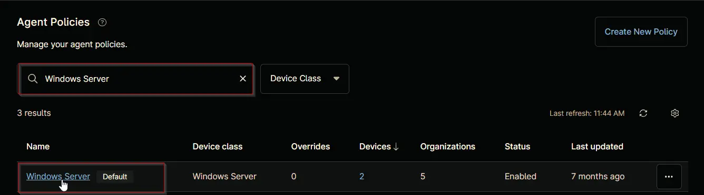

## Purpose

The solution is designed to manage the members in the local admin group for Windows machines.

## Associated Content

### Custom Field

| Content | Definition Scope | Required | Type | Available Options | Applicable OS | Function |
| ------- | ---------------- | -------- | ---- | ----------------- | ------------- | -------- |
| [cPVAL Local Admin Group Cleanup](/docs/d39ab865-2fad-461f-8c39-6540e0199b8e) | `Organization`, `Location`, `Device` | True | Drop-down | `Windows`, `Windows Workstations`, `Windows Servers`, `Disabled` | `Windows` | Select the operating system to enable the local admin group cleanup solution for the client. Set this field to `Disable` at the location or device level to exclude it. |
| [cPVAL Approved Local Admins](/docs/ead6d2e4-c4a2-442e-8471-09c4e6b78bd4) | `Organization`, `Location`, `Device` | True | Text | | `Windows` | Enter a comma-separated list of approved local admins for the client. Setting this custom field at the location or device level will override the value set at the organization level. |

### Automation

| Content | Function |
| ------- | -------- |
| [Local Admin Group Cleanup](/docs/27432f96-a5bf-4605-b2c8-fd046487b2db) | Manages the local Administrators group by ensuring only the users specified in the [cPVAL Approved Local Admins](/docs/ead6d2e4-c4a2-442e-8471-09c4e6b78bd4) custom field are present. If any approved users are missing, the automation will add them to the group. If the field is not set, all users except 'Administrator' (and 'Domain Admins' for domain-joined machines) will be removed from the group. |

### Compound Conditions

| Content | Function |
| ------- | -------- |
| [Local Admin Group Cleanup - Windows Workstations](/docs/88f222b2-c167-4202-b1f2-7dd790bf36dd) | Initiates the [Local Admin Group Cleanup](/docs/27432f96-a5bf-4605-b2c8-fd046487b2db) automation on Windows Workstations where the cleanup feature is enabled. |
| [Local Admin Group Cleanup - Windows Servers](/docs/fa339801-d0b8-4ce4-afd1-2468712c76e7) | Initiates the [Local Admin Group Cleanup](/docs/27432f96-a5bf-4605-b2c8-fd046487b2db) automation on Windows Servers where the cleanup feature is enabled. |

## Implementation

### Step 1

Create the following custom fields:

- [cPVAL Local Admin Group Cleanup](/docs/d39ab865-2fad-461f-8c39-6540e0199b8e)
- [cPVAL Approved Local Admins](/docs/ead6d2e4-c4a2-442e-8471-09c4e6b78bd4)

### Step 2

Create the following [Local Admin Group Cleanup](/docs/27432f96-a5bf-4605-b2c8-fd046487b2db) automation.

### Step 3

Create the [Local Admin Group Cleanup - Windows Workstations](/docs/88f222b2-c167-4202-b1f2-7dd790bf36dd) compound condition for default `Windows Workstation [Default]` agent policy.  

### Step 4

Create the [Local Admin Group Cleanup - Windows Servers](/docs/fa339801-d0b8-4ce4-afd1-2468712c76e7) compound condition for default `Windows Server [Default]` agent policy.  

## FAQ

### 1. Can the Local Admin Group Cleanup automation be run manually?

Yes, the automation can be run manually, independent of the [cPVAL Local Admin Group Cleanup](/docs/d39ab865-2fad-461f-8c39-6540e0199b8e) custom field. However, the [cPVAL Approved Local Admins](/docs/ead6d2e4-c4a2-442e-8471-09c4e6b78bd4) must be populated. Even if the cleanup feature is disabled or a device is excluded, you can still manually execute the automation to manage the local Administrators group.

### 2. Are the [cPVAL Local Admin Group Cleanup](/docs/d39ab865-2fad-461f-8c39-6540e0199b8e) and [cPVAL Approved Local Admins](/docs/ead6d2e4-c4a2-442e-8471-09c4e6b78bd4) custom fields required for the automation to work?

Yes, these custom fields are necessary for the automation to function as intended. The cleanup automation uses these fields to determine which devices should be included and which local admin accounts should be retained.

### 3. What should I check if the cleanup is not being applied to certain devices?

If the cleanup is not working on specific devices, verify that the [cPVAL Local Admin Group Cleanup](/docs/d39ab865-2fad-461f-8c39-6540e0199b8e) custom field is set appropriately and not set to `Disabled` at the organization, location, or device level. Also, ensure the correct compound conditions are applied to the relevant agent policies.

### 4. Can I customize which admin accounts are retained on each device?

Yes, you can specify a comma-separated list of approved local admin accounts in the [cPVAL Approved Local Admins](/docs/ead6d2e4-c4a2-442e-8471-09c4e6b78bd4) custom field. Setting this field at the location or device level will override the organization-level value for that scope.

### 5. What happens if the [cPVAL Approved Local Admins](/docs/ead6d2e4-c4a2-442e-8471-09c4e6b78bd4) field is left blank?

If the [cPVAL Approved Local Admins](/docs/ead6d2e4-c4a2-442e-8471-09c4e6b78bd4) custom field is not set, the automation will remove all users from the local Administrators group except for 'Administrator' (and 'Domain Admins' on domain-joined machines).

### 6. How should I set values in the [cPVAL Approved Local Admins](/docs/ead6d2e4-c4a2-442e-8471-09c4e6b78bd4) custom field?

- Enter the value in single quotes.  
  **Example:** `'firstCat'`  
    

- For multiple approved admins, separate each entry with a comma.  
  **Example:** `'firstCat, secondCat'`  
    

- To specify domain users or groups, use the `Domain` keyword (do not enter the actual domain name). The automation will automatically substitute `Domain` with the correct domain name for domain-joined machines and ignore it for workgroup machines.  
  **Example:** `'firstCat, secondCat, Domain\Cats Group, Domain\goldenCat'`  
    

- You do not need to include `Administrator` or `Domain\Domain Admins` in this field. The automation will automatically add `Administrator` and, for domain-joined machines, `Domain\Domain Admins`.

- If this custom field is left blank, the automation will remove all users from the local Administrators group except for 'Administrator' (and 'Domain Admins' on domain-joined machines).
