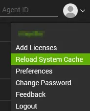
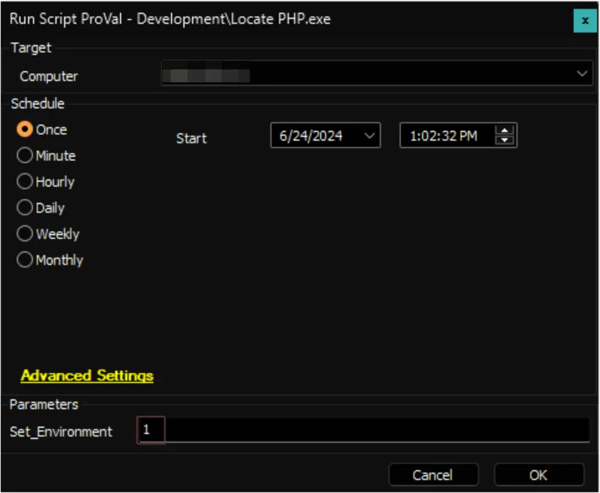
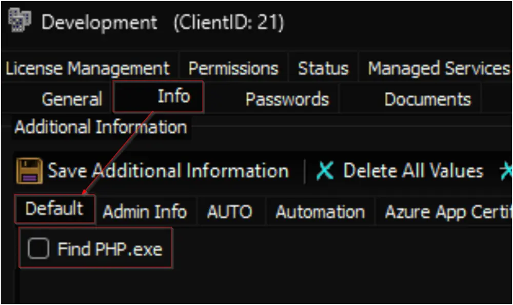

## Purpose

The goal of this solution is to identify the computers that have the PHP.exe file available.

## Associated Content

| Content                                                                 | Type           | Function        |
|-------------------------------------------------------------------------|----------------|-----------------|
| [Script - Locate PHP.exe](/docs/174c59f1-8d7f-44a0-b5de-d69145ab4a43)         | Script         | Fetches data.   |
| [Custom Table - pvl_php_audit](/docs/10712956-11f1-47f6-ab0a-d063d2ca67d1)     | Custom Table   | Stores data.    |
| [Dataview - PHP.exe File Location](/docs/142bb69a-42f3-469a-ac3f-a8b9007c73f0) | Dataview       | Displays data.  |
| [Internal Monitor - Execute Script - Locate PHP.exe](/docs/20be21ac-550d-478e-b486-34d2879725e0) | Internal Monitor | Detects computers. |
| △ Custom - Execute Script - Find PHP.exe                                  | Alert Template | Executes script. |

## Implementation

1. Import the following content using the ProSync Plugin:
   - [Script - Locate PHP.exe](/docs/174c59f1-8d7f-44a0-b5de-d69145ab4a43)
   - [Custom Table - pvl_php_audit](/docs/10712956-11f1-47f6-ab0a-d063d2ca67d1)
   - [Dataview - PHP.exe File Location](/docs/142bb69a-42f3-469a-ac3f-a8b9007c73f0)
   - [Internal Monitor - Execute Script - Locate PHP.exe](/docs/20be21ac-550d-478e-b486-34d2879725e0)
   - Alert Template - △ Custom - Execute Script - Find PHP.exe

2. Reload the system cache:
   

3. Run the script with the `Set_Environment` parameter set to `1` to create the [custom table](/docs/10712956-11f1-47f6-ab0a-d063d2ca67d1) and the EDF being used by the script.
   

4. Configure the solution as outlined below:
   - Navigate to Automation → Monitors within the CWA Control Center and set up the following:
     - [Internal Monitor - Execute Script - Locate PHP.exe](/docs/20be21ac-550d-478e-b486-34d2879725e0)
       - `△ Custom - Execute Script - Find PHP.exe`
       - Right-click and select "Run Now" to start the monitor.

5. Mark the `Find PHP.exe` EDF on the clients you would like to audit the information on.
   