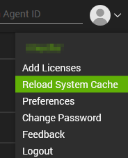
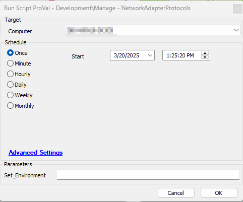

## Purpose
This solution manages network protocols on Windows machines, including enabling, disabling, and configuring them to use DHCP.

## Associated Content
| Content                                                      | Type             | Function                                                                                                          |
| ------------------------------------------------------------ | ---------------- | ----------------------------------------------------------------------------------------------------------------- |
| Manage-NetworkAdapterProtocols                      | Script           | Manages Network Adpater Protocols                                                                                 |
| ProVal - Production - Manage Network Adapters       | Internal Monitor | Detects machines selected for Network Adapters Protocol Solution                                                  |
| `△ Custom - Execute Script - Manage-NetworkAdapterProtocols` | Alert Template   | Execute the script Manage-NetworkAdapterProtocols against the machines detected by the internal monitor. |

## Implementation
1. Import the following content using the ProSync Plugin:
   - Manage-NetworkAdapterProtocols  
   - ProVal - Production - Manage Network Adapters
   -  `△ Custom - Execute Script - Manage-NetworkAdapterProtocols` 

2. Reload the system cache:  
 

1. Run the Manage-NetworkAdapterProtocols against any machine with the Set_Environment parameter set to '1':  

1. Configure the solution as outlined below:
   - Navigate to Automation → Monitors within the CWA Control Center and set up the following:
     - ProVal - Production - Manage Network Adapters
       - `△ Custom - Execute Script - Manage-NetworkAdapterProtocols` 
       - Right-click and Run Now to start the monitor.

