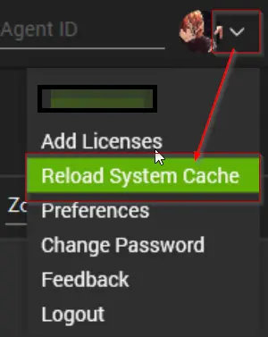

## Purpose

The purpose of this solution is to collect and display OneDrive sync status information from Windows machines exclusively for Non-SharePoint Linked Sites.

## Associated Content

#### Auditing

| Content                                                                 | Type           | Function                                                   |
|-------------------------------------------------------------------------|----------------|------------------------------------------------------------|
| [Script - Microsoft OneDrive Sync Status [DV]](/docs/11c05d45-a0fb-4cfb-b388-cdc59362d9a1) | Script         | Fetch the data.                                           |
| [Dataview - Microsoft OneDrive Sync Status [Script]](/docs/5b97dae1-f82c-4ae4-9e21-a5c4e3b1480c) | Dataview       | Display the data.                                         |
| [Internal Monitor - Execute Script - Microsoft OneDrive Sync Status](/docs/b7936e96-423d-4c53-bd95-d10a6c4861f1) | Internal Monitor | Detect the relevant computers to execute the script.     |
| △ CUSTOM - Execute Script - Microsoft OneDrive Sync Status              | Alert Template | Executes the script against the computers detected by the Internal Monitor. |

#### Alerting

| Content                                                                 | Type           | Function                                                   |
|-------------------------------------------------------------------------|----------------|------------------------------------------------------------|
| [Internal Monitor - OneDrive Sync Status Issue](/docs/e54f4273-60a6-4790-bb8e-8c0a3d2033d5) | Internal Monitor | Detects the problematic machines.                          |
| [Script - Ticket Creation - Computer](/docs/63beba3c-f4a6-41a5-98e2-d4e4ce885035) | Autofix Script | Manages ticketing.                                        |
| △ Custom - Ticket Creation - Computer                                     | Alert Template | Executes the script against the computers detected by the Internal Monitor. |

## Implementation

### 1.
Import/Update the following scripts from the `ProSync` plugin:
- [Script - Microsoft OneDrive Sync Status [DV]](/docs/11c05d45-a0fb-4cfb-b388-cdc59362d9a1)  
- [Script - Ticket Creation - Computer](/docs/63beba3c-f4a6-41a5-98e2-d4e4ce885035)  

### 2.
Import/Update the following internal monitors from the `ProSync` plugin:
- [Internal Monitor - Execute Script - Microsoft OneDrive Sync Status](/docs/b7936e96-423d-4c53-bd95-d10a6c4861f1)  
- [Internal Monitor - OneDrive Sync Status Issue](/docs/e54f4273-60a6-4790-bb8e-8c0a3d2033d5)  

### 3.
Import/Update the following alert templates from the `ProSync` plugin:
- △ CUSTOM - Execute Script - Microsoft OneDrive Sync Status  
- △ Custom - Ticket Creation - Computer  

### 4.
Import the [Dataview - Microsoft OneDrive Sync Status [Script]](/docs/5b97dae1-f82c-4ae4-9e21-a5c4e3b1480c) from the `ProSync` plugin.

### 5.
Reload the system cache.  

### 6.
Implement the Auditing solution as follows:
- Navigate to Automation > Monitors > Internal Monitors
  - [Internal Monitor - Execute Script - Microsoft OneDrive Sync Status](/docs/b7936e96-423d-4c53-bd95-d10a6c4861f1)  
  - Alert Template: `△ CUSTOM - Execute Script - Microsoft OneDrive Sync Status`

### 7.
Implement the Alerting solution as follows:
- Navigate to Automation > Monitors > Internal Monitors
  - [Internal Monitor - OneDrive Sync Status Issue](/docs/e54f4273-60a6-4790-bb8e-8c0a3d2033d5)  
  - Alert Template: `△ Custom - Ticket Creation - Computer`

## FAQ

**Q:** Why does the script occasionally throw an error and fail to retrieve data from the computer?  
**A:** The script relies on the functionality of the [Onedrive.dll](https://github.com/rodneyviana/ODSyncService) module to fetch the necessary data. However, it's important to note that the [Onedrive.dll](https://github.com/rodneyviana/ODSyncService) module is not entirely infallible, which can result in occasional errors during data retrieval. Additionally, it's crucial to ensure that no security applications are impeding the functionality of this module, as it needs to operate without restrictions to retrieve data successfully.
