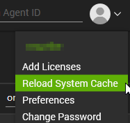
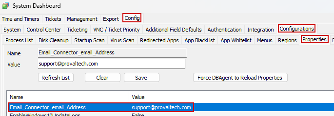
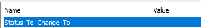

## Purpose

The purpose of this solution is to change the status of the ticket in ConnectWise Manage to the desired status when an offline machine comes back online.

## Associated Content

| Content                                                                                                         | Type            | Function                                                                                                                                                                                                                                                                                                                                 |
|-----------------------------------------------------------------------------------------------------------------|-----------------|------------------------------------------------------------------------------------------------------------------------------------------------------------------------------------------------------------------------------------------------------------------------------------------------------------------------------------------|
| [Script - Online Status Alerting - Update EDFs [Param]](/docs/79f11a31-7ae1-4e12-a9d7-581e809aaa2e)       | Script          | This script can be used to provide input to the computer EDFs "Online Alert Reason," "Online Alert Email," and "Online Alert Ticket ID."                                                                                                                                                                                                 |
| [Script - Online Status Alerting - Autofix - Update Ticket + Email [EDF]](/docs/71b6a39c-0d61-4959-8f1e-69b1cc84d182) | Auto-fix Script | This will run as an autofix to the [Online Status Alerting - Machine Back Online](/docs/76fa2909-0cc0-4f76-82a0-c067660d52ac) and [Online Status Alerting - Machine Restarted](/docs/b2fbe440-9d16-41ae-bd52-14037790697f) monitor sets to change the status of the ConnectWise Manage ticket.                                                                                  |
| [Internal Monitor - Online Status Alerting - Machine Back Online](/docs/76fa2909-0cc0-4f76-82a0-c067660d52ac) | Internal Monitor | This will look for machines for which the EDF "Online Alert Ticket ID" is filled with a Ticket ID and that were offline but have just come back online. It will then trigger the [Script - Online Status Alerting - Autofix - Update Ticket + Email [EDF]](/docs/71b6a39c-0d61-4959-8f1e-69b1cc84d182).                                                                                   |
| [Internal Monitor - Online Status Alerting - Machine Restarted](/docs/b2fbe440-9d16-41ae-bd52-14037790697f) | Internal Monitor | Runs the script [Online Status Alerting - Autofix - Update Ticket + Email [EDF]](/docs/71b6a39c-0d61-4959-8f1e-69b1cc84d182) once a machine comes back online after a restart and has either the Ticket ID filled in the EDF "Online Alert Ticket ID" or the Email ID filled in the EDF "Online Alert Email."                                                                 |
| △ Custom - Autofix - Online Status Alerting                                                                     | Alert Template   | This will run the [Script - Online Status Alerting - Autofix - Update Ticket + Email [EDF]](/docs/71b6a39c-0d61-4959-8f1e-69b1cc84d182).                                                                                                                                                                                                 |

## Implementation

1. Import both scripts, the internal monitor, and the alert template:
   - [Script - Online Status Alerting - Autofix - Update Ticket + Email [EDF]](/docs/71b6a39c-0d61-4959-8f1e-69b1cc84d182)
   - [Script - Online Status Alerting - Update EDFs [Param]](/docs/79f11a31-7ae1-4e12-a9d7-581e809aaa2e)
   - [Internal Monitor - Online Status Alerting - Machine Back Online](/docs/76fa2909-0cc0-4f76-82a0-c067660d52ac)
   - [Internal Monitor - Online Status Alerting - Machine Restarted](/docs/b2fbe440-9d16-41ae-bd52-14037790697f)
   - `△ Custom - Autofix - Online Status Alerting`

2. Run or debug the [Script - Online Status Alerting - Autofix - Update Ticket + Email [EDF]](/docs/71b6a39c-0d61-4959-8f1e-69b1cc84d182) against a random Windows computer with the following parameters filled out:
   - `SetEnvironment`  
     - Set this value to 1
   - `Email_Connector_email_Address`  
     - Fill this out with the email address of the connector within Manage. This allows tickets to be updated when the machine comes online.
   - `Status_To_Change_To`  
     - Set this to what the status should change to when the machine comes online.

   For more information on system properties, see the document for the script [Online Status Alerting - Autofix - Update Ticket + Email [EDF]](/docs/71b6a39c-0d61-4959-8f1e-69b1cc84d182).

3. Reload the System Cache  
   

4. Navigate to the System Dashboard → Config → Configurations → Properties and validate that the settings you specified have been set correctly:  
     
     
   **If they are different from what you specified, update them now.** The SetEnvironment process does not overwrite any existing properties if they exist, so this must be double-checked.

5. Navigate to Automation → Monitors → Internal Monitors
   - Find the [Internal Monitor - Online Status Alerting - Machine Back Online](/docs/76fa2909-0cc0-4f76-82a0-c067660d52ac)  
     - Apply the alert template `△ Custom - Autofix - Online Status Alerting`  
       - Ensure this alert template is set to run the [Script - Online Status Alerting - Autofix - Update Ticket + Email [EDF]](/docs/71b6a39c-0d61-4959-8f1e-69b1cc84d182)  
     - Right-click and select Run Now on the monitor
   - Find the [Internal Monitor - Online Status Alerting - Machine Restarted](/docs/b2fbe440-9d16-41ae-bd52-14037790697f)  
     - Apply the alert template `△ Custom - Autofix - Online Status Alerting`  
       - Ensure this alert template is set to run the [Script - Online Status Alerting - Autofix - Update Ticket + Email [EDF]](/docs/71b6a39c-0d61-4959-8f1e-69b1cc84d182)  
     - Right-click and select Run Now on the monitor

