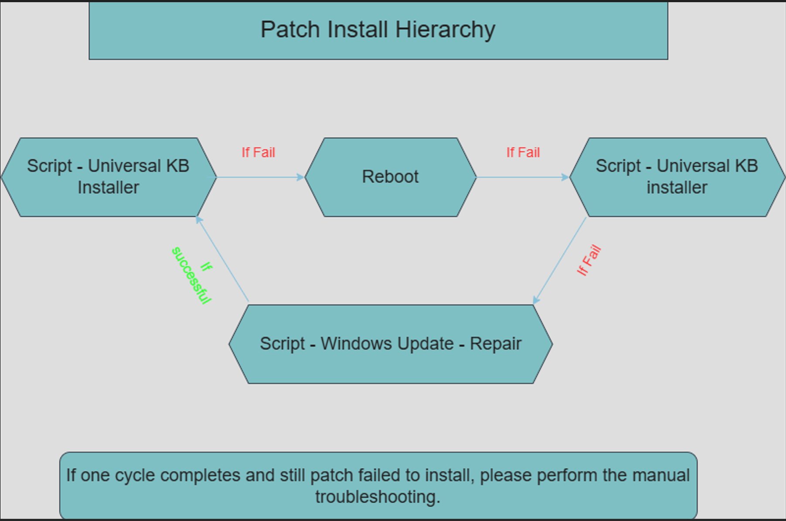
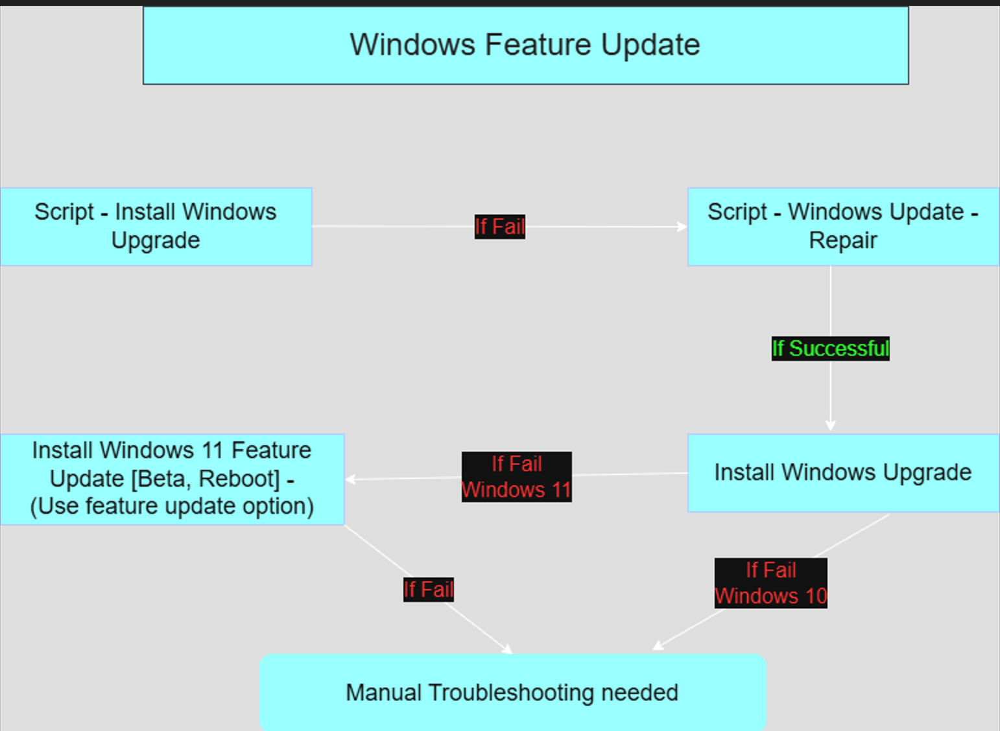
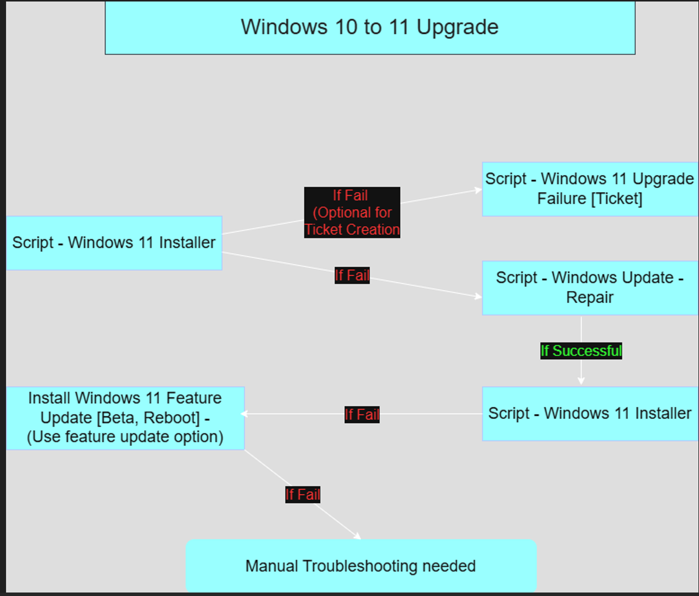

## Purpose

This solution is targeted to compute all the patch management automation together for better understanding.

## Associated Content

### **Install Patches**

| Content               | Type   | Function                                             |
|-----------------------|--------|------------------------------------------------------|
| [Script - Universal KB Installer](/docs/424dfd5c-377f-461f-a57f-80001d839af8)| Script | The purpose of this script is to install the desired patch on Windows machines. |

### **Uninstall Patches**

| Content                  | Type   | Function                                                                 |
|--------------------------|--------|-------------------------------------------------------------------------|
| [Script - Uninstall Windows KB Param](/docs/fd611b68-7cd6-4a6a-bee1-3d772ecd9a27) | Script | The script is designed to facilitate uninstalling a specific Windows update on a computer.  |

### **Install/Audit Latest Cumulative Update**

| Content                       | Type     | Function                                                                                                                             |
|-------------------------------|----------|-------------------------------------------------------------------------------------------------------------------------------------|
| [Solution - Latest Installed Cumulative Update](/docs/991e926f-dcd2-4be3-9f3a-ea7ee9842da2) | Solution | The solution audits Windows 10 and 11 computers to verify the latest installed Cumulative Update. It also includes an Autofix option that automatically attempts to install the latest available CU if no update has been installed within the specified days. |

### **Windows Update - Repair**

| Content                  | Type   | Function                                                                                                               |
|--------------------------|--------|-----------------------------------------------------------------------------------------------------------------------|
| [Script - Windows Update - Repair](/docs/aaa3f8da-cfd3-454a-808b-d4501f9c2608)  | Script | This script attempts to repair and reset Windows update settings using the ProVal agnostic PowerShell: [Agnostic - Repair-WindowsUpdate](/docs/39345bfd-d9e2-4e68-9d7a-3e8b443140cc). The goal of this script is to fix potential patching issues for Windows devices. |

### **Windows 11 Compatibility Audit**

| Content                  | Type   | Function                                                                                                               |
|--------------------------|--------|-----------------------------------------------------------------------------------------------------------------------|
| [Solution - Windows 11 Compatibility Audit](/docs/f0bb3ffc-60cb-484c-b7fa-27a386ac664c)  | Solution | The solution aims to determine the compatibility of Windows 10 machines for the Windows 11 installation.   Additionally, it can be used to detect Windows 11 computers that do not meet Microsoft's requirements for Windows 11. While Windows 11 can be forcefully installed on incompatible computers, the feature pack cannot be updated for such machines using the Windows Update Assistant. |

### **Upgrade Windows 10 and 11 to Windows 11 24H2**

| Content                  | Type   | Function                                                                                                               |
|--------------------------|--------|-----------------------------------------------------------------------------------------------------------------------|
| [Solution - Windows 11 24H2 Installation](/docs/00b08a60-f202-42db-9f67-a76ea29289fa)  | Solution | This solution is designed to automate the upgrade from Windows 10 to Windows 11, and install feature update for Windows 11 addressing the end-of-support deadline for Windows 10 in October 2025. |

### **Workaround script for erroneous Windows machines**

| Content                  | Type   | Function                                                                                                               |
|--------------------------|--------|-----------------------------------------------------------------------------------------------------------------------|
| [Script - Install Windows 11 Feature Update [Beta, Reboot]](/docs/27f8240b-603a-4af2-b9d9-480a560f8747)  | Script | This document describes the Automate implementation of the agnostic script [Install-WindowsFeatureUpdate](/docs/837e00a9-4fde-4457-9516-591da7ba4da0). The script automates the installation of the latest Windows 11 Feature Update. It performs comprehensive pre-checks, maintenance, and validation to ensure a smooth upgrade process. The script supports both Windows 10 and Windows 11. For Windows 10, it attempts to upgrade to the latest available version of Windows 11. For Windows 11, it ensures the system is updated to the latest available feature update. |

## Implementation

This compute solution contains separate patching solutions to be used as per the requirement.
Please refer to the each script/solution provided based on the title mentioned as per your requirement.

## FAQ

- (Q) Does the above solutions dependent to each other?
- (A) Not really, they are separate solution and build with different perspective. No doubt, these all relates to patching so can be run together as a customized solution based on the requirement.

## Flow Chart

Below are the few flow chart that can assist you to follow steps for patch install, Windows feature update, and Windows Upgrade from 10 to 11.

- **Patch install Hierarchy**  
Follow this hierarchy if a patch is not getting install. You can run the [Script - Universal KB Installer](/docs/424dfd5c-377f-461f-a57f-80001d839af8) to install that patch and if the issue persists, follow the flow chart below:

- **Windows Feature Update**  
Follow this for problems related to feature updates for Win 10 or 11: 

- **Windows 10 to 11 Upgrade**  
Follow this if a Windows 10 computer is failing to upgrade to Windows 11:

