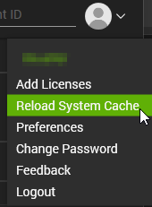
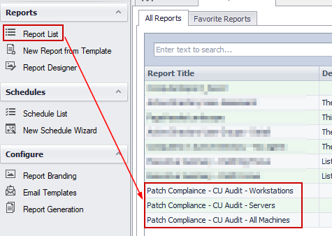
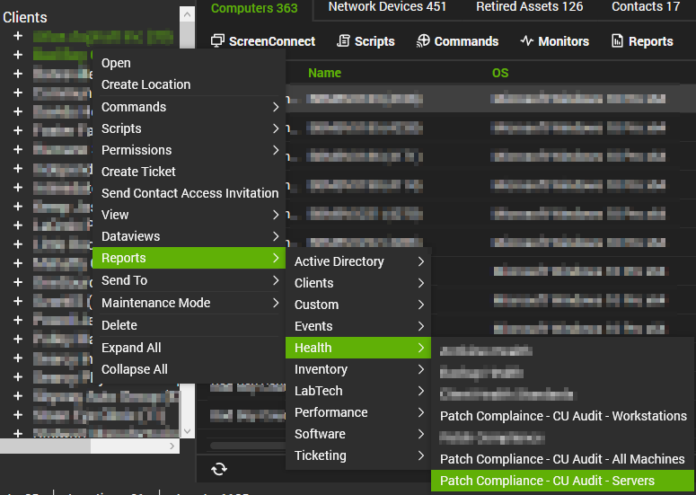
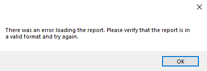

## Purpose

To provide clients with professional-looking patch management reports that they can confidently trust. These reports are based entirely on the cumulative update solution and a custom table.

## Reports Included

| Content | Type | Function |
|---------|------|----------|
| [Report - Patch Compliance - CU Audit - All Machines](/docs/7be1d6f2-7b75-4740-a42b-8e6f66377d15) | Report | Displays a comprehensive summary of all machines at a specific client and their respective patch status. |
| [Report - Patch Compliance - CU Audit - Servers](/docs/f2a584ea-6b77-4b95-917a-a658da7a6785) | Report | Displays a comprehensive summary of all servers at a specific client and their respective patch status. |
| [Report - Patch Compliance - CU Audit - Workstations](/docs/bbeeb6dd-3c9b-49f0-ae6d-ef6f543d2174) | Report | Displays a comprehensive summary of all workstations at a specific client and their respective patch status. |

## Associated Content

### Automate Content

| Content | Type | Function |
|---------|------|----------|
| [Script - Create Views for Patch Compliance Report](/docs/7174f88a-38fc-4e5a-83cc-1f48a6c29526) | Script | This script creates all the necessary items in the database to ensure the [Patch Compliance Reporting Solution](/docs/6dd7be85-8983-413b-8f56-1426446f25da) functions correctly. |

### Additional Content

| Content | Type | Function |
|---------|------|----------|
| [Patch Compliance Reporting SQL Import Attachment](/docs/d031272f-71dd-46c3-af06-327cac5c648a) | Document | Implementation instructions on how to import these patch compliance reports into a partner's environment. |

## Dependencies

These reports are dependent on the following items:
- Report Center being installed and configured
- [Script - Create Views for Patch Compliance Report](/docs/7174f88a-38fc-4e5a-83cc-1f48a6c29526)
- [Solution - Latest Installed Cumulative Update](/docs/991e926f-dcd2-4be3-9f3a-ea7ee9842da2)

## Implementation

1. Ensure the [Solution - Latest Installed Cumulative Update](/docs/991e926f-dcd2-4be3-9f3a-ea7ee9842da2) is imported and up to date in the environment. The audit script must be running regularly for this report to show accurate data.

2. Import the following script from the ProSync Plugin:
   - [Script - Create Views for Patch Compliance Report](/docs/7174f88a-38fc-4e5a-83cc-1f48a6c29526)

3. Run the [Script - Create Views for Patch Compliance Report](/docs/7174f88a-38fc-4e5a-83cc-1f48a6c29526) on any machine to create the views necessary for this solution. After running the script once, it can be deleted from the environment.

4. Follow the instructions outlined in the [Patch Compliance Reporting SQL Import Attachment](/docs/d031272f-71dd-46c3-af06-327cac5c648a) document to import the reports into the report center.

5. Reload the system cache:  
   

6. After the reports have been imported, they can be viewed instantly by going into the Report Center --> Report List --> View the reports mentioned in this document:  
     
   
   To view them from the Right-Click menu (Reports --> Health --> Patch Compliance - CU Audit - XXXX), the control center must be restarted before they become visible. If the partner does not need to access them right away, this is typically not an issue.  
   

## FAQ

**Q: How is the data calculated on these reports?**  
A: Each machine is given a compliance score depending on how far out of date the machine is or if it is EOL. The criteria are outlined below:
- Current (Up-to-date) machines: These are machines that have a cumulative update installed that is less than 45 days old. These are given a 100% compliance score.
- Warning (Nearing out-of-date) machines: These are machines that have a cumulative update installed that is between 45–90 days old. These are given a 75% compliance score.
- Error (Out-of-date) machines: These are machines that are between 90–120 days old. These are given a 25% compliance score.
- Error (Extremely Out-of-date) machines: These are machines that are greater than 120 days since the last cumulative update was installed. These are given a 10% compliance score.
- EOL machines are given a 0% compliance score.  
At the end, all the machines are totaled and averaged to get the main percentage on the front page.

**Q: I am seeing one of my machines reporting a very high age since the last cumulative update has been installed. Where should I start troubleshooting?**  
A: I have outlined some steps that can be taken to troubleshoot why you may be seeing out-of-date machines:
1. Open the Computer Management screen of the affected device --> Navigate to the Patching screen --> Look for the latest month's cumulative update.
   - If you cannot find the latest cumulative update, try running the [Script - Patch Manager - WUA Settings Validation](/docs/1f78325c-968a-4a73-ba85-2a18c061063e) and scan for patches again. If that does not work, further troubleshooting will need to happen manually on the machine.
2. If the latest cumulative update is visible, look for any failure messages on that main screen or when selecting the Patch Job tab.
   - If there are no job logs, there is likely a configuration issue with the assigned patch policy that must be investigated.
   - If you see a failure during the maintenance window, investigate the mentioned error code.
3. If you still do not see any issues reported, open Patch Manager (Automation --> Patch Manager) --> Click the monitor icon at the top left to access the device screen --> Find the machine in question and select it --> You should see patch information populate at the bottom --> Select the Patch History tab and look for any failures with the latest cumulative update.
   - Investigate any failures.
4. You can also view the Groups tab to confirm the setup of the patch policy if you need to validate that.

**Q: I've tried everything and I can't get the latest cumulative update to install. Manual installation from the Microsoft Update Catalog does not work, repair scripts do nothing, and Windows Update consistently fails. What can I try next?**  
A: If this is a workstation, you can try to update to the latest feature update or even a preview build of a feature update. Typically, feature updates consist of a full OS reload while saving data, which can often fix these types of issues.  
- If all else fails, an OS upgrade from Windows 10 to 11 may work, but if it is already on Windows 11, you must perform a reload of the machine to get patching to function.  
- If this is a server, I do not have many additional things to try other than upgrading/reloading the server.

**Q: What does it mean when a machine has 'No Audit Information' provided?**  
A: The cumulative update data is audited from the [Solution - Latest Installed Cumulative Update](/docs/bd99d6b2-2d31-4611-9682-3c8518c53998) should be running against all agents every 7 days. If you see machines in this list, they are most likely offline frequently. If not, you can try running the script manually against the machine and report any errors to ProVal Technologies for further investigation.

## Potential Problems

If you see the following error when opening one of the reports, it means at least one of the views or the custom table is missing and cannot be referenced. If they are all present, verify that you have full permissions to the table and views.  

