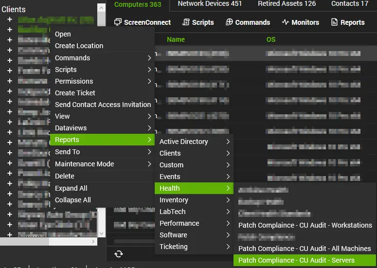

## Purpose

To provide clients with professional-looking patch management reports that they can confidently trust. These reports are based entirely on the cumulative update solution and a custom table.

## Reports Included

| Content | Type | Function |
| --- | --- | --- |
| [CU Compliance and Audit - All Machines](/docs/7be1d6f2-7b75-4740-a42b-8e6f66377d15) | Report | Provides a high-level overview of the patch health across the entire client environment (servers and workstations), focusing on the age of the last installed Cumulative Update. |
| [CU Compliance and Audit - Servers](/docs/f2a584ea-6b77-4b95-917a-a658da7a6785) | Report | Provides a focused overview of patch health strictly for managed servers, helping to identify critical infrastructure risks. |
| [CU Compliance and Audit - Workstations](/docs/bbeeb6dd-3c9b-49f0-ae6d-ef6f543d2174) | Report | Provides a focused overview of patch health for laptops and desktops, highlighting end-user devices that may have missed recent updates. |

## Associated Content

### Automate Content

| Content | Type | Function |
| --- | --- | --- |
| [Create Views for Patch Compliance Report](/docs/7174f88a-38fc-4e5a-83cc-1f48a6c29526) | Script | This script creates all the necessary items in the database to ensure the [CU Compliance Reporting](/docs/6dd7be85-8983-413b-8f56-1426446f25da) solution functions correctly. |

### Additional Content

| Content | Type | Function |
| --- | --- | --- |
| [plugin_proval_computerpatchcompliance](/docs/f50c0f90-b8e1-4db9-bbb2-88887d5a21af) | View | The master detail view that calculates compliance scores, EOL status, and patch age for every individual computer. |
| [plugin_proval_clientpatchstats](/docs/c553d954-7ded-4f34-ab94-91179848a280) | View | Aggregates data to the client level to calculate the overall compliance percentage for the "All Machines" report. |
| [plugin_proval_clientpatchstatsserver](/docs/9ead43e2-1786-475d-b65b-ee600dc12c72) | View | Aggregates server-specific data to populate the headers and summaries of the "Servers" report. |
| [plugin_proval_clientpatchstatsworkstation](/docs/56f4fea1-0a77-4014-9f2b-b587712ec308) | View | Aggregates workstation-specific data to populate the headers and summaries of the "Workstations" report. |

### Dependencies

This solution relies on the following components to function correctly:

* **[Solution - Latest Installed Cumulative Update](/docs/991e926f-dcd2-4be3-9f3a-ea7ee9842da2):** This solution runs the audit script that gathers the "Last Cumulative Update" date from agents. Without this, the reports will show "No Audit Information."
* **[Custom Table - plugin_proval_windows_os_support](/docs/938cd822-f6a3-4ee3-add2-62b407e45622):** This table contains the lifecycle data (End-of-Life dates) for Windows operating systems. It is required to correctly identify and score EOL machines.

## Implementation

1. Ensure the [Solution - Latest Installed Cumulative Update](/docs/991e926f-dcd2-4be3-9f3a-ea7ee9842da2) is imported and up to date in the environment. The audit script must be running regularly for this report to show accurate data.
2. Ensure the [Custom Table - plugin_proval_windows_os_support](/docs/938cd822-f6a3-4ee3-add2-62b407e45622) exists and is up-to-date.
3. Import the following script from the ProSync Plugin:
   * [Script - Create Views for Patch Compliance Report](/docs/7174f88a-38fc-4e5a-83cc-1f48a6c29526)
4. Run the [Script - Create Views for Patch Compliance Report](/docs/7174f88a-38fc-4e5a-83cc-1f48a6c29526) on any machine to create the views necessary for this solution. After running the script once, it can be deleted from the environment.
5. Download and import the [cu_compliance_reports.sql](../../static/attachments/6dd7be85-8983-413b-8f56-1426446f25da/cu-compliance-reports.sql) to the environment.
6. Reload the system cache:  
  
7. After the reports have been imported, they can be viewed instantly by going into the Report Center --> Report List --> View the reports mentioned in this document:  
    
To view them from the Right-Click menu (Reports --> Health --> CU Compliance and Audit - XXXX), the control center must be restarted before they become visible. If the partner does not need to access them right away, this is typically not an issue.  
  

## FAQ

**Q: How is the data calculated on these reports?**  
**A:** Each machine is given a compliance score depending on how far out of date the machine is or if it is EOL. The criteria are outlined below:

* **Current (Up-to-date):** Cumulative update installed < 45 days ago. Score: **100% (1.0)**.
* **Aging:** Cumulative update installed 45–90 days ago. Score: **75% (0.75)**.
* **Older:** Cumulative update installed 90–120 days ago. Score: **25% (0.25)**.
* **Critical:** Cumulative update installed > 120 days ago. Score: **20% (0.20)**.
* **No Audit Data:** Machine is supported but has no CU data. Score: **10% (0.10)**.
* **End of Life (EOL):** OS is no longer supported. Score: **0%**.

At the end, all the machine scores are totaled and averaged to get the main percentage on the front page.

**Q: I am seeing one of my machines reporting a very high age since the last cumulative update has been installed. Where should I start troubleshooting?**  
**A:** I have outlined some steps that can be taken to troubleshoot why you may be seeing out-of-date machines:

1. Open the Computer Management screen of the affected device --> Navigate to the Patching screen --> Look for the latest month's cumulative update.

   * If you cannot find the latest cumulative update, try running the [Script - Patch Manager - WUA Settings Validation](/docs/1f78325c-968a-4a73-ba85-2a18c061063e) and scan for patches again. If that does not work, further troubleshooting will need to happen manually on the machine.

2. If the latest cumulative update is visible, look for any failure messages on that main screen or when selecting the Patch Job tab.

    * If there are no job logs, there is likely a configuration issue with the assigned patch policy that must be investigated.
    * If you see a failure during the maintenance window, investigate the mentioned error code.

3. If you still do not see any issues reported, open Patch Manager (Automation --> Patch Manager) --> Click the monitor icon at the top left to access the device screen --> Find the machine in question and select it --> You should see patch information populate at the bottom --> Select the Patch History tab and look for any failures with the latest cumulative update.

    * Investigate any failures.

4. You can also view the Groups tab to confirm the setup of the patch policy if you need to validate that.

**Q: I've tried everything and I can't get the latest cumulative update to install. Manual installation from the Microsoft Update Catalog does not work, repair scripts do nothing, and Windows Update consistently fails. What can I try next?**  
**A:** If this is a workstation, you can try to update to the latest feature update or even a preview build of a feature update. Typically, feature updates consist of a full OS reload while saving data, which can often fix these types of issues.

* If all else fails, an OS upgrade from Windows 10 to 11 may work, but if it is already on Windows 11, you must perform a reload of the machine to get patching to function.
* If this is a server, I do not have many additional things to try other than upgrading/reloading the server.

**Q: What does it mean when a machine has 'No Audit Information' provided?**  
**A:** The cumulative update data is audited from the [Solution - Latest Installed Cumulative Update](/docs/991e926f-dcd2-4be3-9f3a-ea7ee9842da2) which should be running against all agents every 7 days. If you see machines in this list, they are most likely offline frequently. If not, you can try running the script manually against the machine and report any errors to ProVal Technologies for further investigation.

**Q: Can I schedule these reports to be automatically emailed to my clients?**  
**A:** Yes. Since these are standard LabTech/Automate reports, you can use the Report Center scheduling wizard to email them on a recurring basis (e.g., monthly or quarterly) just like any other system report.

**Q: I just finished patching a machine, but the report still shows it as non-compliant. Why?**  
**A:** The report relies on the [Solution - Latest Installed Cumulative Update](/docs/991e926f-dcd2-4be3-9f3a-ea7ee9842da2) to gather data. This audit script runs on a schedule (typically weekly). If you need the report to reflect immediate changes, run the "Get Last Cumulative Update Audit" script manually on the agent and wait for it to complete before generating the report.

**Q: Does this report support Mac, Linux, or VMWare ESXi devices?**  
**A:** No. This report is specifically designed for Windows Operating Systems (Workstations and Servers) as it tracks Microsoft Cumulative Update (KB) installation dates. Non-Windows devices will generally be excluded or show irrelevant data.

**Q: Can I change the compliance thresholds (e.g., make "Warning" start at 30 days instead of 45)?**  
**A:** No, the scoring logic is hard-coded into the SQL views created by the setup script.

**Q: Why does a brand new computer show "No Audit Information" or a 10% score?**  
**A:** New agents often haven't had a chance to run the daily/weekly maintenance scripts yet. Ensure the machine is online and the audit script has run at least once to populate the "Last CU" date.

**Q: Does this report track missing drivers or third-party applications (e.g., Adobe, Chrome)?**  
**A:** No. This report focuses strictly on the "freshness" of the Windows OS by tracking the Monthly Cumulative Update. It does not factor in driver updates or third-party software vulnerabilities.

**Q: How does the report handle Windows 10/11 devices enrolled in the Extended Security Updates (ESU) program?**  
**A:** Currently, these devices are treated as **End of Life (EOL)** by the report logic, even if they are successfully installing updates. As a result, they will receive a compliance score of **0%**. We plan to update the solution in a future release to correctly identify ESU-enrolled devices and count them as supported.

**Q: Can I exclude specific groups of machines (like a "Test" group) from the report?**  
**A:** By default, the report pulls data for all managed agents associated with the client. To filter out specific groups, you would need to modify the report design file (.repx) in the Report Designer to add a filter string excluding those specific group IDs.

**Q: Does this report show historical trends (e.g., Compliance last month vs. this month)?**  
**A:** No. This report is a snapshot of the *current* state of the environment at the moment the report is generated. It does not store historical compliance scores for trending analysis.

**Q: My "Total Managed Devices" count in the summary doesn't match the "All Agents" count in Automate. Why?**  
**A:** The views often filter out "Ignored" agents or agents with no operating system detected. Ensure the missing agents are properly onboarded and have valid inventory data.

**Q: Can I brand this report with my company logo?**  
**A:** Yes. These reports utilize the standard branding configurations within the Report Center. If you have already configured your company logo and header information in the global report settings, it will automatically appear on these reports.

## Potential Problems

If you see the following error when opening one of the reports, it means at least one of the views or the custom table is missing and cannot be referenced. If they are all present, verify that you have full permissions to the table and views.  

