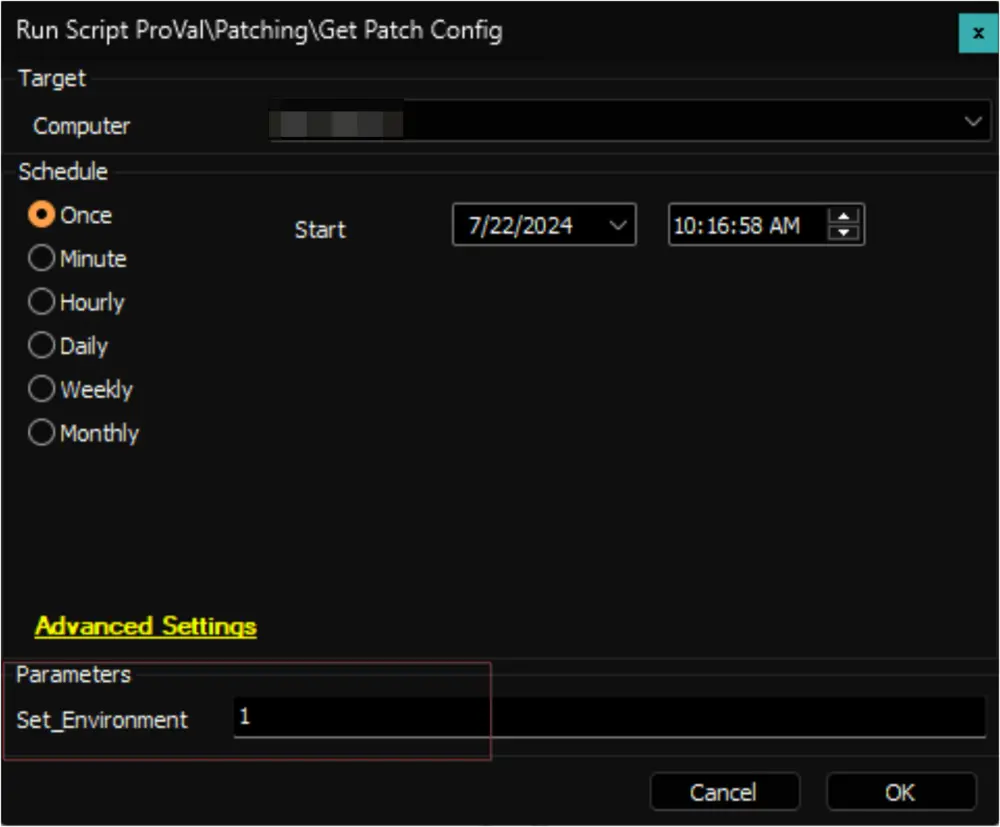

## Purpose

The purpose of this solution is to showcase the patch configuration of a Windows computer. It exhibits the configuration information altered by the [WUA Settings Validation](/docs/1f78325c-968a-4a73-ba85-2a18c061063e) script.

## Upgrade Notice: 29-Oct-2024

The solution has been updated to indicate whether Windows upgrades or feature updates are restricted from the registry key for Windows 10 and 11.

Reference: [https://admx.help/?Category=Windows_10_2016&Policy=Microsoft.Policies.WindowsUpdate::TargetReleaseVersion](https://admx.help/?Category=Windows_10_2016&Policy=Microsoft.Policies.WindowsUpdate::TargetReleaseVersion)

Execute the [Get Patch Config](/docs/c1b906ec-7aea-41f3-8241-358d3d644900) script against any online Windows computer with the `Set_Environment` parameter set to `1`. This will add the newly introduced column `upgradeRestricted` to the [pvl_patch_config](/docs/c9891eb9-3731-4b0d-9882-dcb4a73229eb) table, which is necessary for the solution.

## Associated Content

#### Auditing

| Content                                                                              | Type           | Function            |
|--------------------------------------------------------------------------------------|----------------|---------------------|
| [Get Patch Config](/docs/c1b906ec-7aea-41f3-8241-358d3d644900)                            | Script         | Gathers Data        |
| [pvl_patch_config](/docs/c9891eb9-3731-4b0d-9882-dcb4a73229eb)                            | Custom Table   | Stores Data         |
| [Patch Config Audit](/docs/16fd768b-b679-4ad4-92e3-e58e2fb1ed74)               | Dataview       | Displays Data       |
| [Execute Script - Get Patch Config](/docs/b6843bcc-c5e6-4af4-b604-e6d1c5871a44) | Internal Monitor| Detects Windows Machines |
| △ Custom - Execute Script - Get Patch Config                                          | Alert Template  | Executes the Script  |

#### Automation

| Content                                                                                              | Type           | Function                                                        |
|------------------------------------------------------------------------------------------------------|----------------|-----------------------------------------------------------------|
| [Patch Manager - WUA Settings Validation](/docs/1f78325c-968a-4a73-ba85-2a18c061063e) | Script         | Validate and set the appropriate values for the patching registries. |
| [Internal Monitor - Patch Config Mismatch](/docs/0e230069-e0d6-49f6-ab3a-894f248f3f5b)             | Internal Monitor| Detect computers with mismatched configurations.                |
| △ Custom - Patch Config Mismatch                                                                      | Alert Template  | Executes [Patch Manager - WUA Settings Validation](/docs/1f78325c-968a-4a73-ba85-2a18c061063e) script. |

## Implementation

### 1.
Import the following auditing content using the ProSync Plugin:
- [Script - Get Patch Config](/docs/c1b906ec-7aea-41f3-8241-358d3d644900)
- [Dataview - Patch Config Audit](/docs/16fd768b-b679-4ad4-92e3-e58e2fb1ed74)
- [Internal Monitor - Execute Script - Get Patch Config](/docs/b6843bcc-c5e6-4af4-b604-e6d1c5871a44)
- Alert Template - △ Custom - Execute Script - Get Patch Config

### 2.
Import the following automation content using the ProSync Plugin:
- [Script - Patch Manager - WUA Settings Validation](/docs/1f78325c-968a-4a73-ba85-2a18c061063e)
- [Internal Monitor - Patch Config Mismatch](/docs/0e230069-e0d6-49f6-ab3a-894f248f3f5b)
- Alert Template: △ Custom - Patch Config Mismatch

### 3.
Reload the system cache:  

### 4.
Execute the [Get Patch Config](/docs/c1b906ec-7aea-41f3-8241-358d3d644900) script against any online Windows computer with the `Set_Environment` parameter set to `1`. This will create the [pvl_patch_config](/docs/c9891eb9-3731-4b0d-9882-dcb4a73229eb) table, which is necessary for the solution.  

### 5.
Configure the auditing solution as outlined below:
- Navigate to Automation → Monitors within the CWA Control Center and set up the following:
  - [Internal Monitor - Execute Script - Get Patch Config](/docs/b6843bcc-c5e6-4af4-b604-e6d1c5871a44)  
    - Set up with the `△ Custom - Execute Script - Get Patch Config` alert template
    - Right-click and Run Now to start the monitor

#### Only if Requested

### 6.
Configure the automation as outlined below:
- Navigate to Automation → Monitors within the CWA Control Center and set up the following:
  - [Internal Monitor - Patch Config Mismatch](/docs/0e230069-e0d6-49f6-ab3a-894f248f3f5b)  
    - Set up with the `△ Custom - Patch Config Mismatch` alert template
    - Right-click and Run Now to start the monitor

## FAQ

**Q:** Can this solution be used in environments without configuring the [WUA Settings Validation](/docs/1f78325c-968a-4a73-ba85-2a18c061063e) script?  
**A:** The auditing section of the solution is independent of the [WUA Settings Validation](/docs/1f78325c-968a-4a73-ba85-2a18c061063e) script.