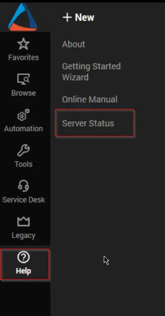
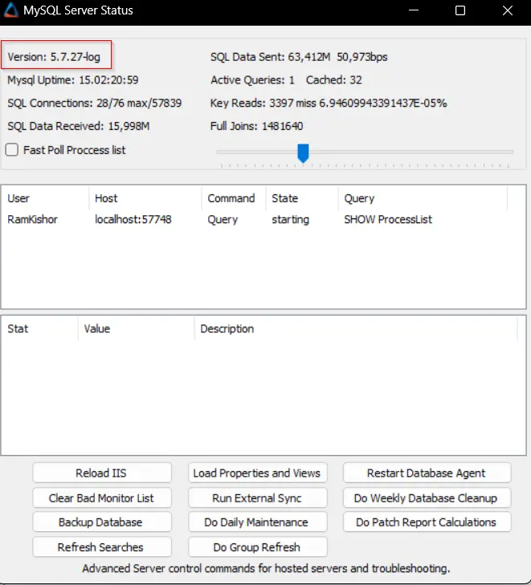

## Purpose

To granularly present the fundamental patching-related statistics for the whole environment, clients, and computers scattered throughout various patch approval ages.

**Minimum Requirement:** MySQL 5.7.7

## Associated Content

| Content                                                                                     | Type     | Function                                                              |
|---------------------------------------------------------------------------------------------|----------|-----------------------------------------------------------------------|
| [MYSQL - View - Create - Plugin_ProVal_v_Patching_Metrics_Overview*](/docs/9aa26b60-2171-43e5-bb14-8bf274a237a4) | Script   | Imports the [plugin_proval_v_patching_metrics_overview](/docs/2a7060e4-0b45-4246-a9ea-f39818cc93e8) view. |
| [plugin_proval_v_patching_metrics_overview](/docs/2a7060e4-0b45-4246-a9ea-f39818cc93e8) | View     | Baseline for the dataviews.                                         |
| [Patching Metrics Overview](/docs/aecfbacc-1c55-4a98-8cc3-7a1b753621ed)                | Dataview | Displays the consolidated statistics for the whole environment.      |
| [Patching Metrics Overview - Client Filter](/docs/e8b825c2-919d-4b92-a94a-8d9e01d48428) | Dataview | Displays the statistics for each client.                             |
| [Patching Metrics Overview - Computer Filter](/docs/7cf32e9b-c86b-4a97-ba5a-f97139cddf0e) | Dataview | Displays the statistics for each computer.                           |

## Implementation

- Import the [MYSQL - View - Create - Plugin_ProVal_v_Patching_Metrics_Overview*](/docs/9aa26b60-2171-43e5-bb14-8bf274a237a4) script.
- Import the [Patching Metrics Overview](/docs/aecfbacc-1c55-4a98-8cc3-7a1b753621ed) dataview.
- Import the [Patching Metrics Overview - Client Filter](/docs/e8b825c2-919d-4b92-a94a-8d9e01d48428) dataview.
- Import the [Patching Metrics Overview - Computer Filter](/docs/7cf32e9b-c86b-4a97-ba5a-f97139cddf0e) dataview.
- Debug the [MYSQL - View - Create - Plugin_ProVal_v_Patching_Metrics_Overview*](/docs/9aa26b60-2171-43e5-bb14-8bf274a237a4) script against any computer and ensure that the dataviews are populated with the data.

## FAQ

**Q:** The [MYSQL - View - Create - Plugin_ProVal_v_Patching_Metrics_Overview*](/docs/9aa26b60-2171-43e5-bb14-8bf274a237a4) script is failing.  
**A:** Please ensure that the minimum requirement is met and that the MySQL version is at least **5.7.7.**  

You can check the database version from the `Server Status` in Control Center.  

  
