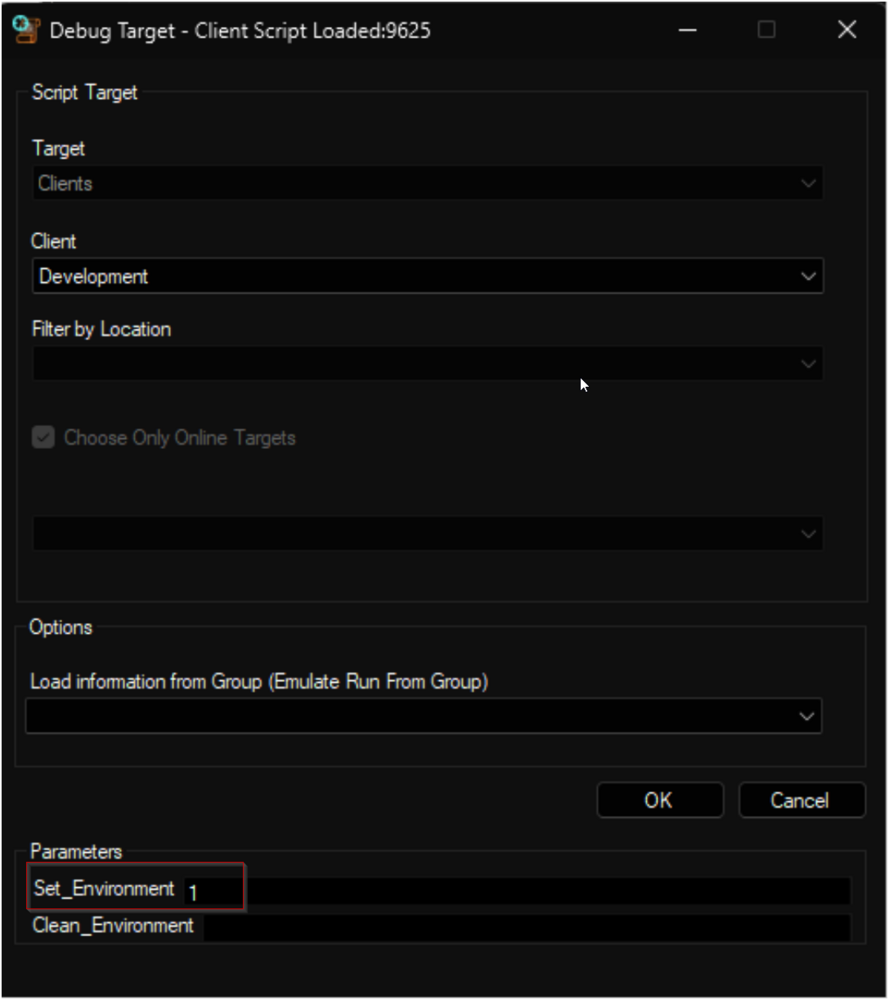

## Purpose

The goal of this solution is to monitor the trend of drive space utilization and provide forecasts on the number of days until the drive space is fully occupied.

## Associated Content

| Content                                                                                     | Type            | Function                     |
|---------------------------------------------------------------------------------------------|-----------------|------------------------------|
| [Predictive Volume Exhaustion Monitor Creation](/docs/d353ba91-e58f-4afb-b5da-1ac2eaeb2006) | Automate Script | Generates remote monitors.   |
| [Get-VolumeExhaustionEstimate](/docs/21bc13d3-b2fb-42d5-8f38-da9b43990e06)              | Agnostic Script | Used by the remote monitors. |
| [Volume Space Prediction](/docs/e928f9f6-f97d-44f3-aad2-26186416fa1f)                  | Remote Monitor  | Used for alerting.          |
| [Volume Space Sampling](/docs/3a441306-efbc-48a5-8732-06bfd56c9a5f)                    | Remote Monitor  | Used for auditing.          |
| [Volume Exhaustion Estimations [Remote Monitor]](/docs/0db68132-d16e-4098-877c-8da269dfe587) | Dataview        | Displays the audited data.  |

## Implementation

1. Import the following content using the ProSync Plugin:
   - [Script - Predictive Volume Exhaustion Monitor Creation](/docs/d353ba91-e58f-4afb-b5da-1ac2eaeb2006)
   - [Dataview - Volume Exhaustion Estimations [Remote Monitor]](/docs/0db68132-d16e-4098-877c-8da269dfe587)

2. Reload the system cache:
   

3. Debug the [Predictive Volume Exhaustion Monitor Creation](/docs/d353ba91-e58f-4afb-b5da-1ac2eaeb2006) script against any random client with the `Set_Environment` parameter set to `1` to create the system properties and the extra data fields used by the script. This will also remove the deprecated version of the solution from the environment.
   

4. Set the `System Properties` and `EDFs` as required.

5. Navigate to System > Configuration > Dashboard > Management > Scheduled Scripts
   - Schedule the [Predictive Volume Exhaustion Monitor Creation](/docs/d353ba91-e58f-4afb-b5da-1ac2eaeb2006) script to run once per day after hours.
   

## Notes

- By default, the solution will create [Volume Space Sampling](/docs/3a441306-efbc-48a5-8732-06bfd56c9a5f) monitors. The following system properties will be enabled as imported:
  - PVE_Monitoring_Server_Enable
  - PVE_Monitoring_Workstation_Enable
  - PVE_Monitoring_Server_AuditOnly
  - PVE_Monitoring_Workstation_AuditOnly
- Global settings can be overridden at the client/location or computer levels using the EDFs outlined in the relevant document.

## FAQ

**Q:** How do I enable auditing across the entire environment?  
**A:** Setting the following system properties to `1` will enable auditing across the entire environment:
- PVE_Monitoring_Server_Enable
- PVE_Monitoring_Workstation_Enable
- PVE_Monitoring_Server_AuditOnly
- PVE_Monitoring_Workstation_AuditOnly

Setting the `_AuditOnly` properties will enable the [Volume Space Sampling](/docs/3a441306-efbc-48a5-8732-06bfd56c9a5f) monitors instead of the [Volume Space Prediction](/docs/e928f9f6-f97d-44f3-aad2-26186416fa1f). The audited data is displayed by the [Volume Exhaustion Estimations [Remote Monitor]](/docs/0db68132-d16e-4098-877c-8da269dfe587) dataview.

