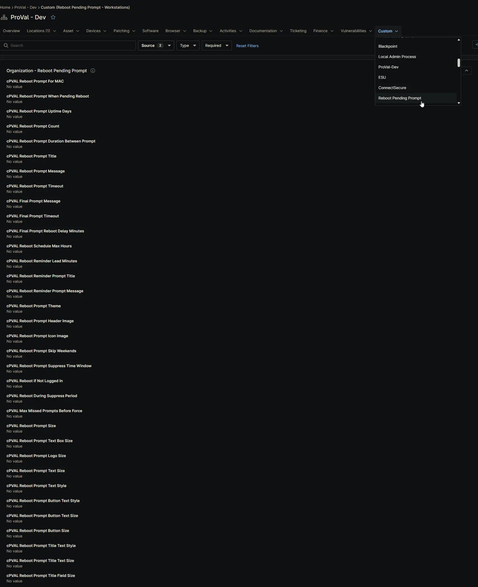
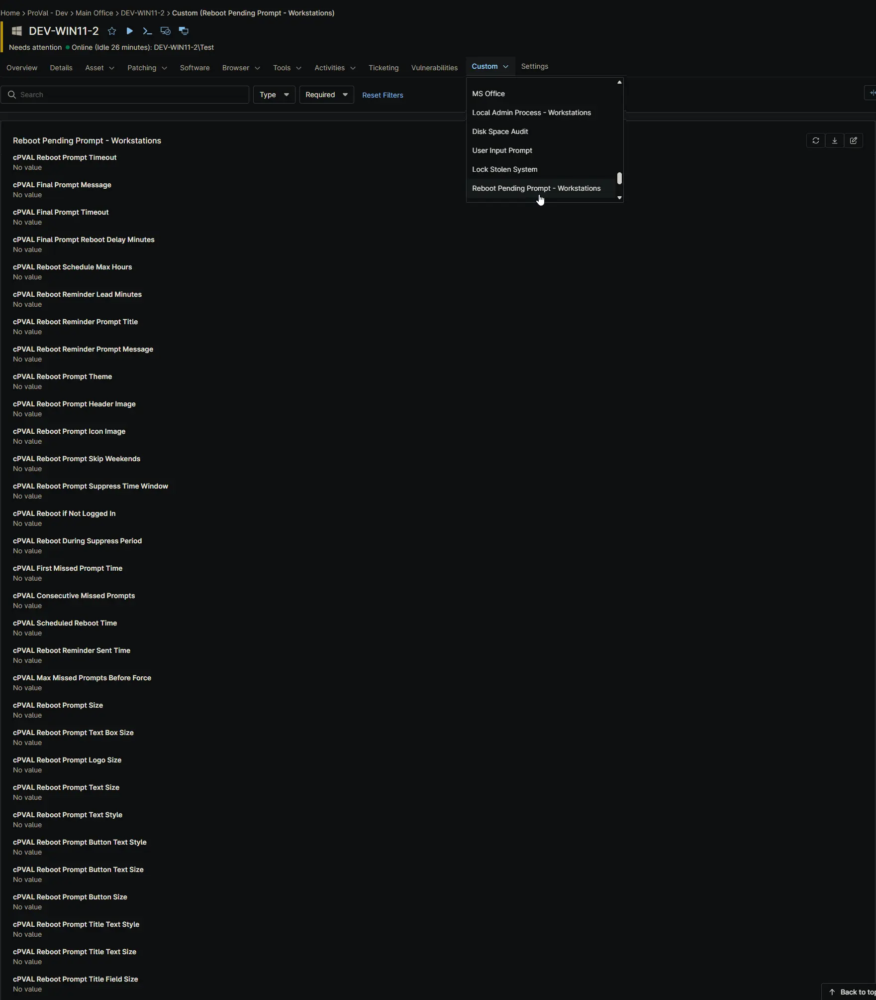
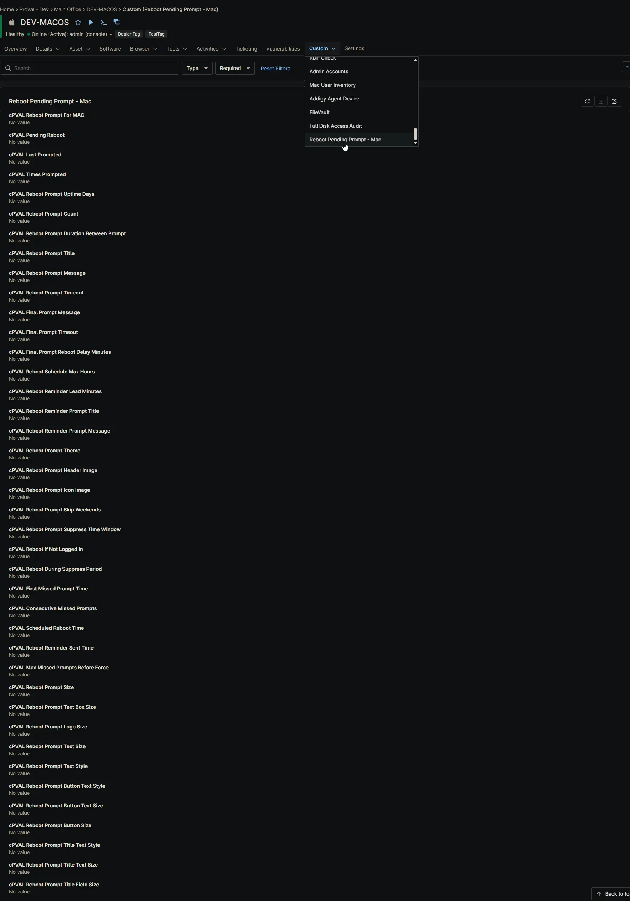
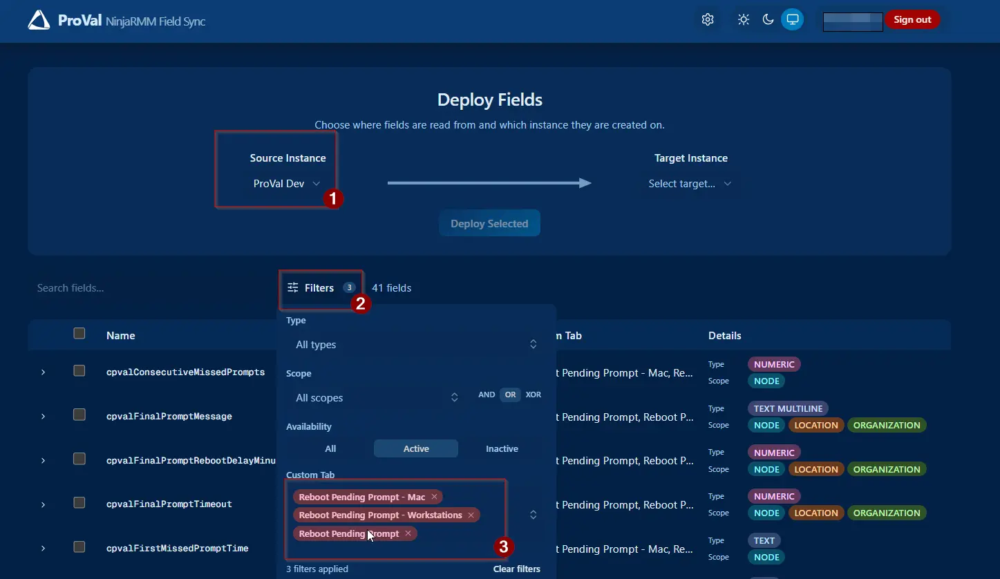

 

  
  <h2 align="center">Reboot Pending Prompt</h2>
  
<b><i>The civilized way to say "Have you tried turning it off and on again?" on Windows and macOS.</i></b>

## Purpose

The **Reboot Pending Prompt** solution provides an automated, user-friendly mechanism to handle pending reboots on both **Windows Workstations** and **macOS** devices within NinjaOne. It solves the classic IT dilemma: enforcing critical updates and maintaining security without abruptly interrupting user productivity. 

Instead of forcing unexpected restarts, the solution displays a branded, interactive GUI prompt that allows users to defer reboots up to a configurable limit. It intelligently detects when a reboot is needed, validates if it is an appropriate time to ask, and gracefully guides the user through the process.

## How It Works

The solution operates using a seamless three-part workflow:

1. **Detection (The Brain):** A background script regularly checks the device. It looks for manual overrides, uptime thresholds, or (on Windows) pending update flags. It also checks if the user is active, if the screen is locked, or if it's outside of approved "Quiet Hours."
2. **Condition (The Trigger):** If the Detection script determines a reboot is needed *and* the timing is right, it returns a specific exit code. This triggers a NinjaOne Compound Condition.
3. **Autofix (The Action):** The Compound Condition launches the Autofix script. This script downloads the lightweight [OmniPrompt](/docs/8ead1ffd-dade-4e17-9958-3313da9a7aa8) utility, displays the interactive window directly to the logged-in user, handles their response (Deferral vs. Immediate Reboot), and updates tracking fields for the next cycle.

Optionally, a fourth behaviour can be layered on top: rather than the last prompt simply announcing a restart, it can hand the choice to the user. They pick a time that suits them, the device is left alone until it is nearly due, and a single reminder appears just beforehand. See [Optional: Enable the Reboot Scheduler](#step-5-optional-enable-the-reboot-scheduler).

## Key Capabilities

* **Cross-Platform Support:** Fully functional on both Windows 10/11 and macOS.
* **Interactive User Prompts:** Displays a modern, customizable GUI window allowing users to "Yes" (Reboot Now) or "No" (Defer), or an "OK" button for final warnings.
* **Dynamic Message Substitution:** Use live variables (like `PromptsLeft`, `ComputerName`, or `ScheduledRebootTime`) directly in your prompt messages for a highly personalized user experience.
* **Deferral Enforcement:** Administrators can set a maximum number of deferrals. Once exhausted, the system transitions to a mandatory "Final Prompt" workflow.
* **User-Scheduled Restarts (Optional):** Instead of a plain final warning, the last prompt can offer a date and time picker so the user chooses when the restart happens, within a window you define. A single reminder is shown shortly beforehand, and the device is not prompted again while it waits.
* **Productivity Protections:** Includes "Quiet Hours" (Suppress Time Windows) to block prompts overnight, and options to skip prompts entirely on weekends.
* **Unattended Handling:** Configurable logic to immediately reboot machines if no user is currently logged in, ensuring patches are applied without waiting for human interaction.
* **Missed Prompt Tracking:** Intelligently tracks consecutive missed prompts when a machine is locked or unattended, with an optional threshold to force a reboot after a set number of misses.
* **Install-In-Progress Protection:** Automatically detects active software installations or OS updates and delays unattended reboots until the process safely finishes, preventing mid-update corruption.
* **Advanced Branding & Styling:** Supports custom window titles, messages, header images, icon images, themes (Dark/Light), and granular control over font sizes, styles, and window dimensions.

---

## Platform Differences: Windows vs. macOS

While the user experience is nearly identical, the underlying mechanics differ slightly between operating systems to respect platform standards:

| Feature | Windows Workstations | macOS |
| :--- | :--- | :--- |
| **Reboot Triggers** | Manual Override, Uptime, **or** Windows Registry (CBS/Windows Update) flags. | Manual Override **or** Uptime. *(macOS does not have an equivalent pending reboot registry).* |
| **GUI Execution** | Uses a temporary Scheduled Task running [SilentLauncher](/docs/b0b9f423-eee3-4148-b8a0-e99400c45698) to bypass Windows Session 0 isolation and render in the user's active session without a console window. | Executes `OmniPrompt.app` directly, as root-level scripts in NinjaOne can already render in the console user's session. |
| **Install Guards** | Checks for `TiWorker`, `wusa`, `SetupHost`, `MoUsoCoreWorker`, `Windows10Upgrader`, `winget`, and the MSI mutex. | Checks for `softwareupdate`, `install`, `msud`, `setupd`, and `osinstallersetupd`. |
| **Reboot Command** | `shutdown.exe /r /f /t <seconds>` (Allows precise second-level delays). | `shutdown -r +<minutes>` (Minute-level delays, with a one minute floor so field updates can be saved first). |
| **Scheduled Restart Wait** | The countdown is handed to Windows, so the script exits immediately and the familiar Windows restart notification takes over. | The script waits out the remaining time itself, so the Autofix automation timeout must exceed the reminder lead time. |

---

## Dynamic Message Substitution Variables

You can make your prompt messages highly contextual by using **Substitution Variables**. Simply type these exact PascalCase tokens into your `cPVAL Reboot Prompt Message` or `cPVAL Final Prompt Message` or `cPVAL Reboot Reminder Prompt Message` custom fields. The script will automatically replace them with live values when the prompt is displayed.

| Token | Description | Example Output |
| :--- | :--- | :--- |
| `PromptsToSend` | Total prompts the user will receive (regular + final) | `5` |
| `PromptsSent` | Number of prompts shown so far, including the current one | `2` |
| `PromptsLeft` | Remaining prompts before the forced/final one | `3` |
| `PromptIntervalMinutes` | Interval between prompts, in minutes | `240` |
| `PromptIntervalHours` | Same interval, in hours | `4` |
| `RegularTimeoutSeconds` | Regular prompt timeout, in seconds | `600` |
| `RegularTimeoutMinutes` | Same timeout, in minutes | `10` |
| `FinalTimeoutSeconds` | Final prompt timeout, in seconds | `900` |
| `FinalTimeoutMinutes` | Same timeout, in minutes | `15` |
| `DelayAfterFinalSeconds` | Delay after the final prompt before reboot, in seconds | `900` |
| `DelayAfterFinalMinutes` | Same delay, in minutes | `15` |
| `ScheduledRebootTime` | Clock time (HH:mm) of the automatic reboot. On the pre-reboot reminder this is the real time the user selected | `14:30` |
| `MinutesUntilReboot` | Minutes until the automatic reboot. On the pre-reboot reminder this is the actual minutes remaining | `10` |
| `ComputerName` | The machine's network name | `PC-OFFICE-01` |
| `UserName` | The currently logged-in username | `jsmith` |

*Example Message:*  
`"Hello UserName, your computer ComputerName requires a restart. You have PromptsLeft deferral(s) remaining. If you wait, the next prompt will appear in PromptIntervalHours hour(s)."`

---

## Associated Content

### Custom Fields

> **Note on Enablement:** The fields `cPVAL Pending Reboot`, `cPVAL Reboot Prompt When Pending Reboot` (Windows only), and `cPVAL Reboot Prompt Uptime Days` have **no default values**. You *must* set at least one of these at the Organization, Location, or Device level to opt-in and activate the solution for your devices.

| Name | Default | Example | Level | Managed By | Function |
| :--- | :--- | :--- | :--- | :--- | :--- |
| [cPVAL Reboot Prompt For MAC](/docs/fafa4c99-8301-46bd-a195-07ff66ea713f) | *(unset)* | `Enable` | Org, Loc, Dev | Manual | Enables or disables the reboot prompt feature for Mac computers. |
| [cPVAL Pending Reboot](/docs/31558959-f3a5-4f4f-9388-6e7512972b01) | `False` | `True` | Device | Manual / Script | Manually forces a reboot prompt to appear on this specific device. |
| [cPVAL Reboot Prompt When Pending Reboot](/docs/be5436e5-e658-4e31-a5ca-4a6bf8052278) | `Disable` | `Enable` | Org, Loc, Dev | Manual | Enables reboot prompts when Windows reports an update is waiting. |
| [cPVAL Reboot Prompt Uptime Days](/docs/d38a1b1a-1620-456a-a341-2770520a8f33) | `0` | `14` | Org, Loc, Dev | Manual | Prompts for a reboot if the computer has been left on for this many days. |
| [cPVAL Reboot Prompt Count](/docs/40cf882a-83e1-4197-b536-e6840c498d0c) | `4` | `5` | Org, Loc, Dev | Manual | Sets how many times a user can delay the reboot before it becomes mandatory. |
| [cPVAL Reboot Prompt Duration Between Prompt](/docs/2b88d214-a59b-4972-a462-121ecfc2a098) | `4` | `2` | Org, Loc, Dev | Manual | Sets how many hours to wait before showing the reboot prompt again. |
| [cPVAL Reboot Prompt Title](/docs/9003db99-40e0-4450-8ce7-95e273d5c252) | `Updates Installed...` | `IT Dept: Action Req` | Org, Loc, Dev | Manual | The text displayed at the top of the reboot prompt window. |
| [cPVAL Reboot Prompt Message](/docs/96249acb-33f6-42ac-bcc1-d37266533397) | *(See script default)* | `Hello UserName...` | Org, Loc, Dev | Manual | The main message shown to the user asking them to restart. |
| [cPVAL Final Prompt Message](/docs/02ca99e5-85be-4e2e-a77b-3cd94be65566) | *(See script default)* | `Final warning...` | Org, Loc, Dev | Manual | The final warning message shown right before a forced restart. |
| [cPVAL Reboot Prompt Timeout](/docs/cb8acc9e-06df-4408-b986-a35e8cc23cff) | `300` | `60` | Org, Loc, Dev | Manual | How many seconds the regular reboot prompt stays on screen before closing. |
| [cPVAL Final Prompt Timeout](/docs/02cc7b8d-28aa-46c6-936b-21786c56206e) | `900` | `120` | Org, Loc, Dev | Manual | How many seconds the final warning prompt stays on screen before closing. |
| [cPVAL Final Prompt Reboot Delay Minutes](/docs/58e81186-a952-40e6-8f06-ad485c52ef2a) | `5` | `10` | Org, Loc, Dev | Manual | How many minutes the computer waits after the final warning before restarting. |
| [cPVAL Reboot Prompt Header Image](/docs/93363322-3d61-484b-abbd-eb5e28bfb6df) | *(blank)* | `https://site.com/logo.png` | Org, Loc, Dev | Manual | A picture or company logo displayed at the top of the prompt. |
| [cPVAL Reboot Prompt Icon Image](/docs/27c3c19d-d5cb-46ae-97e7-605e682df948) | *(blank)* | `C:\Logos\icon.ico` | Org, Loc, Dev | Manual | A small icon displayed next to the prompt title. |
| [cPVAL Reboot Prompt Theme](/docs/1cef781e-295c-4cf5-aca5-bea0de5537fc) | `Dark` | `Light` | Org, Loc, Dev | Manual | Changes the visual style of the prompt window to Dark or Light mode. |
| [cPVAL Reboot Prompt Skip Weekends](/docs/01773daf-c7be-4d03-ab86-8b81cc939a83) | `Disable` | `Enable` | Org, Loc, Dev | Manual | Prevents reboot prompts from appearing on Saturdays and Sundays. |
| [cPVAL Reboot Prompt Suppress Time Window](/docs/12775f61-616e-4157-9f47-4623433bf68d) | *(blank)* | `1800-0900` | Org, Loc, Dev | Manual | Blocks reboot prompts from appearing during specific hours (e.g., overnight). |
| [cPVAL Reboot if Not Logged In](/docs/c1c1cb99-496a-4b3a-9a9c-e0fdf7ee4562) | `Disable` | `Enable` | Org, Loc, Dev | Manual | Restarts the computer automatically if no one is currently logged in. |
| [cPVAL Reboot During Suppress Period](/docs/32897c40-8b81-4f6b-97eb-6fdc47a20bc5) | `Disable` | `Enable` | Org, Loc, Dev | Manual | Allows forced reboots to happen even during blocked hours or weekends. |
| [cPVAL Max Missed Prompts Before Force](/docs/f93e2bb8-905f-4032-98c5-4d943f0e6580) | `0` | `3` | Org, Loc, Dev | Manual | How many times a user can ignore the prompt before the computer forces a restart. |
| [cPVAL Reboot Prompt Size](/docs/6c47725e-9162-4f6d-aaf8-3e3df24f263b) | `640x480` | `800x600` | Org, Loc, Dev | Manual | The overall width and height of the reboot prompt window. |
| [cPVAL Reboot Prompt Text Box Size](/docs/0b87e4d5-6548-4603-b741-77db2e81b8f3) | *(blank)* | `500x200` | Org, Loc, Dev | Manual | The size of the area where the message text is displayed. |
| [cPVAL Reboot Prompt Logo Size](/docs/0782fa7d-74e2-462d-8d71-1c9750d90b15) | `400x150` | `500x200` | Org, Loc, Dev | Manual | The width and height of the header image or logo. |
| [cPVAL Reboot Prompt Text Size](/docs/eb1cc24a-cef3-435f-899a-65743054c3bb) | `14` | `16` | Org, Loc, Dev | Manual | How large the main message text appears. |
| [cPVAL Reboot Prompt Text Style](/docs/4336846b-1395-46a5-8c40-b4838b8e8720) | `Arial` | `Calibri` | Org, Loc, Dev | Manual | The font style used for the main message text. |
| [cPVAL Reboot Prompt Button Text Style](/docs/124f688c-156e-421c-93be-0b4361bf300c) | `Arial` | `Calibri` | Org, Loc, Dev | Manual | The font style used for the text on the buttons (e.g., "Yes", "No"). |
| [cPVAL Reboot Prompt Button Text Size](/docs/2eeaaa34-ffca-4f6c-a159-4e91353c3ff2) | `14` | `16` | Org, Loc, Dev | Manual | How large the text on the buttons appears. |
| [cPVAL Reboot Prompt Button Size](/docs/4dd04068-bcd3-4ea0-a51b-c59960dffadd) | *(blank)* | `120x40` | Org, Loc, Dev | Manual | The width and height of the buttons in the prompt. |
| [cPVAL Reboot Prompt Title Text Style](/docs/69dec24f-e5be-4973-9cd1-59adde2b94ca) | `Arial` | `Calibri` | Org, Loc, Dev | Manual | The font style used for the title bar text. |
| [cPVAL Reboot Prompt Title Text Size](/docs/105858ba-5b0a-4927-80be-76e1fc425490) | `14` | `16` | Org, Loc, Dev | Manual | How large the title bar text appears. |
| [cPVAL Reboot Prompt Title Field Size](/docs/62efc1fe-b6f0-4a1f-99f4-36843a46c566) | *(blank)* | `640x35` | Org, Loc, Dev | Manual | The width and height of the title bar area. |
| [cPVAL Last Prompted](/docs/fe3a8ca4-3722-4eaf-895a-723f8d563395) | *(blank)* | `2024-05-20 14:30:00` | Device | Script (Auto) | Automatically records the date and time the last reboot prompt was shown. |
| [cPVAL Times Prompted](/docs/fded67bb-c3a3-40bb-acb1-2baa0464de45) | `0` | `2` | Device | Script (Auto) | Automatically counts how many times the user has been asked to reboot. |
| [cPVAL Consecutive Missed Prompts](/docs/e61fd6fa-cf42-4315-831f-d4a150bc53d6) | `0` | `2` | Device | Script (Auto) | Automatically counts how many times the reboot prompt was ignored in a row. |
| [cPVAL First Missed Prompt Time](/docs/d6add994-9648-4f4c-9888-b2c8416b0c9a) | *(blank)* | `2024-05-20 14:30:00` | Device | Script (Auto) | Automatically records the date and time the user first started ignoring prompts. |
| [cPVAL Reboot Schedule Max Hours](/docs/b5ebd2f7-43ab-414e-876f-25d843fcb7bd) | `0` | `48` | Org, Loc, Dev | Manual | Lets the user pick their own restart time on the final prompt, up to this many hours ahead. `0` turns the scheduler off. |
| [cPVAL Reboot Reminder Lead Minutes](/docs/0ee089f7-57f0-4f99-a896-bd366b9ff08c) | `15` | `15` | Org, Loc, Dev | Manual | How much warning the user gets before a restart they scheduled themselves. |
| [cPVAL Reboot Reminder Prompt Title](/docs/5877dc91-199c-451e-9f39-a287c82343c2) | `Reboot Required - Starting Soon` | `Restart Starting Soon` | Org, Loc, Dev | Manual | The title of the reminder window shown shortly before a scheduled restart. |
| [cPVAL Reboot Reminder Prompt Message](/docs/c738149c-3efb-459e-8bff-96653fa028c4) | *(See script default)* | `Your restart begins at ScheduledRebootTime.` | Org, Loc, Dev | Manual | The message shown on that reminder. Supports substitution variables. |
| [cPVAL Scheduled Reboot Time](/docs/e5cebd02-17e2-4e64-9ace-c62d8541f52c) | *(blank)* | `2026-09-09 14:30:00` | Device | Script (Auto) | Automatically records the restart time the user selected. |
| [cPVAL Reboot Reminder Sent Time](/docs/0181a174-2874-47d1-a18f-009c1aeb7024) | *(blank)* | `2026-09-09 14:15:00` | Device | Script (Auto) | Automatically records when the reminder was sent and the restart countdown began. |

#### **Organization-Level Fields**

#### **Device-Level Fields [Windows Workstations]**

#### **Device-Level Fields [Mac]**

### Automations

| Name | Function |
| :--- | :--- |
| [Reboot Pending Prompt - Detection [Windows]](/docs/9817ce6b-6f8c-4718-844f-4f44f6c66376) | Evaluates Windows registry, uptime, and user state. Returns Exit Code 1 to trigger the Autofix if conditions are met. |
| [Reboot Pending Prompt - Autofix [Windows]](/docs/7e3688a0-9f8f-40cf-9239-0e3593a84ba8) | Downloads `OmniPrompt` and `SilentLauncher`, launches the prompt via a Scheduled Task in the user's session, handles the response (including a scheduled restart and its reminder), and updates tracking fields. |
| [Reboot Pending Prompt - Detection [Macintosh]](/docs/0a3f085c-11da-4567-80c3-8ba2f4047e4a) | Evaluates uptime, manual overrides, and macOS-specific user/install states. Returns Exit Code 1 to trigger the Autofix. |
| [Reboot Pending Prompt - Autofix [Macintosh]](/docs/93c3e0c2-8c43-4829-8bee-81267b8f151c) | Downloads `OmniPrompt.app` and executes it directly in the console user's session, handles the response, and updates tracking fields. |

### Compound Conditions

| Name | Function |
| :--- | :--- |
| [Reboot Pending Prompt - Windows Workstation](/docs/b540cb53-0d54-4d63-9ce4-073732fd1aa3) | Triggers the Windows Autofix when the Windows Detection script returns Exit Code 1. |
| [Reboot Pending Prompt - Macintosh](/docs/203e9aa3-5081-487b-b71c-ee8c37a6f769) | Triggers the macOS Autofix when the macOS Detection script returns Exit Code 1. |

---

## Implementation

### Step 1: Create Custom Fields

This solution uses **41 custom fields**. You can create them in either of two ways.

#### Option A: Import Them From the ProVal NinjaRMM Field Sync Portal

The [NinjaRMM Field Sync](https://ninjafields.provaltech.com/) portal creates every field in the target instance for you, with the correct type, scope, permissions, and custom tab already set. This is considerably faster than building 41 fields by hand and removes the most common source of implementation errors.

1. Sign in to the [NinjaRMM Field Sync](https://ninjafields.provaltech.com/) portal.
2. Set the **Source Instance** to `ProVal Dev`.
3. Open **Filters** and set the **Custom Tab** filter to these three tabs:
    * `Reboot Pending Prompt`
    * `Reboot Pending Prompt - Mac`
    * `Reboot Pending Prompt - Workstations`
4. Confirm the field count now reads **41 fields**. If it does not, one of the three tab filters is missing.
5. Set the **Target Instance** to the partner instance you are implementing in.
6. Select all 41 fields and click **Deploy Selected**.

> **⚠️ Validate the result before moving on.** The portal creates the fields and assigns them to the correct tabs, but you should still confirm that every field is present and that the ordering within each tab matches the reference screenshots in this document:
>
> * [Organization-Level Fields](#organization-level-fields)
> * [Device-Level Fields [Windows Workstations]](#device-level-fields-windows-workstations)
> * [Device-Level Fields [Mac]](#device-level-fields-mac)
>
> Pay particular attention to the two Location-level tabs, which mirror the Organization tab, and to the six scheduler fields added in the latest release. A field that lands on the wrong tab still works, but it makes the solution considerably harder for a technician to configure later.

#### Option B: Create the Fields Manually

If you would rather build the fields by hand, or the portal is unavailable, create each of the following as described in its own document. Each document lists the exact type, scope, permissions, tab placement, and help text to use.

* [Custom Field: cPVAL Reboot Prompt For MAC](/docs/fafa4c99-8301-46bd-a195-07ff66ea713f)
* [Custom Field: cPVAL Pending Reboot](/docs/31558959-f3a5-4f4f-9388-6e7512972b01)
* [Custom Field: cPVAL Reboot Prompt When Pending Reboot](/docs/be5436e5-e658-4e31-a5ca-4a6bf8052278)
* [Custom Field: cPVAL Reboot Prompt Uptime Days](/docs/d38a1b1a-1620-456a-a341-2770520a8f33)
* [Custom Field: cPVAL Reboot Prompt Count](/docs/40cf882a-83e1-4197-b536-e6840c498d0c)
* [Custom Field: cPVAL Reboot Prompt Duration Between Prompt](/docs/2b88d214-a59b-4972-a462-121ecfc2a098)
* [Custom Field: cPVAL Reboot Prompt Title](/docs/9003db99-40e0-4450-8ce7-95e273d5c252)
* [Custom Field: cPVAL Reboot Prompt Message](/docs/96249acb-33f6-42ac-bcc1-d37266533397)
* [Custom Field: cPVAL Final Prompt Message](/docs/02ca99e5-85be-4e2e-a77b-3cd94be65566)
* [Custom Field: cPVAL Reboot Prompt Timeout](/docs/cb8acc9e-06df-4408-b986-a35e8cc23cff)
* [Custom Field: cPVAL Final Prompt Timeout](/docs/02cc7b8d-28aa-46c6-936b-21786c56206e)
* [Custom Field: cPVAL Final Prompt Reboot Delay Minutes](/docs/58e81186-a952-40e6-8f06-ad485c52ef2a)
* [Custom Field: cPVAL Reboot Prompt Header Image](/docs/93363322-3d61-484b-abbd-eb5e28bfb6df)
* [Custom Field: cPVAL Reboot Prompt Icon Image](/docs/27c3c19d-d5cb-46ae-97e7-605e682df948)
* [Custom Field: cPVAL Reboot Prompt Theme](/docs/1cef781e-295c-4cf5-aca5-bea0de5537fc)
* [Custom Field: cPVAL Reboot Prompt Skip Weekends](/docs/01773daf-c7be-4d03-ab86-8b81cc939a83)
* [Custom Field: cPVAL Reboot Prompt Suppress Time Window](/docs/12775f61-616e-4157-9f47-4623433bf68d)
* [Custom Field: cPVAL Reboot if Not Logged In](/docs/c1c1cb99-496a-4b3a-9a9c-e0fdf7ee4562)
* [Custom Field: cPVAL Reboot During Suppress Period](/docs/32897c40-8b81-4f6b-97eb-6fdc47a20bc5)
* [Custom Field: cPVAL Max Missed Prompts Before Force](/docs/f93e2bb8-905f-4032-98c5-4d943f0e6580)
* [Custom Field: cPVAL Consecutive Missed Prompts](/docs/e61fd6fa-cf42-4315-831f-d4a150bc53d6)
* [Custom Field: cPVAL First Missed Prompt Time](/docs/d6add994-9648-4f4c-9888-b2c8416b0c9a)
* [Custom Field: cPVAL Reboot Prompt Size](/docs/6c47725e-9162-4f6d-aaf8-3e3df24f263b)
* [Custom Field: cPVAL Reboot Prompt Text Box Size](/docs/0b87e4d5-6548-4603-b741-77db2e81b8f3)
* [Custom Field: cPVAL Reboot Prompt Logo Size](/docs/0782fa7d-74e2-462d-8d71-1c9750d90b15)
* [Custom Field: cPVAL Reboot Prompt Text Size](/docs/eb1cc24a-cef3-435f-899a-65743054c3bb)
* [Custom Field: cPVAL Reboot Prompt Text Style](/docs/4336846b-1395-46a5-8c40-b4838b8e8720)
* [Custom Field: cPVAL Reboot Prompt Button Text Style](/docs/124f688c-156e-421c-93be-0b4361bf300c)
* [Custom Field: cPVAL Reboot Prompt Button Text Size](/docs/2eeaaa34-ffca-4f6c-a159-4e91353c3ff2)
* [Custom Field: cPVAL Reboot Prompt Button Size](/docs/4dd04068-bcd3-4ea0-a51b-c59960dffadd)
* [Custom Field: cPVAL Reboot Prompt Title Text Style](/docs/69dec24f-e5be-4973-9cd1-59adde2b94ca)
* [Custom Field: cPVAL Reboot Prompt Title Text Size](/docs/105858ba-5b0a-4927-80be-76e1fc425490)
* [Custom Field: cPVAL Reboot Prompt Title Field Size](/docs/62efc1fe-b6f0-4a1f-99f4-36843a46c566)
* [Custom Field: cPVAL Last Prompted](/docs/fe3a8ca4-3722-4eaf-895a-723f8d563395)
* [Custom Field: cPVAL Times Prompted](/docs/fded67bb-c3a3-40bb-acb1-2baa0464de45)
* [Custom Field: cPVAL Reboot Schedule Max Hours](/docs/b5ebd2f7-43ab-414e-876f-25d843fcb7bd)
* [Custom Field: cPVAL Reboot Reminder Lead Minutes](/docs/0ee089f7-57f0-4f99-a896-bd366b9ff08c)
* [Custom Field: cPVAL Reboot Reminder Prompt Title](/docs/5877dc91-199c-451e-9f39-a287c82343c2)
* [Custom Field: cPVAL Reboot Reminder Prompt Message](/docs/c738149c-3efb-459e-8bff-96653fa028c4)
* [Custom Field: cPVAL Scheduled Reboot Time](/docs/e5cebd02-17e2-4e64-9ace-c62d8541f52c)
* [Custom Field: cPVAL Reboot Reminder Sent Time](/docs/0181a174-2874-47d1-a18f-009c1aeb7024)

### Step 2: Create Automations

Create the following automations as described in the document:

* [Automation: Reboot Pending Prompt - Detection [Windows]](/docs/9817ce6b-6f8c-4718-844f-4f44f6c66376)
* [Automation: Reboot Pending Prompt - Autofix [Windows]](/docs/7e3688a0-9f8f-40cf-9239-0e3593a84ba8)
* [Automation: Reboot Pending Prompt - Detection [Macintosh]](/docs/0a3f085c-11da-4567-80c3-8ba2f4047e4a)
* [Automation: Reboot Pending Prompt - Autofix [Macintosh]](/docs/93c3e0c2-8c43-4829-8bee-81267b8f151c)

>*Pro Tip:* In the Automation settings, you can define the **Script Variables** (like `Prompt Count`, `Prompt Theme`, etc.) to establish global fallback defaults for your entire organization.

### Step 3: Create Compound Conditions

Create the following compound conditions as described in the document:

* [Compound Condition: Reboot Pending Prompt - Windows Workstation](/docs/b540cb53-0d54-4d63-9ce4-073732fd1aa3)
* [Compound Condition: Reboot Pending Prompt - Macintosh](/docs/203e9aa3-5081-487b-b71c-ee8c37a6f769)

### Step 4: Enable the Solution (Opt-In)

The solution is **opt-in** by design to prevent unexpected interruptions. To activate it for a device, Location, or Organization, you must configure at least *one* of the following trigger fields:

1. **Manual Override:** Check the `cPVAL Pending Reboot` box (Device level only).
2. **Uptime Check:** Set `cPVAL Reboot Prompt Uptime Days` to a number greater than `0` (e.g., `14`).
3. **Registry Check (Windows Only):** Set `cPVAL Reboot Prompt When Pending Reboot` to `Enable`.
4. **macOS Global Enable:** Set `cPVAL Reboot Prompt For MAC` to `Enable` (this opts in all Macs client-wide, overriding the need for individual manual flags).

### Step 5 (Optional): Enable the Reboot Scheduler

By default the final prompt is a single acknowledgement and the restart follows shortly after. If you would rather let users choose their own restart time, configure the following. All four fields can be set at the Organization, Location, or Device level.

1. Set [cPVAL Reboot Schedule Max Hours](/docs/b5ebd2f7-43ab-414e-876f-25d843fcb7bd) to how many hours ahead a user may schedule their restart, for example `48`. Leaving it at `0` keeps the original behaviour with no scheduler and no reminder.
2. Set [cPVAL Reboot Reminder Lead Minutes](/docs/0ee089f7-57f0-4f99-a896-bd366b9ff08c) to how much warning they get beforehand. The default of `15` suits most environments; keep it well below `60`.
3. Optionally set [cPVAL Reboot Reminder Prompt Title](/docs/5877dc91-199c-451e-9f39-a287c82343c2) and [cPVAL Reboot Reminder Prompt Message](/docs/c738149c-3efb-459e-8bff-96653fa028c4) to word the reminder in your own voice.

> **⚠️ Set the lead time in both places.** `Reboot Reminder Lead Minutes` exists as a Script Variable on both the Detection and the Autofix automation for each platform, and the two must agree. The Detection automation decides when a scheduled restart is due for its reminder; the Autofix sizes the countdown from it.
>
> **⚠️ macOS only.** The Autofix script stays running while the reminder is displayed, so the automation timeout for **Reboot Pending Prompt - Autofix [Macintosh]** must be longer than your lead minutes value. Windows is unaffected, as Task Scheduler owns the prompt there.

---

## Comprehensive FAQs

### General Usage

**Q. What does this solution actually do?**  
**A:** It helps computers restart when they need to (e.g., after updates), but it asks the user nicely first. Instead of forcing a restart while someone is working, it shows a popup window asking if they want to reboot now or later. You control how many times they can say "later."

**Q. Does this work on both Windows and Macs?**  
**A:** Yes! The solution is fully cross-platform. It uses PowerShell and Scheduled Tasks for Windows, and Bash scripts with direct execution for macOS. The user experience is nearly identical on both.

**Q. Is this solution enabled automatically for all my devices?**  
**A:** No. It is strictly **opt-in**. You must explicitly enable it by configuring at least one trigger field (Uptime Days > 0, Pending Reboot checkbox, or the macOS master switch) at the Organization, Location, or Device level.

**Q. Can I force a reboot prompt even if the system doesn't think it needs one?**  
**A:** Yes. Simply check the `cPVAL Pending Reboot` box on a specific device. The Detection script will see this and start the prompting process immediately, regardless of uptime or OS flags.

**Q. What happens if another script or solution checks the "cPVAL Pending Reboot" box?**  
**A:** That will automatically trigger the reboot prompt cycle! This solution is designed to act as a **central reboot manager**. If a patching automation flags the box, this solution takes over, ensuring a consistent, user-friendly experience (with snoozes and quiet hours) instead of a harsh, immediate reboot.

**Q. Do I really have to create 41 custom fields by hand?**  
**A:** No. The [NinjaRMM Field Sync](https://ninjafields.provaltech.com/) portal can deploy all 41 into the target instance from the `ProVal Dev` source instance, with types, scopes, permissions, and tab placement already correct. Manual creation remains fully documented and supported if you prefer it, or if the portal is unavailable. See [Step 1](#step-1-create-custom-fields).

**Q. After importing the fields from the portal, is there anything to check?**  
**A:** Yes. Confirm the count is 41 and that each field appears on the expected tab in the expected order, using the reference screenshots for the [Organization](#organization-level-fields), [Windows Workstations](#device-level-fields-windows-workstations), and [Mac](#device-level-fields-mac) tabs. A misplaced field still functions, but it makes life harder for whoever configures the solution next.

### Prompting & Deferrals

**Q. How many times can a user say "No" to the reboot?**  
**A:** You decide! By default, they can snooze it **4 times** (configured in `cPVAL Reboot Prompt Count`). If set to 4, they get 4 regular "Yes/No" prompts, followed by 1 final "OK" prompt, for a total of 5 interactions before a forced reboot.

**Q. What happens when the user runs out of "Snoozes"?**  
**A:** The next prompt will be the **Final Prompt**. This window does not have a "No" button—only an "OK" button. It informs the user that the computer *will* restart soon, giving them a final grace period (default 5 minutes) to save their work.

**Q. What if the user ignores the prompt and walks away?**  
**A:** The prompt has a built-in timer!  

* **Warning Prompts:** If the timer runs out (Default: 5 mins), it counts as a "Snooze" and closes the window so it doesn't block the screen.  
* **Final Prompt:** If the timer runs out here (Default: 15 mins), it assumes the user isn't there and **forces the reboot** to ensure the machine gets patched.

**Q. Why is the prompt not showing up on my computer?**  
**A:** Common reasons include:  

1. **Not Needed:** The computer doesn't meet the trigger criteria (uptime is low, no manual flag).  
2. **Too Soon:** The user clicked "No" recently, and the `Duration Between Prompt` window hasn't elapsed.  
3. **Quiet Time:** It's currently within the configured `Suppress Time Window` or on a weekend (if `Skip Weekends` is enabled).  
4. **User Away:** The screen is locked or the screensaver is running. The system blocks the prompt to ensure the user doesn't miss it, and will retry when they unlock the machine.

### Advanced Features & Protections

**Q. I don't want to bother users at night or on weekends. Can I stop the prompts?**  
**A:** Yes. Use `cPVAL Reboot Prompt Suppress Time Window` (e.g., `1800-0900` for 6 PM to 9 AM) and set `cPVAL Reboot Prompt Skip Weekends` to `Enable`.

**Q. What is the "Reboot During Suppress Period" feature?**  
**A:** Normally, suppress windows and weekends block *all* prompts. If you enable this field, the solution will make an exception: it will allow **unattended reboots** (when no user is logged in and "Reboot if Not Logged In" is enabled) or **forced reboots** (when the missed prompt threshold is reached) to proceed even during quiet hours. Logged-in users still get their quiet hours protected.

**Q. What happens if nobody is logged into the computer?**  
**A:** If `cPVAL Reboot if Not Logged In` is set to `Enable`, the system will bypass the GUI prompt entirely and reboot immediately (subject to the Install-In-Progress guard).

**Q. Will the solution reboot my machine while updates are still installing?**  
**A:** No. Before any unattended reboot, the script checks for active installations (e.g., Windows Update, macOS `softwareupdate`, MSI installers, `winget`). If an install is detected, the reboot is cleanly deferred and retried on the next cycle. *Note: This guard does not apply if a user actively clicks "Yes" to reboot.*

**Q. What is the "Missed Prompt" tracking feature?**  
**A:** If a machine is locked or unattended, the prompt cannot be seen. The solution tracks these "missed" cycles. If the count reaches the threshold set in `cPVAL Max Missed Prompts Before Force` (e.g., `3`), it will trigger a forced reboot, ensuring devices that are rarely unlocked still receive critical updates.

### Reboot Scheduling & Reminders

**Q. What is the reboot scheduler?**  
**A:** It changes what happens on the *last* prompt. Normally the final prompt is a single "OK" and the restart follows a few minutes later. With the scheduler switched on, the final prompt instead shows a date and time picker: the user chooses when their computer restarts, within a window you define. Shortly before that moment arrives, they get one reminder, and then the machine restarts.

**Q. How do I turn it on?**  
**A:** Set [cPVAL Reboot Schedule Max Hours](/docs/b5ebd2f7-43ab-414e-876f-25d843fcb7bd) to the number of hours ahead a user may schedule their restart. `48` is a typical value. Leave it at `0` (the default) and nothing changes at all: no picker, no reminder, and the solution behaves exactly as it did before.

**Q. So the feature is off unless I deliberately enable it?**  
**A:** Correct. Existing implementations are entirely unaffected until you raise that one field above zero.

**Q. Will the user keep getting prompts while they wait for their scheduled restart?**  
**A:** No, and this is the point of the feature. Once the user picks a time, the device is deliberately left alone. The Detection automation stops detecting it, so no further prompts appear for a restart the user has already agreed to.

**Q. How much warning do they get before the restart?**  
**A:** Whatever you set in [cPVAL Reboot Reminder Lead Minutes](/docs/0ee089f7-57f0-4f99-a896-bd366b9ff08c), which defaults to `15`. The reminder is delivered by the regular detection cycle rather than a local timer, so it appears somewhere inside that window rather than at an exact offset. The message always states the real restart time and the true number of minutes remaining, so it stays accurate wherever in the window it lands.

**Q. Do I need to set that value in more than one place?**  
**A:** Yes. `Reboot Reminder Lead Minutes` exists as a Script Variable on **both** the Detection and the Autofix automation for each platform, and the two must match. The Detection automation uses it to decide when a scheduled restart is due for its reminder; the Autofix uses it to size the countdown. The custom field, where set, overrides both.

**Q. Why should I keep the lead time under an hour?**  
**A:** A restart countdown that is still pending after 60 minutes is treated as cancelled, and the stored schedule is cleared so the device can return to the normal prompt cycle. Setting a lead time near or above that threshold would cause the solution to discard a restart that was still perfectly valid.

**Q. What if the computer is switched off or asleep at the scheduled time?**  
**A:** The schedule is not lost. The next time the device checks in, the solution notices the restart is overdue and proceeds with the reminder and the restart then. It happens late rather than never.

**Q. What if the user cancels the shutdown countdown?**  
**A:** Nothing breaks. The solution notices after 60 minutes that no restart occurred, clears the leftover tracking values, and the device re-enters the normal prompt cycle from the beginning.

**Q. What if an update is installing when the reminder falls due?**  
**A:** The scheduled time is quietly pushed forward by one reminder window instead of restarting through the install, and the next cycle tries again. The same Install-In-Progress protection that guards unattended reboots applies here.

**Q. Can the user pick a time that is only two minutes away?**  
**A:** They can, and the solution treats it sensibly. A time that has already passed, or one already inside the reminder window, is read as "restart now" rather than scheduled, since the earliest option the picker offers is the current moment.

**Q. Does the scheduler change how many regular prompts the user sees?**  
**A:** No. `cPVAL Reboot Prompt Count` still controls the deferrals. The scheduler only changes the character of the final prompt and adds the one reminder before the restart.

**Q. Is there anything macOS-specific I should watch for?**  
**A:** One thing. Because macOS has no scheduled task equivalent, the Autofix script stays running while the reminder is on screen and until the restart is issued. The automation timeout for **Reboot Pending Prompt - Autofix [Macintosh]** must therefore be longer than your lead minutes value. If a run is cut short, the schedule survives and the next cycle retries, so the result is a late restart rather than a lost one.

**Q. Can I word the reminder myself?**  
**A:** Yes. Use [cPVAL Reboot Reminder Prompt Title](/docs/5877dc91-199c-451e-9f39-a287c82343c2) and [cPVAL Reboot Reminder Prompt Message](/docs/c738149c-3efb-459e-8bff-96653fa028c4). The `ScheduledRebootTime` and `MinutesUntilReboot` tokens are especially useful here, because on the reminder they resolve to the real restart time the user picked and the actual minutes left.

### Customization & Technical Details

**Q. Can I customize the message the user sees?**  
**A:** Absolutely. Use the `cPVAL Reboot Prompt Message` and `cPVAL Final Prompt Message` fields. You can use **Substitution Variables** (like `UserName` or `PromptsLeft`) to make the message dynamic.  
*⚠️ Important:* Avoid using single quotes (`'`) in these fields, as they can break the script's string parsing. Use double quotes (`"`) if needed.

**Q. Can I add my company logo to the prompt?**  
**A:** Yes. Provide a local file path (e.g., `C:\Logos\header.png`) or a public URL in the `cPVAL Reboot Prompt Header Image` and `cPVAL Reboot Prompt Icon Image` fields.

**Q. How does the GUI utility get to the computer?**  
**A:** The Autofix script automatically downloads a lightweight, secure utility called [OmniPrompt](/docs/8ead1ffd-dade-4e17-9958-3313da9a7aa8) (Windows `.exe` or macOS `.app`) from ProVal's repository. It verifies the file's SHA256 hash before extraction to ensure integrity. On Windows it also downloads [SilentLauncher](/docs/b0b9f423-eee3-4148-b8a0-e99400c45698), which starts the prompt in the user's session without flashing a console window. Both are only re-downloaded when the local copy no longer matches the published hash. No manual prerequisite deployment (like .NET) is required.

**Q. Can I edit the built-in default values directly in the script files?**  
**A:** No. The scripts are code-signed. Modifying the script body will break the signature and prevent execution. Always use NinjaOne **Custom Fields** or **Script Variables** (configured in the Automation settings) to adjust default behaviors.

**Q. I manually rebooted the computer, but the tracking fields didn't reset. Why?**  
**A:** The fields update the *next* time the Detection script runs. After a reboot, the Detection script will run, see that the computer uptime is low and no registry keys are set, and it will automatically clear `cPVAL Pending Reboot` and reset the counters for you.

### Advanced Customization & Styling

**Q. Can I format the text in my reboot prompt messages (e.g., bold, italic, line breaks)?**  
**A:** Yes! The prompt engine supports basic Markdown-style formatting for plain text messages. You can use:

- `**bold**` for **bold text**
- `*italic*` for *italic text*
- `__underline__` for <u>underlined text</u>
- `\n` to create a new line (e.g., `Line 1\nLine 2`).  
*(Note: These markers are rendered automatically; you do not need to add any special HTML tags unless you are using advanced HTML message modes).*

**Q. Fun Fact: Can I resize the prompt window and its individual components?**  
**A:** Absolutely! You have granular control over the UI layout to perfectly match your branding or screen requirements. You can customize:

- **Overall Window:** `cPVAL Reboot Prompt Size` (e.g., `800x600`)
- **Message Area:** `cPVAL Reboot Prompt Text Box Size` (e.g., `500x200`)
- **Header/Logo Area:** `cPVAL Reboot Prompt Logo Size` (e.g., `400x150`)
- **Title Bar:** `cPVAL Reboot Prompt Title Field Size`  
You can also independently adjust the font family and size for the main message, the buttons, and the title bar using their respective Custom Fields. If left blank, OmniPrompt gracefully falls back to its optimized built-in defaults.

**Q. Can I use animated images (like GIFs) for my company logo or header?**  
**A:** Yes! Both the `cPVAL Reboot Prompt Header Image` and `cPVAL Reboot Prompt Icon Image` fields fully support animated `.gif` files. You can provide either a public URL or a local file path. This is a fantastic way to add a subtle, engaging, and modern touch to your IT communications.

**Q. Where can I find more advanced customization options or technical details about the prompt engine?**  
**A:** The underlying GUI utility is **OmniPrompt**, a powerful, cross-platform tool built by ProVal. For a complete list of supported arguments, advanced text formatting rules, HTML message capabilities, and troubleshooting tips, please refer to the comprehensive [OmniPrompt Documentation](/docs/8ead1ffd-dade-4e17-9958-3313da9a7aa8).

---

## Changelog

### 2026-09-09

- **Optional Reboot Scheduler:** The final prompt can now present a date and time picker, letting the user choose when their own restart happens within a window you define. Controlled entirely by the new `cPVAL Reboot Schedule Max Hours` field; at its default of `0` the solution behaves exactly as before.
- **Pre-Reboot Reminder:** A single reminder is shown shortly before a restart the user scheduled, stating the real restart time and the actual minutes remaining. The lead time is set by the new `cPVAL Reboot Reminder Lead Minutes` field, and the wording by `cPVAL Reboot Reminder Prompt Title` and `cPVAL Reboot Reminder Prompt Message`.
- **Devices Awaiting a Scheduled Restart Are No Longer Prompted:** Once a user picks a time, the Detection automations leave the device alone until the reminder is due, so the solution never nags a user about a restart they have already agreed to.
- **Resilience:** A device switched off through its scheduled time restarts late rather than never, and a cancelled countdown is detected after 60 minutes so the device returns to the normal prompt cycle on its own.
- **New Tracking Fields:** Added `cPVAL Scheduled Reboot Time` and `cPVAL Reboot Reminder Sent Time`, both managed automatically by the scripts.
- **Custom Field Import:** Documented the [NinjaRMM Field Sync](https://ninjafields.provaltech.com/) portal as an alternative to creating all 41 custom fields manually.
- **Windows Prompt Launcher:** The Windows Autofix now launches the prompt through [SilentLauncher](/docs/b0b9f423-eee3-4148-b8a0-e99400c45698) instead of a VBScript wrapper, which modern endpoint protection frequently blocks and which Microsoft has announced will be deprecated.
- **Fixes:** Corrected a scheduled task time limit that could close a long final prompt prematurely; removed a generic `setup.exe` check that could defer reboots indefinitely on machines with an unrelated installer of that name; and prompt text containing an apostrophe or a percent sign is now handled correctly.

### 2026-07-20

- **Cross-Platform Expansion:** Added full support for macOS, including dedicated Detection and Autofix scripts, a macOS-specific Compound Condition, and the `cPVAL Reboot Prompt For MAC` master enablement field.
- **New GUI Engine:** Replaced the legacy `.NET Prompter.exe` with `OmniPrompt`, a modern, cross-platform, Go-based utility that requires no external runtime dependencies.
- **Dynamic Substitution Variables:** Added support for live tokens (e.g., `PromptsLeft`, `ComputerName`, `ScheduledRebootTime`) in prompt messages for highly contextual user communication.
- **Advanced Styling:** Introduced new Custom Fields for granular UI control: `Size`, `Text Box Size`, `Logo Size`, `Text Size`, `Text Style`, `Button Text Style`, `Button Text Size`, `Button Size`, `Title Text Style`, `Title Text Size`, and `Title Field Size`.
- **Script Variables:** Migrated hardcoded default values to NinjaRMM Script Variables, allowing administrators to define global fallback defaults directly within the Automation configuration UI.
- **New Logic:** Added the `cPVAL Reboot During Suppress Period` field, allowing unattended or forced reboots to bypass quiet hours/weekends while still protecting active, logged-in users.

### 2026-06-10

- Missed prompt counter now uses real elapsed time instead of counting each script run, making the forced reboot timeline predictable.
- Added safety checks for active installations before rebooting unattended machines.
- Machines with no user logged in will no longer reboot mid-update; the script exits safely and retries once servicing is done.
- Winget is now only treated as active when it is actually doing work, preventing false detections.

### 2026-06-03

- Added support for missed-prompt tracking custom fields and forced reboot after repeated missed prompts.
- Added default values for missed-prompt handling, weekend behavior, suppress window behavior, and no-user reboot behavior.

### 2026-05-26

- Updated the solution to install .Net 10 Desktop Runtime instead of .Net 8 (Legacy Windows version).
- Fixed a bug where the script failed to reset custom fields for manual reboots after rejecting the first prompt.

### 2025-12-19

- Initial version of the document.
