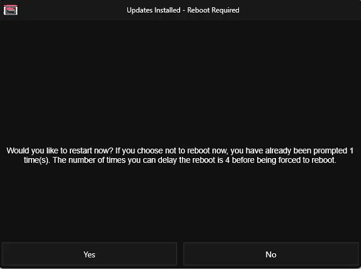
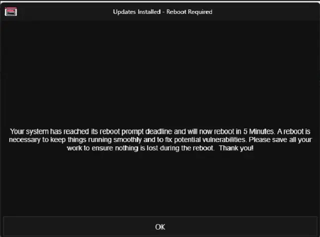

## Purpose

This solution is designed to send a reboot prompt popup to the user's screen on workstations and enforce a forceful reboot after several attempts, as specified in the custom field, to maintain OS patching stability. It includes both automatic and manual reboot features, as well as a functionality to generate tickets for servers where a reboot is pending.

## Associated Content

| Content                                                                                       | Type          | Function                                                                                                                                                                                                                                            |
|-----------------------------------------------------------------------------------------------|---------------|-----------------------------------------------------------------------------------------------------------------------------------------------------------------------------------------------------------------------------------------------------|
| [Task - Reboot Prompter](/docs/8d171849-b417-4ce7-a75f-c9294aca045b)                   | Task          | The script prompts the user to reboot with a simple yes or no prompt. It also forces a reboot after the `PromptRebootCount` is exceeded.                                                                                                           |
| [Task - Reboot Pending Check Automation](/docs/509ed97f-105b-47d7-8a66-f7da58da8138)    | Task          | This task is designed to automatically detect reboot pending status on endpoints and check the custom field `Auto_RebootPendingCheck`, so that the agent is added to the dynamic group [CW RMM - Dynamic Group - Reboot Prompter Deployment - Auto](/docs/93faad94-8731-4fd5-afd0-0ae2a669fc05). |
| [Custom Fields - Reboot Prompter](/docs/7876f32c-a5ec-4b58-9f7e-b60b710e19d5)           | Custom Fields | This document contains details of all custom fields that have task and deployment dependencies.                                                                                                                                                                 |
| [Dynamic Group - Reboot Prompter Deployment - Manual](/docs/284c0ff4-381a-45c0-8282-aa6ac4c3da20) | Dynamic Group | This dynamic group depends on the endpoint custom field `Prompter_RebootPending` being checked, and the agent should be available to check into the group.                                                                                 |
| [Dynamic Group - Reboot Prompter Deployment - Auto](/docs/93faad94-8731-4fd5-afd0-0ae2a669fc05) | Dynamic Group | This dynamic group depends on the endpoint custom field `Auto_RebootPendingCheck` being checked, and the agent should be available to check into the group.                                                                                 |
| [Dynamic Group - Automatic Reboot Pending Check](/docs/1c798d37-8ff8-4e73-ba39-027e025a3551) | Dynamic Group | This group is designed to schedule the task `Automatic Reboot Pending Check` to set the auto reboot pending automation by checking the custom field `Auto_RebootPendingCheck`.                                                                         |
| [Dynamic Group - Reboot Pending Servers](/docs/d6235892-7f62-4a75-83ef-c6c01cc43898)    | Dynamic Group | This group contains server endpoints where a reboot is pending. It detects only supported Windows servers (i.e., 2016, 2019, and 2022) and works only when the Reboot Prompter Solution is activated.                                          |
| [Monitor - Reboot Pending - Servers](/docs/b456d0ae-a456-4a35-85c2-c9b44eef2844)        | Monitor       | This monitor creates a ticket on servers where a reboot is pending. It detects only supported Windows servers (i.e., 2016, 2019, and 2022) and works only when the Reboot Prompter Solution is activated.                                          |

## Implementation

- Create the [Custom Fields - Reboot Prompter](/docs/7876f32c-a5ec-4b58-9f7e-b60b710e19d5)
- Create the [Task - Reboot Prompter](/docs/8d171849-b417-4ce7-a75f-c9294aca045b)
- Create the [Task - Reboot Pending Check Automation](/docs/509ed97f-105b-47d7-8a66-f7da58da8138)
- Create the [Dynamic Group - Reboot Prompter Deployment - Manual](/docs/284c0ff4-381a-45c0-8282-aa6ac4c3da20)
- Create the [Dynamic Group - Reboot Prompter Deployment - Auto](/docs/93faad94-8731-4fd5-afd0-0ae2a669fc05)
- Create the [Dynamic Group - Automatic Reboot Pending Check](/docs/1c798d37-8ff8-4e73-ba39-027e025a3551)
- Create the [Dynamic Group - Reboot Pending Servers](/docs/d6235892-7f62-4a75-83ef-c6c01cc43898)
- Create the [Monitor - Reboot Pending - Servers](/docs/b456d0ae-a456-4a35-85c2-c9b44eef2844)
- Schedule the [Task - Reboot Pending Check Automation](/docs/509ed97f-105b-47d7-8a66-f7da58da8138) at the [Dynamic Group - Automatic Reboot Pending Check](/docs/1c798d37-8ff8-4e73-ba39-027e025a3551) every 2 hours.
  - Follow the deployment instructions in the [Task - Reboot Pending Check Automation](/docs/509ed97f-105b-47d7-8a66-f7da58da8138).
- Schedule the [Task - Reboot Prompter](/docs/8d171849-b417-4ce7-a75f-c9294aca045b) at the [Dynamic Group - Reboot Prompter Deployment - Manual](/docs/284c0ff4-381a-45c0-8282-aa6ac4c3da20) and the [Dynamic Group - Reboot Prompter Deployment - Auto](/docs/93faad94-8731-4fd5-afd0-0ae2a669fc05) according to client requirements to send prompts at the specified intervals.
  - Follow the deployment instructions in the task [CW RMM - Task - Reboot Prompter](/docs/8d171849-b417-4ce7-a75f-c9294aca045b).
- Schedule the monitor [Monitor - Reboot Pending - Servers](/docs/b456d0ae-a456-4a35-85c2-c9b44eef2844) to target the group [Dynamic Group - Reboot Pending Servers](/docs/d6235892-7f62-4a75-83ef-c6c01cc43898) to create a ticket for the reboot pending on the servers.

## FAQ

The script popup screenshot:

Send Yes/No prompt option for attempts equal to [RebootPromptCount](http://RebootPromptCount).  
Note: The time (in seconds) depends on the count it prompted the user, and "4" before being forced to reboot depends on the threshold set at the site-level custom field "RebootPromptCount".

Afterward, it sends a force reboot prompt as shown below:  
Note: The 5 minutes depends on the value provided in the custom field 'RebootForceTimeDelayMinutes'.

