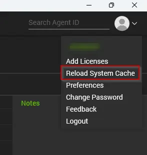

## Purpose

The objective of this solution is to remove any additional and unwanted ScreenConnect clients from Windows computers.

## Associated Content

| Content                                                                                             | Type            | Function                                                             |
|-----------------------------------------------------------------------------------------------------|-----------------|----------------------------------------------------------------------|
| [Script - Remove - All But My - ScreenConnect Client Installations](/docs/50779f68-4329-4d15-b069-c50fcba00614) | Script          | Remove additional ScreenConnect installations from the machines.     |
| [Internal Monitor - Remove Additional ScreenConnect Clients](/docs/7803bfd7-52e0-482d-805a-29aca6cadf04) | Internal Monitor | Detects the computers with additional ScreenConnect clients where Auto-Removal is enabled. |
| △ Custom - Remove Additional ScreenConnect Clients                                                   | Alert Template   | Executes the script against the computers detected by the internal monitor. |

## Implementation

1. **Import the following content from the `ProSync` plugin:**
   - Script: [Script - Remove - All But My - ScreenConnect Client Installations](/docs/50779f68-4329-4d15-b069-c50fcba00614)
   - Internal Monitor: [Internal Monitor - Remove Additional ScreenConnect Clients](/docs/7803bfd7-52e0-482d-805a-29aca6cadf04)
   - Alert Template: △ Custom - Remove Additional ScreenConnect Clients

2. **Reload the system cache.**  
   

3. **Configure the Extra Data Fields as explained in the [script's](/docs/50779f68-4329-4d15-b069-c50fcba00614) document.**  
   - Auto removal for a client can be enabled by flagging the Client-Level EDF `Remove Additional SC Clients`.
   - A location and computer can be excluded from the Auto-Removal by marking the location-level and computer-level EDF `Exclude - Additional SC Removal`, respectively.

4. **Configure the solution as follows:**
   - [Internal Monitor - Remove Additional ScreenConnect Clients](/docs/7803bfd7-52e0-482d-805a-29aca6cadf04)  
     - Configure with the alert template: `△ Custom - Remove Additional ScreenConnect Clients`
     - Right-click and Run Now to start the monitor.

#### Audit SQL

Below is some SQL that will grab all of the unique instance IDs of ScreenConnect found within Automate, so partners can quickly assess what instance IDs may need to be excluded from this solution:

```sql
SELECT software.name, COUNT(software.computerid), GROUP_CONCAT(DISTINCT clients.name) AS Clients 
FROM software
LEFT JOIN computers c ON c.computerid = software.computerid
LEFT JOIN clients ON clients.clientid = c.clientid
WHERE software.name LIKE '%screenconnect%' 
GROUP BY software.name
```