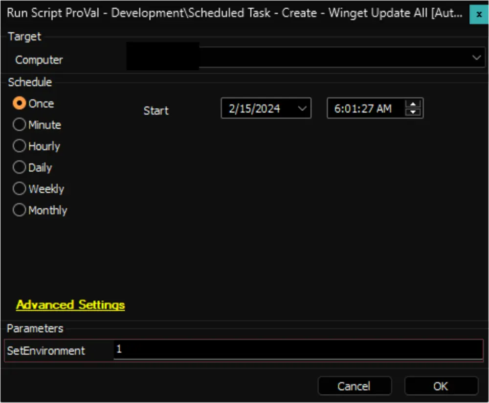
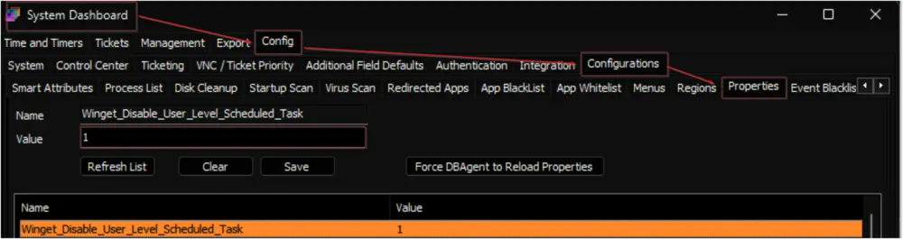
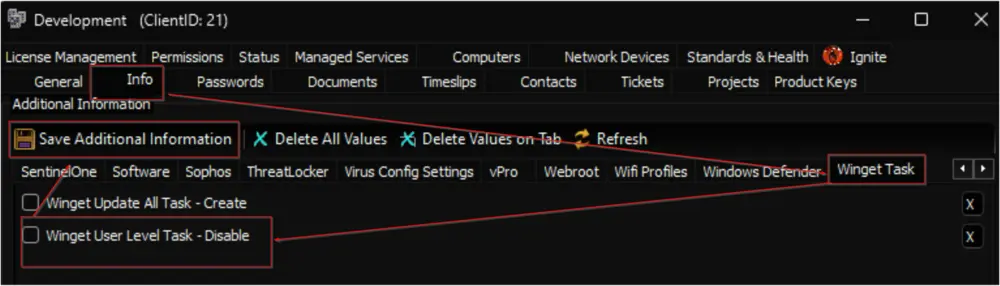

## Purpose

The ultimate objective of this solution is to establish and oversee two scheduled tasks designed to update installed applications utilizing Winget on Windows 10 and 11 machines within the environment.

- The `Winget Update All [System]` task executes Winget's `upgrade all` command upon system boot (after network connection) under the SYSTEM context.
- The `Winget Update All [Logged on User]` task initiates Winget's `upgrade all` command upon user login.

**Note:** Excluding the client/location/computer will remove both scheduled tasks from the associated endpoint(s).

## Associated Content

### Script

| Content                                                                 | Type   | Function                     |
|-------------------------------------------------------------------------|--------|------------------------------|
| [Script - Scheduled Task - Create - Winget Update All [Autofix]](/docs/4bb08610-f80b-4c5a-8e13-b6db095484c1) | Script | Creates the tasks.           |
| [Script - Scheduled Task - Delete - Winget Update All [Autofix]](/docs/23d4e4bf-1a80-4db0-983b-99da88e8ba34) | Script | Deletes the tasks.           |

### Internal Monitor

| Content                                                                 | Type             | Function                                                   |
|-------------------------------------------------------------------------|------------------|------------------------------------------------------------|
| [Internal Monitor - Execute Script - Scheduled Task - Create - Winget Update All](/docs/2f324c74-1e32-4c48-b567-abbeebdabe6d) | Internal Monitor | Detects the Windows 10 and 11 machines where either of the tasks are missing. |
| [Internal Monitor - Execute Script - Scheduled Task - Delete - Winget Update All](/docs/dc75761e-6b11-40be-973e-e01290c8c134) | Internal Monitor | Detects the Windows 10 and 11 machines where either of the tasks are present but are excluded. |

### Alert Template

| Content                                                                 | Type          | Function                                                                                                     |
|-------------------------------------------------------------------------|---------------|--------------------------------------------------------------------------------------------------------------|
| △ CUSTOM - Execute Script - Scheduled Task - Create - Winget Update All | Alert Template | Executes the [Script - Scheduled Task - Create - Winget Update All [Autofix]](/docs/4bb08610-f80b-4c5a-8e13-b6db095484c1) against the computers detected by the [Internal Monitor - Execute Script - Scheduled Task - Create - Winget Update All](/docs/2f324c74-1e32-4c48-b567-abbeebdabe6d) |
| △ CUSTOM - Execute Script - Scheduled Task - Delete - Winget Update All | Alert Template | Executes the [Script - Scheduled Task - Delete - Winget Update All [Autofix]](/docs/23d4e4bf-1a80-4db0-983b-99da88e8ba34) against the computers detected by the [Internal Monitor - Execute Script - Scheduled Task - Delete - Winget Update All](/docs/dc75761e-6b11-40be-973e-e01290c8c134) |

## Implementation

1. Import the following scripts from the ProSync plugin:
   - [Script - Scheduled Task - Create - Winget Update All [Autofix]](/docs/4bb08610-f80b-4c5a-8e13-b6db095484c1)
   - [Script - Scheduled Task - Delete - Winget Update All [Autofix]](/docs/23d4e4bf-1a80-4db0-983b-99da88e8ba34)

2. Import the following internal monitors from the ProSync plugin:
   - [Internal Monitor - Execute Script - Scheduled Task - Create - Winget Update All](/docs/2f324c74-1e32-4c48-b567-abbeebdabe6d)
   - [Internal Monitor - Execute Script - Scheduled Task - Delete - Winget Update All](/docs/dc75761e-6b11-40be-973e-e01290c8c134)

3. Import the following alert templates from the ProSync plugin:
   - △ CUSTOM - Execute Script - Scheduled Task - Create - Winget Update All
   - △ CUSTOM - Execute Script - Scheduled Task - Delete - Winget Update All

4. Reload the system cache.
   

5. Execute the [Script - Scheduled Task - Create - Winget Update All [Autofix]](/docs/4bb08610-f80b-4c5a-8e13-b6db095484c1) against any online Windows 10 or Windows 11 computer with the `SetEnvironment` parameter set to `1` to create the system property and the EDFs.
   

6. Configure the Extra Data Fields to initiate the solution as described in this document: [Script - Scheduled Task - Create - Winget Update All [Autofix]](/docs/4bb08610-f80b-4c5a-8e13-b6db095484c1).

   **Note:** Marking the client-level EDF `Winget Update All Task - Create` will initiate the solution for the client.

7. Configure the solution as follows:

   Navigate to Automation → Monitors within the CWA Control Center and set up the following:

   - [CWM - Automate - Internal Monitor - Execute Script - Scheduled Task - Create - Winget Update All](/docs/2f324c74-1e32-4c48-b567-abbeebdabe6d)
     - Configure with the alert template: `△ CUSTOM - Execute Script - Scheduled Task - Create - Winget Update All`
     - Right-click and Run Now to start the monitor

   - [CWM - Automate - Internal Monitor - Execute Script - Scheduled Task - Delete - Winget Update All](/docs/dc75761e-6b11-40be-973e-e01290c8c134)
     - Configure with the alert template: `△ CUSTOM - Execute Script - Scheduled Task - Delete - Winget Update All`
     - Right-click and Run Now to start the monitor

## FAQ

**Q:** How to disable the `Winget Update All [Logged on User]` task on the endpoints?  
**A:**
- For Environment-Level Changes
  - Set the `Winget_Disable_User_Level_Scheduled_Task` system property to `1`.  
  
  - Follow the steps described in the [Reset - Extra Data Field - Winget_update_all_task_created](/docs/f5286dd2-1161-4580-8060-d113b3ab28b7) article for the **Environment Level Changes**.

- For Client-Level Changes
  - Flag the Client-Level EDF `Winget User Level Task - Disable`.  
  
  - Follow the steps described in the [Reset - Extra Data Field - Winget_update_all_task_created](/docs/f5286dd2-1161-4580-8060-d113b3ab28b7) article for the **Client Level Changes**.

**Q:** How to recreate the tasks on all Windows 10 and 11 computers in the environment?  
**A:** Follow the steps described in the [Reset - Extra Data Field - Winget_update_all_task_created](/docs/f5286dd2-1161-4580-8060-d113b3ab28b7) article for the **Environment Level Changes**.

**Q:** How to recreate the tasks on all Windows 10 and 11 computers for a particular client?  
**A:** Follow the steps described in the [Reset - Extra Data Field - Winget_update_all_task_created](/docs/f5286dd2-1161-4580-8060-d113b3ab28b7) article for the **Client Level Changes**.

**Q:** How to delete the tasks created on an endpoint?  
**A:** Upon marking the Computer-Level EDF `Winget Update All Task - Exclude`, the [Execute Script - Scheduled Task - Delete - Winget Update All](/docs/dc75761e-6b11-40be-973e-e01290c8c134) internal monitor executes the [Scheduled Task - Delete - Winget Update All [Autofix]](/docs/23d4e4bf-1a80-4db0-983b-99da88e8ba34) script to remove the tasks from the endpoint.

**Q:** How to remove the tasks from all machines of a location?  
**A:** Upon marking the Location-Level EDF `Winget Update All Task - Exclude`, the [Execute Script - Scheduled Task - Delete - Winget Update All](/docs/dc75761e-6b11-40be-973e-e01290c8c134) internal monitor executes the [Scheduled Task - Delete - Winget Update All [Autofix]](/docs/23d4e4bf-1a80-4db0-983b-99da88e8ba34) script to remove the tasks from all Windows 10 and 11 machines of the location.

**Q:** How to remove the tasks from all machines of a client?  
**A:** Upon unmarking the Client-Level EDF `Winget Update All Task - Create`, the [Execute Script - Scheduled Task - Delete - Winget Update All](/docs/dc75761e-6b11-40be-973e-e01290c8c134) internal monitor executes the [Scheduled Task - Delete - Winget Update All [Autofix]](/docs/23d4e4bf-1a80-4db0-983b-99da88e8ba34) script to remove the tasks from all Windows 10 and 11 machines of the client.
