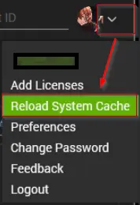

## Purpose

The solution comprises three dataviews designed to showcase the performance, historical, and descriptive details of the scripts.

## Associated Content

| Content                                                                 | Type      | Function                                                              |
|-------------------------------------------------------------------------|-----------|----------------------------------------------------------------------|
| [Dataview - Script List](/docs/c5c0f740-2981-4557-9fcc-dd2f863a1240)          | Dataview  | Displays the basic information of the scripts present in the environment. |
| [Dataview - Script Effectiveness Performance Audit](/docs/5606850a-c68e-4b15-b183-399cded6e601) | Dataview  | Displays the performance audit of the scripts present in the environment. |
| [Dataview - Script Run Time Historical Audit](/docs/84ff85b8-06d4-4c2b-abaa-fbd2b05756c2) | Dataview  | Displays the historical run-time data of the scripts present in the environment. |

## Implementation

1. Remove the following dataviews if they are present in the environment:
   - Script List (replaced by [Script List](/docs/c5c0f740-2981-4557-9fcc-dd2f863a1240))
   - Script Effectiveness Performance Audit (replaced by [Script Effectiveness Performance Audit](/docs/5606850a-c68e-4b15-b183-399cded6e601))
   - Script Effectiveness Audit (replaced by [Script Effectiveness Performance Audit](/docs/5606850a-c68e-4b15-b183-399cded6e601))
   - Script Engine + Time Saved (replaced by [Script Run Time Historical Audit](/docs/84ff85b8-06d4-4c2b-abaa-fbd2b05756c2))

2. Import the following dataviews from the `ProSync` plugin:
   - [Dataview - Script List](/docs/c5c0f740-2981-4557-9fcc-dd2f863a1240)
   - [Dataview - Script Effectiveness Performance Audit](/docs/5606850a-c68e-4b15-b183-399cded6e601)
   - [Dataview - Script Run Time Historical Audit](/docs/84ff85b8-06d4-4c2b-abaa-fbd2b05756c2)

3. Reload the System Cache  
   

## FAQ

**Q:** Is it feasible to consolidate these dataviews into a single dataview?  
**A:** While it is technically possible to merge these dataviews into one, it's important to note that the resulting dataview will not function reliably due to the complexity of calculations and the volume of data processed to generate these views.
