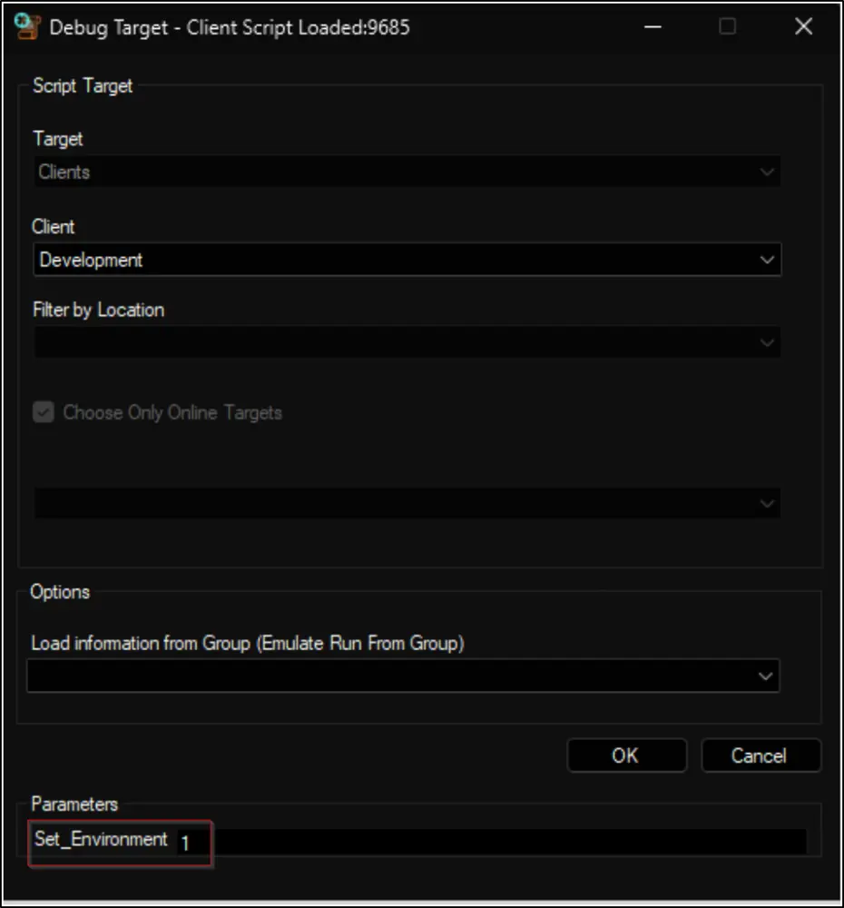
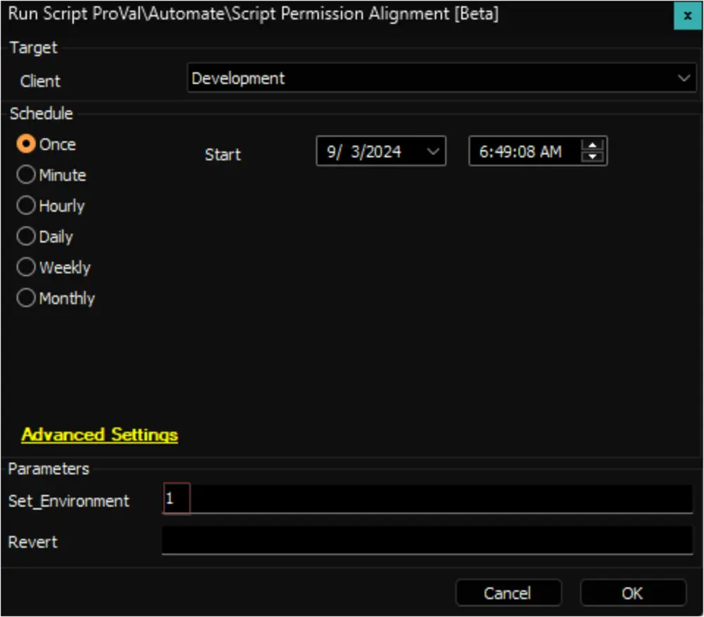
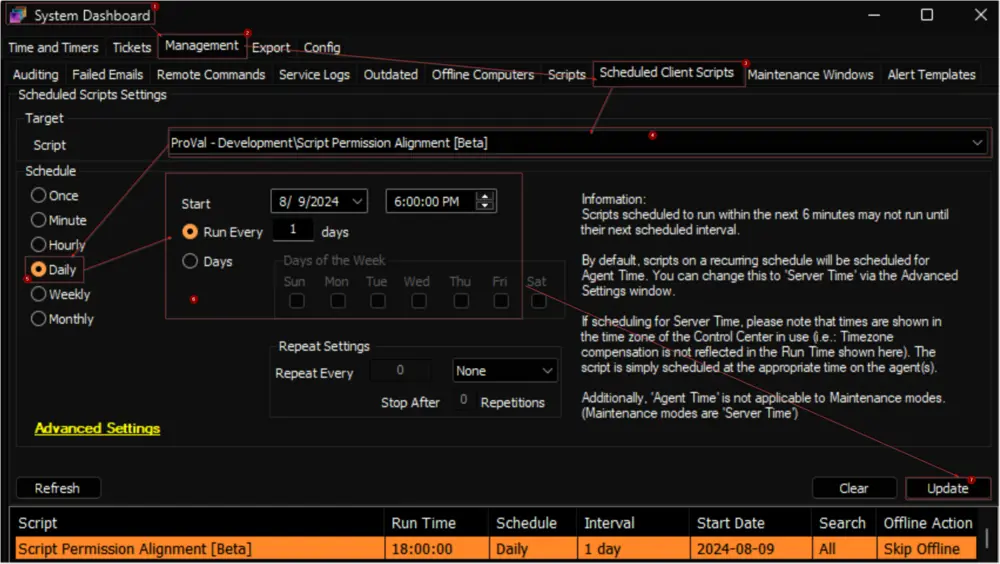

## Purpose

Set the standard permissions for the stock scripts in ConnectWise Automate.

## Associated Content

| Content                                                                          | Type         | Function                                                                                         |
| -------------------------------------------------------------------------------- | ------------ | ------------------------------------------------------------------------------------------------ |
| [Script Permission Alignment [Beta]](/docs/46412261-f40b-456f-92db-500d166c41ca) | Script       | Set the permissions defined in the custom table to the Built-In scripts in ConnectWise Automate. |
| [Script Permission Alignment [Beta]](/docs/c7532677-9914-419a-b6cc-da381393c68c) | Dataview     | Displays the user classes that will be assigned to the stock scripts after running the script.   |
| [pvl_scripts_permissions](/docs/22dabcfc-b55c-4eae-81df-96c01446c3b7)            | Custom Table | Stores the GUID and the set of user class(es) for Built-In scripts.                              |

## Implementation

1. Import the following content using the ProSync Plugin:
   - [Script - Script Permission Alignment [Beta]](/docs/46412261-f40b-456f-92db-500d166c41ca)
   - [Dataview - Script Permission Alignment [Beta]](/docs/c7532677-9914-419a-b6cc-da381393c68c)
   - [Custom Table - pvl_scripts_permissions](/docs/22dabcfc-b55c-4eae-81df-96c01446c3b7)

2. Reload the system cache:
   

3. Debug or run the script against any client with the `Set_Environment` parameter set to `1`.  
     
   

4. Set the Tier 1 and Tier 2 user classes in the system properties. The consultant should provide this information. Check the [script's](/docs/46412261-f40b-456f-92db-500d166c41ca) document for more information on the system properties.  
   

5. It is suggested to ask the partner to review the [Script Permission Alignment [Beta]](/docs/c7532677-9914-419a-b6cc-da381393c68c) before scheduling the script.

6. Schedule the script to run `Daily` after getting the green light from the partner or consultant.  
   

## FAQ

**Q:** Can we use the solution to set permissions for any script?  
**A:** The solution allows setting permissions only for the scripts listed in the [Script Permission Alignment [Beta]](/docs/c7532677-9914-419a-b6cc-da381393c68c) dataview, and these permissions cannot be customized. However, the user classes Tier 1 and Tier 2 can be defined in the system properties.

