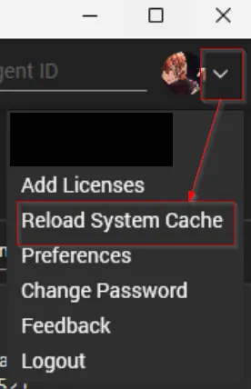
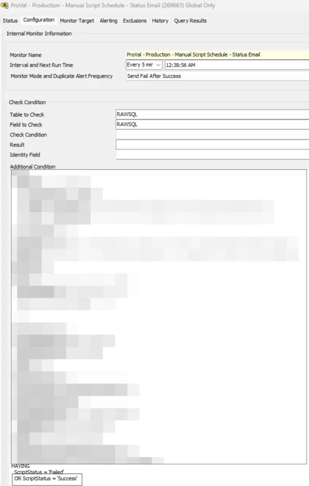

## Purpose

This solution is designed to detect when a user runs a script manually on an agent and sends an email to the user who ran the script containing the status of that script. This allows the technician to quickly become aware of failing scripts or verify successful ones.

## Limitations

- The solution's limitation entails sending only one email per script, preventing the ability to consolidate information about all scripts executed within the specified time frame. This constraint is attributed to how Automate stores data and the complexity of various scenarios.
- Reliable data may not be obtained if a script is executed frequently within intervals of 2 or 3 minutes against the same computer. This intermittent execution can disrupt the accuracy of the information gathered.
- Furthermore, the solution's functionality is limited to scripts scheduled on individual machines or multiple machines; it does not extend to scripts executed against groups.

#### Disclaimer

It is important to note that this solution will send an email for every script issued manually by a user. This means if a user shift-clicks and runs a script on 100 machines, they WILL receive 100 emails.

## Associated Content

| Content                                                                                   | Type            | Function                                                                                                                                                       |
|-------------------------------------------------------------------------------------------|-----------------|----------------------------------------------------------------------------------------------------------------------------------------------------------------|
| [Script - Email Creation - Computer [LTRunByUser]*](/docs/aff3413b-574f-4399-8f4b-85e04d388c5a) | Script          | This offline script is designed to be used with the monitor [Manual Script Schedule - Status Email](/docs/587dab37-7b57-467f-bcde-b112783f5cf1) to send emails to the user who ran the script manually during its completion. |
| [Internal Monitor - Manual Script Schedule - Status Email](/docs/587dab37-7b57-467f-bcde-b112783f5cf1) | Internal Monitor | This monitor detects the manual script execution by the LT User.                                                                                             |
| △ Custom - Autofix - Email Send LTRunByUser                                            | Alert Template   | This alert template is required to run the script [Email Creation - Computer [LTRunByUser]*](/docs/aff3413b-574f-4399-8f4b-85e04d388c5a) as an autofix with the monitor [Manual Script Schedule - Status Email](/docs/587dab37-7b57-467f-bcde-b112783f5cf1) |

## Implementation

1. Import the following contents from the ProSync plugin:
   - Script: [Email Creation - Computer [LTRunByUser]*](/docs/aff3413b-574f-4399-8f4b-85e04d388c5a) 
   - Internal Monitor: [Manual Script Schedule - Status Email](/docs/587dab37-7b57-467f-bcde-b112783f5cf1) 
   - Alert Template: `△ Custom - Autofix - Email Send LTRunByUser`

2. Reload the System Cache.  
   

3. Configure the solution as follows:
   - Navigate to Automation > Monitors > Internal Monitor
     - Internal Monitor: [Manual Script Schedule - Status Email](/docs/587dab37-7b57-467f-bcde-b112783f5cf1)
       - Alert Template: `△ Custom - Autofix - Email Send LTRunByUser`
       - Reset and run the monitor to initiate monitoring.

## Customization

Remove or comment out the last line in the additional condition of the monitor to disable receiving emails for successful script executions and limit the monitor sets to script failures only.  

