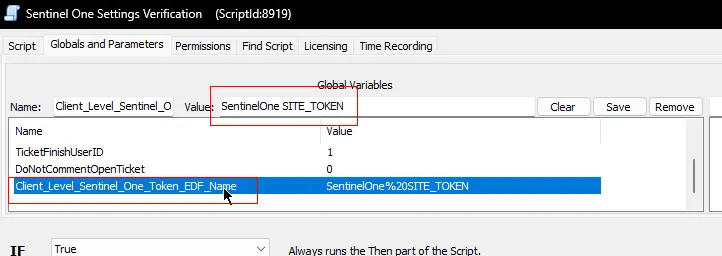
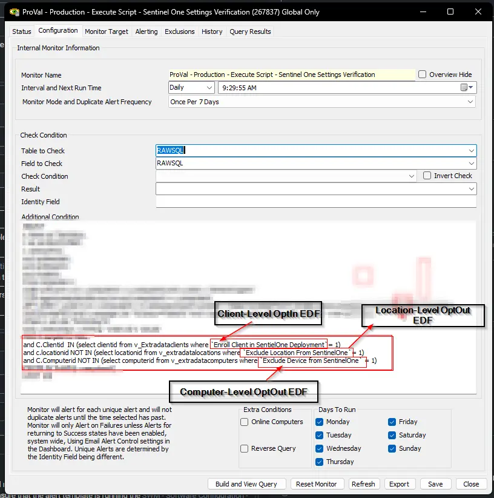

## Purpose

The purpose of this solution is to identify instances where computers are utilizing a Sentinel Agent from a different company than the one to which they rightfully belong.

## Associated Content

| Content                                                                                                                                                                       | Type           | Function                                                                                                               |
|------------------------------------------------------------------------------------------------------------------------------------------------------------------------------|----------------|------------------------------------------------------------------------------------------------------------------------|
| [SWM - Software Configuration - Script - Sentinel One Settings Verification](/docs/9eb5531e-3a3f-43a6-88e6-cf2b3dc5ebb5)                                             | Script         | Compares the Sentinel One token available on the computer with the one present in the client-level Sentinel Token EDF. |
| [CWM - Automate - Internal Monitor - Execute Script - Sentinel One Settings Verification](/docs/a115d376-6bc5-4392-8407-a6a5448445cf)        | Internal Monitor| Executes the [SWM - Software Configuration - Script - Sentinel One Settings Verification](/docs/9eb5531e-3a3f-43a6-88e6-cf2b3dc5ebb5) script once every 14 days against the Sentinel Managed client with the Sentinel Agent installed. |
| △ CUSTOM - Execute Script - Sentinel One Settings Verification                                                                                                             | Alert Template  | Executes the script against the computers detected in the monitor set.                                               |

## Implementation

- Read the solution-related documents carefully.
- Import the [SWM - Software Configuration - Script - Sentinel One Settings Verification](/docs/9eb5531e-3a3f-43a6-88e6-cf2b3dc5ebb5) script.
- Import the [CWM - Automate - Internal Monitor - Execute Script - Sentinel One Settings Verification](/docs/a115d376-6bc5-4392-8407-a6a5448445cf) internal monitor.
- Create/import the `△ CUSTOM - Execute Script - Sentinel One Settings Verification` alert template, and ensure that the alert template is running the [SWM - Software Configuration - Script - Sentinel One Settings Verification](/docs/9eb5531e-3a3f-43a6-88e6-cf2b3dc5ebb5) script.
- Importing the script and internal monitor will not create the EDF(s), as both contents are using existing Sentinel One EDF.
- Go to the client-level EDFs, find the name of the EDF that the partner is using to store the Sentinel One Installation Token, and set it to the script's global variable `Client_Level_Sentinel_One_Token_EDF_Name`.  
    
    
- If the partner is using different names for the client-level Installation Opt-In and location, and computer-level Installation Opt-Out EDFs, then change the names of the EDFs in the internal monitor's additional condition as well.  
    
- Execute the script against a few random machines with Sentinel One installed and ensure that it's delivering as expected.
- Implement the alert template to the internal monitor.